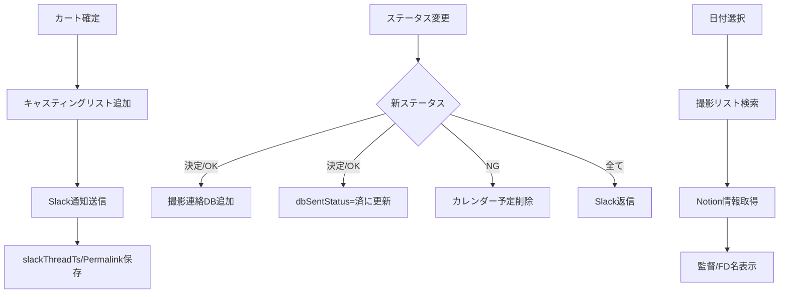

# AI Agent Specification - Casting System Migration

このドキュメントはAIコーディングエージェント向けの実装仕様書です。

---

## プロジェクト概要

**目的**: キャスティング管理システムを Python/Sheets から Vue/Firestore へ移行

**技術スタック**:
- Frontend: Vue 3 + Vite + PrimeVue 4 + TypeScript
- Backend: Firebase Cloud Functions (Node.js/TypeScript)
- Database: Cloud Firestore
- Auth: Firebase Authentication (Google)
- Hosting: Firebase Hosting

---

## Phase 1: プロジェクト初期化

### 1.1 Vite + Vue プロジェクト作成

```bash
cd /Users/mk0012/Desktop/casting-management-system-v1
npx create-vite@latest frontend --template vue-ts
cd frontend
npm install
```

### 1.2 依存関係インストール

```bash
npm install primevue @primevue/themes primeicons
npm install pinia vue-router
npm install firebase
npm install @vueuse/core
npm install -D @types/node
```

### 1.3 PrimeVue 設定

**ファイル**: `frontend/src/main.ts`
```typescript
import { createApp } from 'vue'
import { createPinia } from 'pinia'
import PrimeVue from 'primevue/config'
import Aura from '@primevue/themes/aura'
import ToastService from 'primevue/toastservice'
import ConfirmationService from 'primevue/confirmationservice'
import 'primeicons/primeicons.css'
import './style.css'
import App from './App.vue'
import router from './router'

const app = createApp(App)
app.use(createPinia())
app.use(router)
app.use(PrimeVue, { theme: { preset: Aura } })
app.use(ToastService)
app.use(ConfirmationService)
app.mount('#app')
```

### 1.4 Firebase 初期化

**ファイル**: `frontend/src/services/firebase.ts`
```typescript
import { initializeApp } from 'firebase/app'
import { getFirestore } from 'firebase/firestore'
import { getAuth, GoogleAuthProvider } from 'firebase/auth'
import { getFunctions } from 'firebase/functions'

const firebaseConfig = {
  apiKey: import.meta.env.VITE_FIREBASE_API_KEY,
  authDomain: import.meta.env.VITE_FIREBASE_AUTH_DOMAIN,
  projectId: import.meta.env.VITE_FIREBASE_PROJECT_ID,
  storageBucket: import.meta.env.VITE_FIREBASE_STORAGE_BUCKET,
  messagingSenderId: import.meta.env.VITE_FIREBASE_MESSAGING_SENDER_ID,
  appId: import.meta.env.VITE_FIREBASE_APP_ID
}

export const app = initializeApp(firebaseConfig)
export const db = getFirestore(app)
export const auth = getAuth(app)
export const functions = getFunctions(app, 'asia-northeast1')
export const googleProvider = new GoogleAuthProvider()
```

---

## Phase 2: Firestore コレクション定義

### 2.1 TypeScript 型定義

**ファイル**: `frontend/src/types/index.ts`
```typescript
import { Timestamp } from 'firebase/firestore'

export interface Cast {
  id: string
  name: string
  gender: '男性' | '女性' | ''
  dateOfBirth?: Timestamp
  agency: string
  imageUrl: string
  email: string
  notes: string
  castType: '内部' | '外部'
  slackMentionId: string
  appearanceCount: number
  createdAt: Timestamp
  updatedAt: Timestamp
}

export interface Casting {
  id: string
  castId: string
  accountName: string
  projectName: string
  projectId: string
  roleName: string
  startDate: Timestamp
  endDate: Timestamp
  rank: number
  status: CastingStatus
  note: string
  mainSub: 'メイン' | 'サブ' | 'その他'
  cost: number
  slackThreadTs: string
  slackPermalink: string
  calendarEventId: string
  dbSentStatus: '済' | ''
  createdBy: string
  updatedBy: string
  createdAt: Timestamp
  updatedAt: Timestamp
}

export type CastingStatus = 
  | '仮押さえ' | '打診中' | 'オーダー待ち'
  | 'OK' | '決定' | 'NG' | 'キャンセル'

export interface ShootingContact {
  id: string
  castingId: string
  castName: string
  castType: '内部' | '外部'
  shootDate: Timestamp
  inTime: string
  outTime: string
  location: string
  address: string
  cost: number
  makingUrl: string
  postDate: string
  mainSub: string
  status: string
  createdAt: Timestamp
  updatedAt: Timestamp
}

export interface CartItem {
  castId: string
  cast: Cast
  roleName: string
  rank: number
  note: string
  mainSub: 'メイン' | 'サブ' | 'その他'
  projectName: string
}
```

---

## Phase 3: Composables 実装

### 3.1 認証 Composable

**ファイル**: `frontend/src/composables/useAuth.ts`
```typescript
import { ref, computed } from 'vue'
import { 
  signInWithPopup, 
  signOut as firebaseSignOut,
  onAuthStateChanged,
  User
} from 'firebase/auth'
import { auth, googleProvider } from '@/services/firebase'

const user = ref<User | null>(null)
const loading = ref(true)

export function useAuth() {
  const isAuthenticated = computed(() => !!user.value)
  const userEmail = computed(() => user.value?.email ?? '')

  const signIn = async () => {
    try {
      await signInWithPopup(auth, googleProvider)
    } catch (error) {
      console.error('Sign in failed:', error)
      throw error
    }
  }

  const signOut = async () => {
    await firebaseSignOut(auth)
  }

  const init = () => {
    onAuthStateChanged(auth, (newUser) => {
      user.value = newUser
      loading.value = false
    })
  }

  return { user, loading, isAuthenticated, userEmail, signIn, signOut, init }
}
```

### 3.2 キャスト Composable

**ファイル**: `frontend/src/composables/useCasts.ts`
```typescript
import { ref } from 'vue'
import { 
  collection, query, where, orderBy,
  onSnapshot, addDoc, updateDoc, doc,
  Timestamp, getDocs
} from 'firebase/firestore'
import { db } from '@/services/firebase'
import type { Cast } from '@/types'

export function useCasts() {
  const casts = ref<Cast[]>([])
  const loading = ref(false)

  const fetchAll = () => {
    loading.value = true
    const q = query(
      collection(db, 'casts'),
      orderBy('name', 'asc')
    )
    
    return onSnapshot(q, (snapshot) => {
      casts.value = snapshot.docs.map(doc => ({
        id: doc.id,
        ...doc.data()
      } as Cast))
      loading.value = false
    })
  }

  const addCast = async (data: Omit<Cast, 'id' | 'createdAt' | 'updatedAt'>) => {
    const now = Timestamp.now()
    await addDoc(collection(db, 'casts'), {
      ...data,
      createdAt: now,
      updatedAt: now
    })
  }

  const updateCast = async (id: string, data: Partial<Cast>) => {
    await updateDoc(doc(db, 'casts', id), {
      ...data,
      updatedAt: Timestamp.now()
    })
  }

  return { casts, loading, fetchAll, addCast, updateCast }
}
```

### 3.3 キャスティング Composable

**ファイル**: `frontend/src/composables/useCastings.ts`
```typescript
import { ref } from 'vue'
import { 
  collection, query, where, orderBy,
  onSnapshot, addDoc, updateDoc, doc,
  Timestamp, writeBatch
} from 'firebase/firestore'
import { httpsCallable } from 'firebase/functions'
import { db, functions } from '@/services/firebase'
import type { Casting, CastingStatus } from '@/types'

export function useCastings() {
  const castings = ref<Casting[]>([])
  const loading = ref(false)

  const fetchByDateRange = (startDate: Date, endDate: Date) => {
    loading.value = true
    const q = query(
      collection(db, 'castings'),
      where('startDate', '>=', Timestamp.fromDate(startDate)),
      where('startDate', '<=', Timestamp.fromDate(endDate)),
      orderBy('startDate', 'asc')
    )
    
    return onSnapshot(q, (snapshot) => {
      castings.value = snapshot.docs.map(doc => ({
        id: doc.id,
        ...doc.data()
      } as Casting))
      loading.value = false
    })
  }

  const updateStatus = async (
    castingId: string, 
    newStatus: CastingStatus,
    options?: { cost?: number }
  ) => {
    const updateData: Partial<Casting> = {
      status: newStatus,
      updatedAt: Timestamp.now()
    }
    if (options?.cost !== undefined) {
      updateData.cost = options.cost
    }
    
    await updateDoc(doc(db, 'castings', castingId), updateData)
    
    // Slack通知 (Cloud Function経由)
    const notifyStatusUpdate = httpsCallable(functions, 'notifyStatusUpdate')
    await notifyStatusUpdate({ castingId, newStatus })
  }

  const createOrder = async (orderData: {
    accountName: string
    projectName: string
    projectId: string
    dateRanges: string[]
    items: Array<{
      castId: string
      roleName: string
      rank: number
      note: string
      mainSub: string
    }>
  }) => {
    const batch = writeBatch(db)
    const now = Timestamp.now()
    
    for (const item of orderData.items) {
      const castingRef = doc(collection(db, 'castings'))
      batch.set(castingRef, {
        ...item,
        accountName: orderData.accountName,
        projectName: orderData.projectName,
        projectId: orderData.projectId,
        status: '仮押さえ',
        createdAt: now,
        updatedAt: now
      })
    }
    
    await batch.commit()
    
    // Slack通知
    const notifyOrderCreated = httpsCallable(functions, 'notifyOrderCreated')
    await notifyOrderCreated(orderData)
  }

  return { castings, loading, fetchByDateRange, updateStatus, createOrder }
}
```

---

## Phase 4: Pinia Store 実装

### 4.1 カート Store

**ファイル**: `frontend/src/stores/cartStore.ts`
```typescript
import { defineStore } from 'pinia'
import type { Cast, CartItem } from '@/types'

export const useCartStore = defineStore('cart', {
  state: () => ({
    items: [] as CartItem[],
    meta: {
      account: '',
      projectNames: ['', '', ''] as string[],
      notionUrl: '',
      dateRanges: [] as string[]
    }
  }),
  
  getters: {
    count: (state) => state.items.length,
    isEmpty: (state) => state.items.length === 0
  },
  
  actions: {
    addItem(cast: Cast, options?: Partial<CartItem>) {
      if (this.items.some(i => i.castId === cast.id)) return
      this.items.push({
        castId: cast.id,
        cast,
        roleName: options?.roleName ?? '',
        rank: this.items.length + 1,
        note: options?.note ?? '',
        mainSub: options?.mainSub ?? 'その他',
        projectName: options?.projectName ?? ''
      })
    },
    
    removeItem(castId: string) {
      const idx = this.items.findIndex(i => i.castId === castId)
      if (idx !== -1) {
        this.items.splice(idx, 1)
        // Re-rank
        this.items.forEach((item, i) => item.rank = i + 1)
      }
    },
    
    updateMeta(meta: Partial<typeof this.meta>) {
      Object.assign(this.meta, meta)
    },
    
    clear() {
      this.items = []
      this.meta = {
        account: '',
        projectNames: ['', '', ''],
        notionUrl: '',
        dateRanges: []
      }
    }
  }
})
```

---

## Phase 5: Vue コンポーネント実装

### 5.1 CastCard コンポーネント

**ファイル**: `frontend/src/components/cast/CastCard.vue`
```vue
<script setup lang="ts">
import { computed } from 'vue'
import Card from 'primevue/card'
import Button from 'primevue/button'
import Tag from 'primevue/tag'
import type { Cast } from '@/types'
import { useCartStore } from '@/stores/cartStore'

const props = defineProps<{
  cast: Cast
  isProvisional?: boolean
  isConfirmed?: boolean
  isNG?: boolean
}>()

const emit = defineEmits<{
  click: [cast: Cast]
}>()

const cart = useCartStore()

const isInCart = computed(() => 
  cart.items.some(i => i.castId === props.cast.id)
)

const badgeSeverity = computed(() => {
  if (props.isConfirmed) return 'danger'
  if (props.isProvisional) return 'warning'
  if (props.isNG) return 'secondary'
  return 'success'
})

const badgeLabel = computed(() => {
  if (props.isConfirmed) return '決定済み'
  if (props.isProvisional) return '仮押さえ中'
  if (props.isNG) return 'NG'
  return '空き'
})

const handleAddToCart = () => {
  if (!props.isConfirmed && !props.isNG) {
    cart.addItem(props.cast)
  }
}
</script>

<template>
  <Card class="cast-card" @click="emit('click', cast)">
    <template #header>
      
    </template>
    <template #title>
      {{ cast.name }}
    </template>
    <template #subtitle>
      {{ cast.agency }}
    </template>
    <template #content>
      <div class="flex gap-2 mb-2">
        <Tag :value="cast.castType" :severity="cast.castType === '内部' ? 'info' : 'secondary'" />
        <Tag :value="badgeLabel" :severity="badgeSeverity" />
      </div>
    </template>
    <template #footer>
      <Button 
        :label="isInCart ? 'カートに追加済み' : 'カートに追加'"
        :icon="isInCart ? 'pi pi-check' : 'pi pi-plus'"
        :disabled="isInCart || isConfirmed || isNG"
        @click.stop="handleAddToCart"
        size="small"
        class="w-full"
      />
    </template>
  </Card>
</template>

<style scoped>
.cast-card {
  cursor: pointer;
  transition: transform 0.2s;
}
.cast-card:hover {
  transform: translateY(-4px);
}
.cast-image {
  width: 100%;
  height: 200px;
  object-fit: cover;
}
</style>
```

### 5.2 StatusChangeDialog コンポーネント

**ファイル**: `frontend/src/components/casting/StatusChangeDialog.vue`
```vue
<script setup lang="ts">
import { ref, computed } from 'vue'
import Dialog from 'primevue/dialog'
import Dropdown from 'primevue/dropdown'
import InputNumber from 'primevue/inputnumber'
import Button from 'primevue/button'
import type { Casting, CastingStatus } from '@/types'

const props = defineProps<{
  visible: boolean
  casting: Casting | null
}>()

const emit = defineEmits<{
  'update:visible': [value: boolean]
  confirm: [status: CastingStatus, cost?: number]
}>()

const statusOptions: CastingStatus[] = [
  '仮押さえ', '打診中', 'OK', '決定', 'NG', 'キャンセル'
]

const selectedStatus = ref<CastingStatus>('仮押さえ')
const cost = ref<number | null>(null)

const showCostInput = computed(() => 
  ['OK', '決定'].includes(selectedStatus.value)
)

const handleConfirm = () => {
  emit('confirm', selectedStatus.value, cost.value ?? undefined)
  emit('update:visible', false)
}
</script>

<template>
  <Dialog 
    :visible="visible" 
    @update:visible="$emit('update:visible', $event)"
    header="ステータス変更"
    modal
    :style="{ width: '400px' }"
  >
    <div class="flex flex-col gap-4">
      <div>
        <label class="block mb-2 font-medium">新しいステータス</label>
        <Dropdown 
          v-model="selectedStatus"
          :options="statusOptions"
          class="w-full"
        />
      </div>
      
      <div v-if="showCostInput">
        <label class="block mb-2 font-medium">金額（税別）</label>
        <InputNumber 
          v-model="cost"
          mode="currency"
          currency="JPY"
          locale="ja-JP"
          class="w-full"
        />
      </div>
    </div>
    
    <template #footer>
      <Button 
        label="キャンセル" 
        severity="secondary"
        @click="$emit('update:visible', false)" 
      />
      <Button 
        label="変更" 
        @click="handleConfirm" 
      />
    </template>
  </Dialog>
</template>
```

---

## Phase 6: Cloud Functions 実装

### 6.1 プロジェクト初期化

```bash
cd /Users/mk0012/Desktop/casting-management-system-v1
firebase init functions
# TypeScript を選択
```

### 6.2 Slack 通知関数

**ファイル**: `functions/src/slack.ts`
```typescript
import * as functions from 'firebase-functions'
import { WebClient } from '@slack/web-api'

const slack = new WebClient(process.env.SLACK_BOT_TOKEN)
const CHANNEL = process.env.SLACK_DEFAULT_CHANNEL!
const MENTION_GROUP = process.env.SLACK_MENTION_GROUP_ID

export const notifyOrderCreated = functions
  .region('asia-northeast1')
  .https.onCall(async (data, context) => {
    if (!context.auth) {
      throw new functions.https.HttpsError('unauthenticated', 'Not authenticated')
    }

    const { accountName, projectName, dateRanges, items, hasInternal } = data

    let text = MENTION_GROUP ? `<!subteam^${MENTION_GROUP}>\n` : ''
    text += 'キャスティングオーダーがありました。\n'
    if (hasInternal) {
      text += '*内部キャストはスタンプで反応ください*\n'
    }
    text += `\n\`撮影日\`\n${dateRanges.map((d: string) => `・${d}`).join('\n')}`
    text += `\n\n\`アカウント\`\n${accountName}`
    text += `\n\n\`作品名\`\n${projectName}`
    // ... 残りのメッセージ構築

    const result = await slack.chat.postMessage({
      channel: CHANNEL,
      text,
      mrkdwn: true
    })

    return { 
      ts: result.ts, 
      permalink: (await slack.chat.getPermalink({
        channel: CHANNEL,
        message_ts: result.ts!
      })).permalink
    }
  })

export const notifyStatusUpdate = functions
  .region('asia-northeast1')
  .https.onCall(async (data, context) => {
    if (!context.auth) {
      throw new functions.https.HttpsError('unauthenticated', 'Not authenticated')
    }

    const { castingId, newStatus, threadTs } = data
    
    if (!threadTs) return { ok: true }

    await slack.chat.postMessage({
      channel: CHANNEL,
      thread_ts: threadTs,
      text: `ステータスが *${newStatus}* に変更されました。`
    })

    return { ok: true }
  })
```

---

## Phase 7: ビジネスワークフロー実装

### 7.1 現行システムのデータフロー概要



### 7.2 オーダー送信 → Firestore保存フロー

**現行 (Google Sheets)**:
```javascript
// index.html: confirmProvisionalBookings()
await gapi.client.sheets.spreadsheets.values.append({
  spreadsheetId: SPREADSHEET_ID,
  range: 'キャスティングリスト!A2',
  resource: { values: [...] }
})
```

**移行後 (Firestore + Cloud Functions)**:

**ファイル**: `frontend/src/composables/useOrders.ts`
```typescript
import { ref } from 'vue'
import { 
  collection, doc, writeBatch, 
  Timestamp, serverTimestamp 
} from 'firebase/firestore'
import { httpsCallable } from 'firebase/functions'
import { db, functions } from '@/services/firebase'
import { useAuth } from './useAuth'

export interface OrderItem {
  castId: string
  castName: string
  roleName: string
  rank: number
  note: string
  mainSub: 'メイン' | 'サブ' | 'その他'
  projectName: string
  isInternal: boolean
  slackMentionId?: string
  conflictInfo?: string
}

export interface OrderPayload {
  accountName: string
  projectId: string // Notion Page ID
  dateRanges: string[]
  items: OrderItem[]
  pdfFiles?: File[]
  isAdditionalOrder?: boolean
  existingThreadTs?: string
}

export function useOrders() {
  const loading = ref(false)
  const { userEmail } = useAuth()

  /**
   * オーダー送信のメインフロー:
   * 1. Firestoreにcastingsコレクション追加
   * 2. Cloud Function経由でSlack通知
   * 3. slackThreadTs/Permalinkを各ドキュメントに更新
   * 4. 内部キャストのカレンダー仮ホールド作成
   */
  const submitOrder = async (payload: OrderPayload) => {
    loading.value = true
    
    try {
      const batch = writeBatch(db)
      const now = Timestamp.now()
      const castingIds: string[] = []
      
      // 1. Firestoreにキャスティングデータを追加
      for (const item of payload.items) {
        for (const dateRange of payload.dateRanges) {
          const [startDate, endDate] = dateRange.split('〜')
          const castingRef = doc(collection(db, 'castings'))
          castingIds.push(castingRef.id)
          
          batch.set(castingRef, {
            accountName: payload.accountName,
            projectName: item.projectName,
            projectId: payload.projectId,
            roleName: item.roleName,
            castId: item.castId,
            castName: item.castName,
            startDate: Timestamp.fromDate(new Date(startDate)),
            endDate: Timestamp.fromDate(new Date(endDate || startDate)),
            rank: item.rank,
            status: item.isInternal ? '仮キャスティング' : 'オーダー待ち',
            note: item.note,
            mainSub: item.mainSub,
            castType: item.isInternal ? '内部' : '外部',
            slackThreadTs: '',
            slackPermalink: '',
            calendarEventId: '',
            dbSentStatus: '',
            createdBy: userEmail.value,
            updatedBy: userEmail.value,
            createdAt: now,
            updatedAt: now
          })
        }
      }
      
      await batch.commit()
      
      // 2. Cloud Function経由でSlack通知
      const notifyOrderCreated = httpsCallable(functions, 'notifyOrderCreated')
      const slackResult = await notifyOrderCreated({
        accountName: payload.accountName,
        projectId: payload.projectId,
        dateRanges: payload.dateRanges,
        items: payload.items,
        isAdditionalOrder: payload.isAdditionalOrder,
        existingThreadTs: payload.existingThreadTs
      })
      
      // 3. slackThreadTs/Permalinkを更新
      const { ts, permalink } = slackResult.data as { ts: string, permalink: string }
      const updateBatch = writeBatch(db)
      for (const id of castingIds) {
        updateBatch.update(doc(db, 'castings', id), {
          slackThreadTs: ts,
          slackPermalink: permalink
        })
      }
      await updateBatch.commit()
      
      // 4. 内部キャストのカレンダー仮ホールド (Cloud Function)
      const internalItems = payload.items.filter(i => i.isInternal)
      if (internalItems.length > 0) {
        const createCalendarHolds = httpsCallable(functions, 'createCalendarHolds')
        await createCalendarHolds({ castingIds, items: internalItems })
      }
      
      return { success: true, castingIds }
    } finally {
      loading.value = false
    }
  }

  return { loading, submitOrder }
}
```

### 7.3 ステータス変更 → 撮影連絡DB保存フロー

**現行ロジック (index.html: changeCastingStatus)**:
```
外部キャスト + (決定 or OK) + dbSentStatus≠済
  → /api/shooting_contact/add 呼び出し
  → X列(dbSentStatus)を「済」に更新
```

**移行後 (Firestore Trigger)**:

**ファイル**: `functions/src/triggers/onCastingUpdate.ts`
```typescript
import * as functions from 'firebase-functions'
import * as admin from 'firebase-admin'

const db = admin.firestore()

/**
 * castingsコレクションのステータス変更を監視
 * 決定/OKになった外部キャストを撮影連絡DBに自動追加
 */
export const onCastingStatusChange = functions
  .region('asia-northeast1')
  .firestore.document('castings/{castingId}')
  .onUpdate(async (change, context) => {
    const before = change.before.data()
    const after = change.after.data()
    const castingId = context.params.castingId
    
    // ステータスが変更されていない場合はスキップ
    if (before.status === after.status) return
    
    const newStatus = after.status
    const isExternal = after.castType === '外部'
    const isFinalStatus = ['決定', 'OK'].includes(newStatus)
    const notYetSent = after.dbSentStatus !== '済'
    
    // 外部キャスト + 決定/OK + 未送信 の場合のみ処理
    if (isExternal && isFinalStatus && notYetSent) {
      // shootingContactsコレクションに追加
      await db.collection('shootingContacts').add({
        castingId: castingId,
        accountName: after.accountName,
        projectName: after.projectName,
        projectId: after.projectId,
        roleName: after.roleName,
        castName: after.castName,
        castType: '外部',
        shootDate: after.startDate,
        note: after.note || '',
        status: '香盤連絡待ち',
        inTime: '',
        outTime: '',
        location: '',
        address: '',
        makingUrl: '',
        cost: after.cost || 0,
        postDate: '',
        mainSub: after.mainSub || 'その他',
        createdAt: admin.firestore.FieldValue.serverTimestamp(),
        updatedAt: admin.firestore.FieldValue.serverTimestamp()
      })
      
      // dbSentStatusを「済」に更新
      await change.after.ref.update({ dbSentStatus: '済' })
      
      console.log(`ShootingContact created for casting: ${castingId}`)
    }
    
    // NGの場合はカレンダー予定を削除
    if (newStatus === 'NG' && after.calendarEventId) {
      const deleteCalendarEvent = functions.httpsCallable('deleteCalendarEvent')
      await deleteCalendarEvent({ eventId: after.calendarEventId })
      await change.after.ref.update({ calendarEventId: '' })
    }
  })
```

### 7.4 Slack連携の移行

**現行**: Python FastAPI (`main.py: notify_order_created`)

**移行後**: Cloud Functions

**ファイル**: `functions/src/slack/notifyOrder.ts`
```typescript
import * as functions from 'firebase-functions'
import { WebClient } from '@slack/web-api'
import * as admin from 'firebase-admin'

const db = admin.firestore()

interface OrderItem {
  castName: string
  roleName: string
  rank: number
  projectName: string
  isInternal: boolean
  slackMentionId?: string
  conflictInfo?: string
}

export const notifyOrderCreated = functions
  .region('asia-northeast1')
  .https.onCall(async (data, context) => {
    if (!context.auth) {
      throw new functions.https.HttpsError('unauthenticated', 'Not authenticated')
    }

    const slack = new WebClient(process.env.SLACK_BOT_TOKEN)
    const CHANNEL = data.isAdditionalOrder 
      ? process.env.SLACK_DEFAULT_CHANNEL 
      : pickChannel(data.orderType)
    
    const MENTION_GROUP = process.env.SLACK_MENTION_GROUP_ID
    const hasInternal = data.items.some((i: OrderItem) => i.isInternal)
    
    // メッセージ構築
    let lines: string[] = []
    
    if (MENTION_GROUP) {
      lines.push(`<!subteam^${MENTION_GROUP}>`)
    }
    
    if (data.isAdditionalOrder) {
      lines.push('追加オーダーのお知らせ')
    } else {
      lines.push('キャスティングオーダーがありました。')
    }
    
    if (hasInternal) {
      lines.push('*内部キャストはスタンプで反応ください*')
    }
    
    lines.push('')
    lines.push('`撮影日`')
    data.dateRanges.forEach((d: string) => lines.push(`・${d}`))
    
    lines.push('')
    lines.push('`アカウント`')
    lines.push(data.accountName)
    
    // 作品名・役名・キャストをグループ化して表示
    const projectGroups = groupByProject(data.items)
    lines.push('')
    lines.push('`役名`')
    
    for (const [projectName, items] of Object.entries(projectGroups)) {
      lines.push(`【${projectName}】`)
      for (const item of items as OrderItem[]) {
        const castDisplay = item.slackMentionId 
          ? `<@${item.slackMentionId}>` 
          : item.castName
        lines.push(`  ${item.roleName || '役名未定'}`)
        lines.push(`    第${item.rank}候補：${castDisplay}`)
        if (item.conflictInfo) {
          lines.push(`    🚨 ${item.conflictInfo}`)
        }
      }
    }
    
    // Notion リンク
    if (data.projectId) {
      lines.push('')
      lines.push('`Notionリンク`')
      lines.push(`https://www.notion.so/${data.projectId.replace(/-/g, '')}`)
    }
    
    const text = lines.join('\n')
    
    // 送信 (追加オーダーの場合は既存スレッドに返信)
    const result = await slack.chat.postMessage({
      channel: CHANNEL!,
      text,
      thread_ts: data.existingThreadTs || undefined,
      mrkdwn: true
    })
    
    const permalink = await slack.chat.getPermalink({
      channel: CHANNEL!,
      message_ts: result.ts!
    })
    
    return { 
      ts: result.ts, 
      permalink: permalink.permalink 
    }
  })

function pickChannel(orderType: string): string {
  switch (orderType) {
    case 'pattern_a': return process.env.SLACK_CHANNEL_TYPE_A!
    case 'pattern_b': return process.env.SLACK_CHANNEL_TYPE_B!
    default: return process.env.SLACK_DEFAULT_CHANNEL!
  }
}

function groupByProject(items: OrderItem[]): Record<string, OrderItem[]> {
  return items.reduce((acc, item) => {
    const key = item.projectName || '未定'
    if (!acc[key]) acc[key] = []
    acc[key].push(item)
    return acc
  }, {} as Record<string, OrderItem[]>)
}
```

### 7.5 Googleカレンダー連携の移行

**現行**: クライアント側 gapi.client.calendar

**移行後**: Cloud Functions (サービスアカウント)

**ファイル**: `functions/src/calendar/createHolds.ts`
```typescript
import * as functions from 'firebase-functions'
import { google, calendar_v3 } from 'googleapis'
import * as admin from 'firebase-admin'

const db = admin.firestore()

// サービスアカウント認証
const auth = new google.auth.GoogleAuth({
  scopes: ['https://www.googleapis.com/auth/calendar']
})

const calendar = google.calendar({ version: 'v3', auth })
const CALENDAR_ID = process.env.CALENDAR_ID_INTERNAL_HOLD

interface HoldItem {
  castingId: string
  castName: string
  accountName: string
  projectName: string
  roleName: string
  mainSub: string
  rank: number
  startDate: string
  endDate: string
  email?: string
}

export const createCalendarHolds = functions
  .region('asia-northeast1')
  .https.onCall(async (data, context) => {
    if (!context.auth) {
      throw new functions.https.HttpsError('unauthenticated', 'Not authenticated')
    }

    const { castingIds, items } = data as { 
      castingIds: string[], 
      items: HoldItem[] 
    }
    
    const results: { castingId: string, eventId: string }[] = []
    
    for (const item of items) {
      const summary = `${item.accountName}_${item.rank}候補_仮キャスティング`
      
      const description = [
        '【キャスティング仮ホールド】',
        '',
        `・アカウント: ${item.accountName}`,
        `・作品名: ${item.projectName}`,
        `・役名: ${item.roleName}`,
        `・区分: ${item.mainSub}`,
        `・キャスト: ${item.castName}`,
        '',
        'この予定はキャスティング管理システムから自動作成されています。'
      ].join('\n')
      
      // 終日イベント（endは翌日）
      const endDate = new Date(item.endDate)
      endDate.setDate(endDate.getDate() + 1)
      
      const event: calendar_v3.Schema$Event = {
        summary,
        description,
        start: { date: item.startDate, timeZone: 'Asia/Tokyo' },
        end: { date: endDate.toISOString().split('T')[0], timeZone: 'Asia/Tokyo' }
      }
      
      // 内部キャストのメールがあれば招待
      if (item.email) {
        event.attendees = [{ email: item.email }]
      }
      
      const result = await calendar.events.insert({
        calendarId: CALENDAR_ID,
        requestBody: event
      })
      
      results.push({ 
        castingId: item.castingId, 
        eventId: result.data.id! 
      })
    }
    
    // Firestoreにイベントidを保存
    const batch = db.batch()
    for (const r of results) {
      batch.update(db.doc(`castings/${r.castingId}`), {
        calendarEventId: r.eventId
      })
    }
    await batch.commit()
    
    return { success: true, results }
  })

export const deleteCalendarEvent = functions
  .region('asia-northeast1')
  .https.onCall(async (data, context) => {
    const { eventId } = data
    
    try {
      await calendar.events.delete({
        calendarId: CALENDAR_ID,
        eventId
      })
    } catch (e: any) {
      if (e.code !== 404) throw e // 404は無視（既に削除済み）
    }
    
    return { success: true }
  })
```

### 7.6 撮影リスト表示（Notion連携の移行）

**現行**:
- 「新香盤撮影リスト」シートから撮影データ取得
- 日付選択時に該当撮影を表示
- 監督(CD)・FD名をSlack通知に使用

**移行後 (Firestore)**:

**Firestoreコレクション**: `shootings`
```typescript
interface Shooting {
  id: string
  notionPageId: string     // Notion Page ID
  title: string            // 作品タイトル
  shootDate: Timestamp     // 撮影日
  team: string             // チーム名
  director: string         // 監督(CD)
  floorDirector: string    // FD
  createdAt: Timestamp
  updatedAt: Timestamp
}
```

**データ同期方法**:

**選択肢A: Notion API → Firestore 定期同期**

**ファイル**: `functions/src/sync/notionToFirestore.ts`
```typescript
import * as functions from 'firebase-functions'
import { Client } from '@notionhq/client'
import * as admin from 'firebase-admin'

const db = admin.firestore()
const notion = new Client({ auth: process.env.NOTION_API_KEY })

/**
 * Cloud Scheduler (毎時) でNotion撮影DBをFirestoreに同期
 */
export const syncNotionShootings = functions
  .region('asia-northeast1')
  .pubsub.schedule('every 1 hours')
  .onRun(async () => {
    const DATABASE_ID = process.env.NOTION_SHOOTING_DB_ID!
    
    const response = await notion.databases.query({
      database_id: DATABASE_ID,
      filter: {
        property: '撮影日',
        date: { is_not_empty: true }
      }
    })
    
    const batch = db.batch()
    
    for (const page of response.results) {
      const props = (page as any).properties
      
      const shootingRef = db.collection('shootings').doc(page.id)
      batch.set(shootingRef, {
        notionPageId: page.id,
        title: props['タイトル']?.title?.[0]?.plain_text || '',
        shootDate: admin.firestore.Timestamp.fromDate(
          new Date(props['撮影日']?.date?.start)
        ),
        team: props['チーム']?.select?.name || '',
        director: props['CD']?.people?.[0]?.name || '',
        floorDirector: props['FD']?.people?.[0]?.name || '',
        updatedAt: admin.firestore.FieldValue.serverTimestamp()
      }, { merge: true })
    }
    
    await batch.commit()
    console.log(`Synced ${response.results.length} shootings from Notion`)
  })
```

**選択肢B: Notion Webhook → Firestore リアルタイム更新**
```typescript
// Notion Webhookエンドポイント (より高度な実装)
export const notionWebhook = functions
  .region('asia-northeast1')
  .https.onRequest(async (req, res) => {
    // Notionからのページ更新通知を処理
    // ...
  })
```

**フロントエンド側の使用**:

**ファイル**: `frontend/src/composables/useShootings.ts`
```typescript
import { ref, computed } from 'vue'
import { 
  collection, query, where, orderBy, 
  onSnapshot, Timestamp 
} from 'firebase/firestore'
import { db } from '@/services/firebase'

export interface Shooting {
  id: string
  notionPageId: string
  title: string
  shootDate: Date
  team: string
  director: string
  floorDirector: string
}

export function useShootings() {
  const shootings = ref<Shooting[]>([])
  const loading = ref(false)

  /**
   * 選択された日付に該当する撮影を取得
   */
  const fetchByDates = (dates: string[]) => {
    loading.value = true
    
    // 日付配列から最小・最大を取得
    const sortedDates = [...dates].sort()
    const startDate = new Date(sortedDates[0])
    const endDate = new Date(sortedDates[sortedDates.length - 1])
    endDate.setHours(23, 59, 59)
    
    const q = query(
      collection(db, 'shootings'),
      where('shootDate', '>=', Timestamp.fromDate(startDate)),
      where('shootDate', '<=', Timestamp.fromDate(endDate)),
      orderBy('shootDate', 'asc')
    )
    
    return onSnapshot(q, (snapshot) => {
      shootings.value = snapshot.docs.map(doc => {
        const data = doc.data()
        return {
          id: doc.id,
          notionPageId: data.notionPageId,
          title: data.title,
          shootDate: data.shootDate.toDate(),
          team: data.team,
          director: data.director,
          floorDirector: data.floorDirector
        }
      })
      loading.value = false
    })
  }

  /**
   * 選択した撮影から情報を取得してカートに反映
   */
  const selectShooting = (shooting: Shooting) => {
    return {
      accountName: shooting.team,
      projectName: shooting.title,
      projectId: shooting.notionPageId,
      director: shooting.director,
      floorDirector: shooting.floorDirector
    }
  }

  return { shootings, loading, fetchByDates, selectShooting }
}
```

### 7.7 Slack通知への監督/FD名組み込み

**現行**: 撮影選択時に取得した情報をSlack通知に含める

**移行後**:

**ファイル**: `functions/src/slack/notifyOrder.ts` に追加
```typescript
// OrderPayload に director/floorDirector を追加
interface OrderPayload {
  accountName: string
  projectId: string
  dateRanges: string[]
  items: OrderItem[]
  director?: string      // 監督名
  floorDirector?: string // FD名
  // ...
}

// メッセージ構築部分
if (data.director || data.floorDirector) {
  lines.push('')
  lines.push('`スタッフ`')
  if (data.director) lines.push(`監督: ${data.director}`)
  if (data.floorDirector) lines.push(`FD: ${data.floorDirector}`)
}
```

---

## Phase 8: 外部連携まとめ

### 連携先別の移行方針

| 連携先 | 現行 | 移行後 | 備考 |
|--------|------|--------|------|
| **Google Sheets** | gapi.client.sheets | Firestore | 完全移行 |
| **Slack** | Python FastAPI | Cloud Functions | WebClient使用 |
| **Google Calendar** | gapi.client.calendar | Cloud Functions | サービスアカウント |
| **Notion** | シート経由 | Cloud Functions + 定期同期 | Notion API直接 |
| **GAS (Notion連携)** | HTTP呼び出し | Cloud Functions | 統合 |

### 環境変数マッピング

**Cloud Functionsで必要な環境変数**:
```bash
firebase functions:config:set \
  slack.bot_token="xoxb-..." \
  slack.default_channel="C0123456789" \
  slack.channel_type_a="C0123456789" \
  slack.channel_type_b="C0123456789" \
  slack.channel_external="C0123456789" \
  slack.mention_group_id="S0123456789" \
  calendar.internal_hold_id="xxx@group.calendar.google.com" \
  notion.api_key="secret_..." \
  notion.shooting_db_id="xxx"
```

---

## 検証チェックリスト

### Phase 1 完了条件
- [ ] `npm run dev` でViteサーバーが起動する
- [ ] PrimeVueコンポーネントが表示される
- [ ] Firebase初期化エラーがない

### Phase 2 完了条件
- [ ] Firestoreにテストデータを書き込めること
- [ ] TypeScript型エラーがないこと

### Phase 3 完了条件
- [ ] `useCasts().fetchAll()` でデータ取得できること
- [ ] リアルタイム更新が動作すること

### Phase 4 完了条件
- [ ] カートに追加/削除が動作すること
- [ ] ページリロード後もカート状態が維持されること (オプション)

### Phase 5 完了条件
- [ ] CastCardクリックで詳細モーダルが開くこと
- [ ] ステータス変更ダイアログが動作すること

### Phase 6 完了条件
- [ ] `firebase deploy --only functions` が成功すること
- [ ] Slack通知が送信されること
