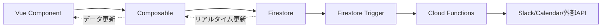

# 完全機能実装仕様書 - Vue Migration

## 📋 目次

1. [キャスティング状況ページ](#1-キャスティング状況ページ)
2. [ステータス更新機能](#2-ステータス更新機能)
3. [管理画面（撮影連絡DB）](#3-管理画面撮影連絡db)
4. [メールテンプレート作成](#4-メールテンプレート作成)
5. [Slack通知連携](#5-slack通知連携)
6. [Googleカレンダー連携](#6-googleカレンダー連携)
7. [権限管理](#7-権限管理)
8. [全体アーキテクチャ](#8-全体アーキテクチャ)

---

## 1. キャスティング状況ページ

### 1.1 概要
**現行:** `renderCastingStatusView()` (index.html: 1145-1400行)  
**目的:** 月ごとのキャスティング状況を案件・キャスト別に表示

### 1.2 Vue実装設計

#### ページ構成
```
CastingStatusView.vue
├── CastingStatusHeader.vue (月切り替え、タブ切り替え、フィルター)
├── CastingStatusTable.vue (メインテーブル)
│   └── CastingStatusRow.vue (各キャスト行)
│       ├── CastInfoCell.vue
│       ├── ProjectStatusCell.vue (複数案件のステータス表示)
│       └── StatusChangeButton.vue
└── StatusChangeDialog.vue (ステータス変更ダイアログ)
```

#### 状態管理 (Pinia Store)
```typescript
// stores/castingStatusStore.ts
export const useCastingStatusStore = defineStore('castingStatus', {
  state: () => ({
    currentMonth: new Date(),
    currentTab: 'casting' as 'casting' | 'special',
    showPast: false,
    showOrderWaitOnly: false,
    castings: [] as Casting[]
  }),
  
  actions: {
    async loadCastings() {
      const startOfMonth = startOfMonth(this.currentMonth);
      const endOfMonth = endOfMonth(this.currentMonth);
      
      const q = query(
        collection(db, 'castings'),
        where('startDate', '>=', Timestamp.fromDate(startOfMonth)),
        where('startDate', '<=', Timestamp.fromDate(endOfMonth)),
        orderBy('startDate', 'asc')
      );
      
      const snapshot = await getDocs(q);
      this.castings = snapshot.docs.map(doc => ({
        id: doc.id,
        ...doc.data()
      } as Casting));
    },
    
    nextMonth() {
      this.currentMonth = addMonths(this.currentMonth, 1);
      this.loadCastings();
    },
    
    prevMonth() {
      this.currentMonth = subMonths(this.currentMonth, 1);
      this.loadCastings();
    }
  },
  
  getters: {
    groupedBycast(state) {
      // キャスト別にグループ化
      const groups = new Map<string, Casting[]>();
      state.castings.forEach(casting => {
        if (!groups.has(casting.castId)) {
          groups.set(casting.castId, []);
        }
        groups.get(casting.castId)!.push(casting);
      });
      return groups;
    },
    
    filteredCastings(state) {
      let result = state.castings;
      
      // 過去フィルター
      if (!state.showPast) {
        const today = new Date();
        result = result.filter(c => c.startDate.toDate() >= today);
      }
      
      // オーダー待ちフィルター
      if (state.showOrderWaitOnly) {
        result = result.filter(c => c.status === 'オーダー待ち');
      }
      
      // タブフィルター
      result = result.filter(c => {
        if (state.currentTab === 'casting') {
          return c.castType === '外部' || c.castType === '内部';
        } else {
          return c.castType === '外部' || c.castType === '社内イベント';
        }
      });
      
      return result;
    }
  }
});
```

#### UI実装
```vue
<!-- CastingStatusView.vue -->
<template>
  <div class="casting-status-view">
    <!-- ヘッダー -->
    <CastingStatusHeader />
    
    <!-- テーブル -->
    <div class="overflow-x-auto">
      <table class="min-w-full bg-white border">
        <thead>
          <tr class="bg-gray-100">
            <th class="sticky left-0 bg-gray-100 z-10 px-4 py-2">キャスト</th>
            <th v-for="date in monthDates" :key="date" class="px-2 py-2">
              {{ formatDate(date) }}
            </th>
          </tr>
        </thead>
        <tbody>
          <CastingStatusRow 
            v-for="[castId, castings] in groupedData" 
            :key="castId"
            :cast-id="castId"
            :castings="castings"
            :dates="monthDates"
          />
        </tbody>
      </table>
    </div>
  </div>
</template>

<script setup lang="ts">
import { computed, onMounted } from 'vue';
import { useCastingStatusStore } from '@/stores/castingStatusStore';
import { startOfMonth, endOfMonth, eachDayOfInterval } from 'date-fns';

const store = useCastingStatusStore();

const monthDates = computed(() => {
  return eachDayOfInterval({
    start: startOfMonth(store.currentMonth),
    end: endOfMonth(store.currentMonth)
  });
});

const groupedData = computed(() => store.groupedBycast);

onMounted(() => {
  store.loadCastings();
});
</script>
```

---

## 2. ステータス更新機能

### 2.1 現行の挙動
**関数:** `changeCastingStatus()` (index.html: 1487-1648行)

**処理フロー:**
1. 管理者権限チェック
2. Sheets APIで行番号検索
3. ステータス・金額を更新
4. カレンダー連携更新
5. Slack通知送信
6. 「決定/OK」の場合: 撮影連絡DBに追加（外部キャストのみ、重複防止）

### 2.2 Vue実装

#### Composable
```typescript
// composables/useCastingStatus.ts
export function useCastingStatus() {
  const { isAdmin } = useAuth();
  const toast = useToast();
  
  const updateCastingStatus = async (
    castingId: string,
    newStatus: CastingStatus,
    options?: { cost?: number, extraMessage?: string }
  ) => {
    // 1. 権限チェック
    if (!isAdmin.value) {
      toast.add({
        severity: 'error',
        summary: 'エラー',
        detail: '管理者のみ実行可能です'
      });
      return;
    }
    
    // 2. Firestoreを更新
    const castingRef = doc(db, 'castings', castingId);
    const updateData: Partial<Casting> = {
      status: newStatus,
      updatedAt: serverTimestamp()
    };
    
    if (options?.cost !== undefined) {
      updateData.cost = options.cost;
    }
    
    await updateDoc(castingRef, updateData);
    
    // 3. Cloud Function呼び出し（Slack通知 + カレンダー更新）
    const notifyStatusUpdate = httpsCallable(functions, 'notifyStatusUpdate');
    await notifyStatusUpdate({
      castingId,
      newStatus,
      cost: options?.cost,
      extraMessage: options?.extraMessage
    });
    
    // 4. 「決定/OK」の場合、Firestore Triggerが撮影連絡DBへ自動追加
    // (Cloud Functionsで実装、フロントエンドは何もしない)
    
    toast.add({
      severity: 'success',
      summary: '成功',
      detail: 'ステータスを更新しました'
    });
  };
  
  return { updateCastingStatus };
}
```

#### ダイアログコンポーネント
```vue
<!-- StatusChangeDialog.vue -->
<template>
  <Dialog 
    v-model:visible="visible" 
    header="ステータス変更"
    :style="{ width: '450px' }"
    modal
  >
    <div class="flex flex-col gap-4">
      <!-- ステータス選択 -->
      <div>
        <label class="block mb-2 font-medium">新しいステータス</label>
        <Dropdown 
          v-model="selectedStatus"
          :options="statusOptions"
          class="w-full"
        />
      </div>
      
      <!-- 金額入力 (決定/OKの場合) -->
      <div v-if="showCostInput">
        <label class="block mb-2 font-medium">金額（税別）</label>
        <InputNumber 
          v-model="cost"
          mode="currency"
          currency="JPY"
          locale="ja-JP"
          class="w-full"
        />
      </div>
      
      <!-- 追加メッセージ -->
      <div>
        <label class="block mb-2 font-medium">追加メッセージ（任意）</label>
        <Textarea 
          v-model="extraMessage"
          rows="3"
          class="w-full"
          placeholder="Slackに追加で送信するメッセージ"
        />
      </div>
    </div>
    
    <template #footer>
      <Button label="キャンセル" severity="secondary" @click="visible = false" />
      <Button label="更新" @click="handleUpdate" />
    </template>
  </Dialog>
</template>

<script setup lang="ts">
import { ref, computed } from 'vue';
import { useCastingStatus } from '@/composables/useCastingStatus';

const props = defineProps<{
  castingId: string
}>();

const emit = defineEmits<{
  updated: []
}>();

const visible = defineModel<boolean>('visible');
const { updateCastingStatus } = useCastingStatus();

const statusOptions = ['仮押さえ', '打診中', 'オーダー待ち', 'OK', '決定', 'NG', 'キャンセル'];
const selectedStatus = ref('仮押さえ');
const cost = ref<number | null>(null);
const extraMessage = ref('');

const showCostInput = computed(() => 
  ['OK', '決定'].includes(selectedStatus.value)
);

const handleUpdate = async () => {
  await updateCastingStatus(props.castingId, selectedStatus.value, {
    cost: cost.value ?? undefined,
    extraMessage: extraMessage.value
  });
  
  emit('updated');
  visible.value = false;
};
</script>
```

---

## 3. 管理画面（撮影連絡DB）

### 3.1 概要
**現行:** `showShootContactPage()` (index.html: 3086-3500行)  
**目的:** 撮影確定後の進行管理（香盤連絡、発注書送信、メイキング共有、投稿日連絡）

### 3.2 Vue実装

#### ページ構成
```
ManagementView.vue
├── ShootingContactTabs.vue (香盤連絡待ち、発注書送信待ち等のタブ)
├── ShootingContactAccordion.vue (日付・案件別アコーディオン)
│   └── ShootingContactTable.vue (案件ごとのテーブル)
│       └── ShootingContactRow.vue (キャスト行)
│           ├── EditableTimeInput.vue (IN/OUT時間)
│           ├── EditableLocationInput.vue (場所)
│           ├── EditableCostInput.vue (金額)
│           └── EmailButton.vue (メール作成ボタン)
└── ShootMailDialog.vue (メール作成ダイアログ)
```

#### Store
```typescript
// stores/shootingContactStore.ts
export const useShootingContactStore = defineStore('shootingContact', {
  state: () => ({
    currentTab: '香盤連絡待ち' as ShootingContactTab,
    contacts: [] as ShootingContact[]
  }),
  
  actions: {
    async loadContacts() {
      // Firestoreから撮影連絡DBを取得
      const q = query(
        collection(db, 'shootingContacts'),
        where('status', '==', this.currentTab),
        orderBy('shootDate', 'asc')
      );
      
      const snapshot = await getDocs(q);
      this.contacts = snapshot.docs.map(doc => ({
        id: doc.id,
        ...doc.data()
      } as ShootingContact));
    },
    
    async updateContact(id: string, updates: Partial<ShootingContact>) {
      await updateDoc(doc(db, 'shootingContacts', id), {
        ...updates,
        updatedAt: serverTimestamp()
      });
      
      // ローカル状態も更新
      const index = this.contacts.findIndex(c => c.id === id);
      if (index !== -1) {
        Object.assign(this.contacts[index], updates);
      }
    }
  },
  
  getters: {
    groupedByDate(state) {
      const groups = new Map<string, ShootingContact[]>();
      state.contacts.forEach(contact => {
        const dateKey = formatDate(contact.shootDate.toDate(), 'yyyy-MM-dd');
        if (!groups.has(dateKey)) {
          groups.set(dateKey, []);
        }
        groups.get(dateKey)!.push(contact);
      });
      return groups;
    }
  }
});
```

#### 編集可能なインプットコンポーネント
```vue
<!-- EditableTimeInput.vue -->
<template>
  <input 
    v-model="localValue"
    type="text"
    :placeholder="placeholder"
    class="border rounded px-1 py-0.5 text-xs w-full bg-gray-50 focus:bg-white focus:ring-1 focus:ring-blue-300"
    @blur="handleBlur"
  />
</template>

<script setup lang="ts">
import { ref, watch } from 'vue';

const props = defineProps<{
  modelValue: string
  placeholder?: string
}>();

const emit = defineEmits<{
  'update:modelValue': [value: string]
  'blur': [value: string]
}>();

const localValue = ref(props.modelValue);

watch(() => props.modelValue, (newVal) => {
  localValue.value = newVal;
});

const handleBlur = () => {
  emit('update:modelValue', localValue.value);
  emit('blur', localValue.value);
};
</script>
```

---

## 4. メールテンプレート作成

### 4.1 現行の挙動
**関数:** `openShootMailModal()` (index.html: 3500-3700行)  
**目的:** 撮影情報を元にメールテンプレートを自動生成

### 4.2 Vue実装

#### Composable
```typescript
// composables/useEmailTemplate.ts
export function useEmailTemplate() {
  const generateShootingEmail = (contact: ShootingContact) => {
    const subject = `【撮影依頼】${contact.projectName} / ${contact.roleName}`;
    
    const body = `
${contact.castName} 様

お世話になっております。
下記の撮影についてご依頼です。

■ 案件名
${contact.accountName} / ${contact.projectName}

■ 役名
${contact.roleName}

■ 撮影日時
${formatDate(contact.shootDate.toDate(), 'yyyy年MM月dd日')}
IN: ${contact.inTime || '未定'}
OUT: ${contact.outTime || '未定'}

■ 場所
${contact.location || '未定'}
${contact.address || ''}

■ 報酬
${contact.cost ? `¥${contact.cost.toLocaleString()}（税別）` : '未定'}

■ メイキングURL
${contact.makingUrl || '後日共有'}

ご確認の上、ご返信をお待ちしております。

よろしくお願いいたします。
    `.trim();
    
    return { subject, body };
  };
  
  const copyToClipboard = async (text: string) => {
    try {
      await navigator.clipboard.writeText(text);
      return true;
    } catch (e) {
      console.error('Failed to copy:', e);
      return false;
    }
  };
  
  return { generateShootingEmail, copyToClipboard };
}
```

#### UI実装
```vue
<!-- ShootMailDialog.vue -->
<template>
  <Dialog 
    v-model:visible="visible"
    header="メール作成"
    :style="{ width: '700px' }"
    modal
  >
    <div class="flex flex-col gap-4">
      <!-- 件名 -->
      <div>
        <label class="block mb-2 font-bold">件名</label>
        <InputText v-model="emailData.subject" class="w-full" />
      </div>
      
      <!-- 本文 -->
      <div>
        <label class="block mb-2 font-bold">本文</label>
        <Textarea 
          v-model="emailData.body"
          rows="20"
          class="w-full font-mono text-sm"
        />
      </div>
    </div>
    
    <template #footer>
      <Button 
        label="クリップボードにコピー" 
        icon="pi pi-copy"
        @click="handleCopy"
      />
      <Button 
        label="mailto: で開く" 
        icon="pi pi-envelope"
        @click="handleMailto"
      />
    </template>
  </Dialog>
</template>

<script setup lang="ts">
import { ref, watch } from 'vue';
import { useEmailTemplate } from '@/composables/useEmailTemplate';
import { useToast } from 'primevue/usetoast';

const props = defineProps<{
  contact: ShootingContact | null
}>();

const visible = defineModel<boolean>('visible');
const { generateShootingEmail, copyToClipboard } = useEmailTemplate();
const toast = useToast();

const emailData = ref({ subject: '', body: '' });

watch(() => props.contact, (contact) => {
  if (contact) {
    emailData.value = generateShootingEmail(contact);
  }
}, { immediate: true });

const handleCopy = async () => {
  const success = await copyToClipboard(
    `件名: ${emailData.value.subject}\n\n${emailData.value.body}`
  );
  
  if (success) {
    toast.add({
      severity: 'success',
      summary: '成功',
      detail: 'クリップボードにコピーしました'
    });
  }
};

const handleMailto = () => {
  const mailtoLink = `mailto:${props.contact?.email}?subject=${encodeURIComponent(emailData.value.subject)}&body=${encodeURIComponent(emailData.value.body)}`;
  window.location.href = mailtoLink;
};
</script>
```

---

## 5. Slack通知連携

### 5.1 Cloud Functions実装

全てのSlack通知はCloud Functionsで実装します。

```typescript
// functions/src/slack/notifications.ts
import * as functions from 'firebase-functions';
import { WebClient } from '@slack/web-api';
import * as admin from 'firebase-admin';

const slack = new WebClient(process.env.SLACK_BOT_TOKEN);

/**
 * ステータス更新時のSlack通知
 */
export const notifyStatusUpdate = functions
  .region('asia-northeast1')
  .https.onCall(async (data, context) => {
    if (!context.auth) {
      throw new functions.https.HttpsError('unauthenticated', 'Not authenticated');
    }
    
    const { castingId, newStatus, extraMessage } = data;
    
    // Castingドキュメントを取得
    const castingDoc = await admin.firestore()
      .collection('castings')
      .doc(castingId)
      .get();
      
    if (!castingDoc.exists) {
      throw new functions.https.HttpsError('not-found', 'Casting not found');
    }
    
    const casting = castingDoc.data();
    
    // Slack通知
    if (casting.slackThreadTs) {
      let text = `ステータスが *${newStatus}* に変更されました。`;
      if (extraMessage) {
        text += `\n\n${extraMessage}`;
      }
      
      await slack.chat.postMessage({
        channel: process.env.SLACK_DEFAULT_CHANNEL!,
        thread_ts: casting.slackThreadTs,
        text
      });
    }
    
    // カレンダー更新
    if (newStatus === 'NG' && casting.calendarEventId) {
      const deleteCalendarEvent = functions.httpsCallable('deleteCalendarEvent');
      await deleteCalendarEvent({ eventId: casting.calendarEventId });
      
      await castingDoc.ref.update({ calendarEventId: '' });
    }
    
    return { ok: true };
  });
```

---

## 6. Googleカレンダー連携

### 6.1 Cloud Functions実装

```typescript
// functions/src/calendar/events.ts
import * as functions from 'firebase-functions';
import { google } from 'googleapis';

const auth = new google.auth.GoogleAuth({
  scopes: ['https://www.googleapis.com/auth/calendar']
});

const calendar = google.calendar({ version: 'v3', auth });

export const deleteCalendarEvent = functions
  .region('asia-northeast1')
  .https.onCall(async (data, context) => {
    const { eventId } = data;
    const CALENDAR_ID = process.env.CALENDAR_ID_INTERNAL_HOLD;
    
    try {
      await calendar.events.delete({
        calendarId: CALENDAR_ID,
        eventId
      });
    } catch (e: any) {
      if (e.code !== 404) throw e;
    }
    
    return { success: true };
  });

export const updateCalendarEvent = functions
  .region('asia-northeast1')
  .https.onCall(async (data, context) => {
    const { eventId, summary, description, start, end } = data;
    const CALENDAR_ID = process.env.CALENDAR_ID_INTERNAL_HOLD;
    
    await calendar.events.update({
      calendarId: CALENDAR_ID,
      eventId,
      requestBody: {
        summary,
        description,
        start,
        end
      }
    });
    
    return { success: true };
  });
```

---

## 7. 権限管理

### 7.1 Firebase Authentication + Custom Claims

#### Cloud Functions (管理者権限設定)
```typescript
// functions/src/admin/setUserRole.ts
export const setUserRole = functions
  .region('asia-northeast1')
  .https.onCall(async (data, context) => {
    // 実行者が既存の管理者かチェック
    if (!context.auth?.token.admin) {
      throw new functions.https.HttpsError('permission-denied', 'Admin only');
    }
    
    const { uid, role } = data;
    
    await admin.auth().setCustomUserClaims(uid, { 
      role,
      admin: role === 'admin'
    });
    
    return { success: true };
  });
```

#### Vue側での権限チェック
```typescript
// composables/useAuth.ts
export function useAuth() {
  const user = ref<User | null>(null);
  const isAdmin = ref(false);
  
  onAuthStateChanged(auth, async (newUser) => {
    user.value = newUser;
    
    if (newUser) {
      const tokenResult = await newUser.getIdTokenResult();
      isAdmin.value = tokenResult.claims.admin === true;
    } else {
      isAdmin.value = false;
    }
  });
  
  return { user, isAdmin };
}
```

---

## 8. 全体アーキテクチャ

### 8.1 責任分離

| レイヤー | 技術 | 責任 |
|---|---|---|
| **表示** | Vue Components | UI表示、ユーザー入力受付 |
| **状態管理** | Pinia Stores | クライアント側の状態管理 |
| **データ取得** | Composables | Firestoreクエリ、リアルタイムリスナー |
| **ビジネスロジック** | Cloud Functions | Slack通知、カレンダー連携、権限チェック |
| **データ永続化** | Firestore | 全データの保存先 |
| **トリガー** | Firestore Triggers | 自動処理（撮影連絡DB追加など） |

### 8.2 データフロー図



---

## 📝 実装チェックリスト

### キャスティング状況ページ
- [ ] 月次切り替え機能
- [ ] タブ切り替え（キャスティング/特別）
- [ ] 過去表示フィルター
- [ ] オーダー待ちフィルター
- [ ] キャスト別グループ表示
- [ ] 日付横スクロール
- [ ] ステータス変更ダイアログ

### ステータス更新
- [ ] 権限チェック
- [ ] Firestore更新
- [ ] Slack通知（Cloud Function）
- [ ] カレンダー更新（NG時削除）
- [ ] 撮影連絡DB自動追加（Trigger）

### 管理画面
- [ ] タブ切り替え（5種類）
- [ ] 日付別アコーディオン
- [ ] 案件別アコーディオン
- [ ] 編集可能な時間/場所/金額入力
- [ ] 保存ボタン
- [ ] メール作成ボタン

### メールテンプレート
- [ ] テンプレート自動生成
- [ ] 編集可能なフォーム
- [ ] クリップボードコピー
- [ ] mailto: リンク

### Slack/カレンダー
- [ ] オーダー作成時通知
- [ ] ステータス更新時通知
- [ ] カレンダー仮ホールド作成
- [ ] カレンダーイベント削除

### 権限管理
- [ ] Custom Claims設定
- [ ] 管理者専用UI表示制御
- [ ] 管理者専用機能の権限チェック
