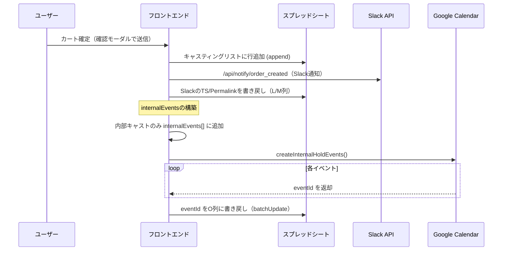
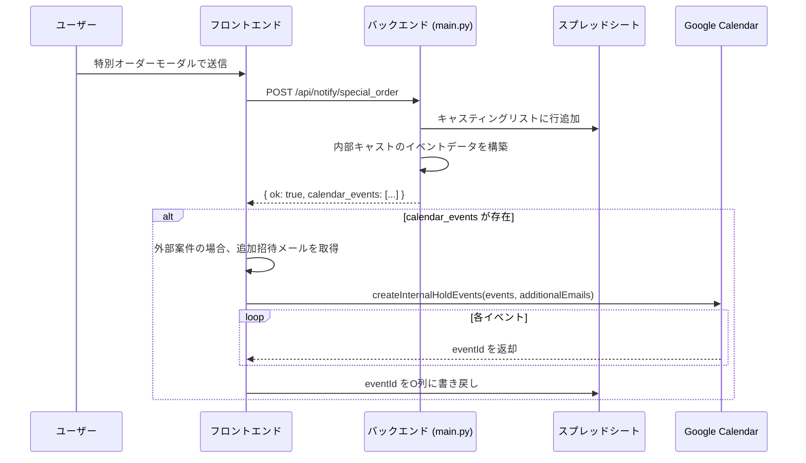
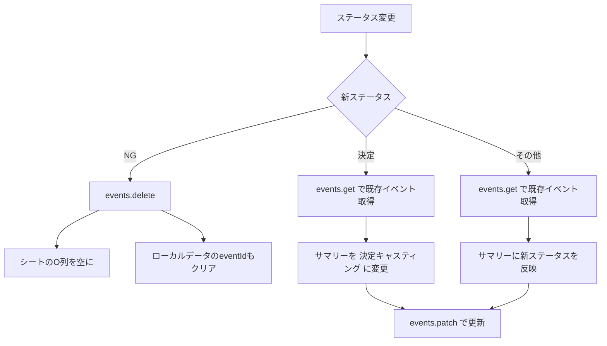
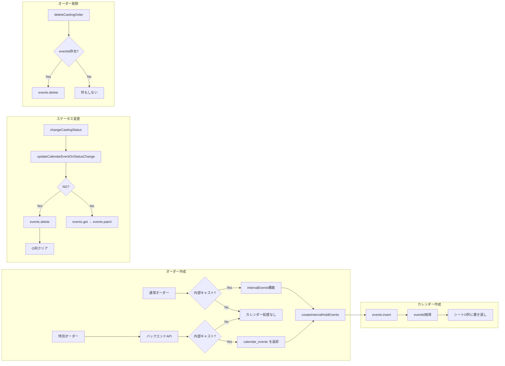

# Googleカレンダー連携仕様書

**更新日:** 2026年2月17日

---

## 📋 目次

1. [概要](#1-概要)
2. [カレンダーイベントの作成](#2-カレンダーイベントの作成)
3. [カレンダーイベントの更新](#3-カレンダーイベントの更新)
4. [カレンダーイベントの削除](#4-カレンダーイベントの削除)
5. [データフロー図](#5-データフロー図)
6. [イベント詳細仕様](#6-イベント詳細仕様)
7. [シート連携](#7-シート連携)

---

## 1. 概要

### 対象カレンダー

- **内部ホールドカレンダー** (`INTERNAL_HOLD_CALENDAR_ID`)
- `/api/config` から `calendar_id_internal_hold` として取得し、フロントエンドのグローバル変数に保存
- 環境変数 `CALENDAR_ID_INTERNAL_HOLD` で設定

### カレンダー操作の実行場所

| 操作 | 実行場所 | API |
|---|---|---|
| イベント作成 | **フロントエンド** | Google Calendar API (gapi) |
| イベント更新 | **フロントエンド** | Google Calendar API (gapi) |
| イベント削除 | **フロントエンド** | Google Calendar API (gapi) |
| イベントデータの準備（特別オーダー） | **バックエンド** | Python → JSONでフロントに返却 |

> [!IMPORTANT]
> カレンダーの実際の作成・更新・削除はすべて **フロントエンド** の `gapi.client.calendar` で実行される。バックエンドは特別オーダー時にイベントデータの準備のみ行う。

### カレンダーイベントが作成される条件

| 条件 | カレンダー作成 |
|---|---|
| 内部キャストの通常オーダー | ✅ |
| 外部キャストの通常オーダー | ❌ |
| 内部キャストの特別オーダー（社内イベント） | ✅ |
| 内部キャストの特別オーダー（外部案件） | ✅ |
| 外部キャストの特別オーダー | ❌ |

---

## 2. カレンダーイベントの作成

### 2.1 通常オーダー時の作成フロー



#### `processNewOrder()` でのイベントデータ構築

内部キャストのみ、以下の情報を含む `internalEvents` 配列を構築:

```javascript
internalEvents.push({
  castingId,          // キャスティングID
  cast: it.cast,      // キャストオブジェクト
  roleName,           // 役名
  rank: it.rank,      // 候補順位
  mainSub,            // 区分（メイン/その他）
  accountName,        // アカウント名
  projectName,        // 作品名
  start: rg.start,    // 開始日 (YYYY-MM-DD)
  end: rg.end,        // 終了日 (YYYY-MM-DD)
  email: emailForRow, // キャストのメールアドレス（招待用）
  status: statusValue,// ステータス（打診中 or 仮キャスティング）
  rowNumber: null,     // 後で埋める
});
```

### 2.2 特別オーダー時の作成フロー



#### バックエンド (`main.py`) でのデータ準備

```python
# 内部キャストの場合のみイベントデータを構築
if is_internal_cast:
    internal_events.append({
        "castingId": casting_id,
        "accountName": account_name,
        "projectName": payload.title,
        "roleName": "出演",
        "mainSub": "その他",
        "start": date,
        "end": date,
        "email": cast_email,
        "status": status,
        "time_range": time_range,  # "10:00 ~ 18:00" 形式
        "rowNumber": None
    })
```

### 2.3 `createInternalHoldEvents()` の詳細処理

**ファイル:** `index.html` L3609-3745

#### イベントのサマリー（タイトル）

```
{アカウント名}_{候補順位}候補_仮キャスティング
```

例: `チームA_1候補_仮キャスティング`

#### イベントの説明文

```
【キャスティング仮ホールド】

・アカウント: {アカウント名}
・作品名: {作品名}
・役名: {役名}
・区分: {区分}
・キャスティングID: {castingId}
・ステータス: {ステータス}

この予定はキャスティング管理システムから自動作成されています。
ステータス変更時にはシステム側で更新される場合があります。
```

#### 時間指定の分岐

| 条件 | イベント種別 | 実装 |
|---|---|---|
| `time_range` に `~` が含まれる | **時間指定イベント** | `start.dateTime` / `end.dateTime` を使用 (ISO 8601 + JST) |
| `time_range` なし or `~` なし | **終日イベント** | `start.date` / `end.date` を使用（終了日は**翌日**を指定） |

#### 出席者（attendees）

| 出席者 | 条件 |
|---|---|
| キャストのメールアドレス | `ev.email` が存在する場合 |
| 追加招待メール | `additionalEmails` 引数で渡された場合（外部案件用） |

**追加招待メールの取得元:** `外部オーダー連携メール` シートのA列

#### eventId の書き戻し

1. カレンダーAPI の `events.insert()` レスポンスから `eventId` を取得
2. `キャスティングリスト` シートのA列を検索して `castingId` → 行番号をマッピング
3. `batchUpdate` で O列に `eventId` を書き込み

---

## 3. カレンダーイベントの更新

### `updateCalendarEventOnStatusChange()` の処理

**ファイル:** `index.html` L2386-2467  
**呼び出し元:** `changeCastingStatus()`

#### 前提条件

- `INTERNAL_HOLD_CALENDAR_ID` が設定されている
- `rec.calendarEventId` が存在する（O列に保存済み）

#### ステータス別の処理

| 新ステータス | 処理 | サマリー変更 | 説明文変更 |
|---|---|---|---|
| **NG** | イベント**削除** | — | — |
| **決定** | イベント更新 | `{アカウント名}_決定キャスティング` | ステータス行を `決定` に差し替え |
| **その他** | イベント更新 | `{アカウント名}_{候補順位}候補_{新ステータス}` | ステータス行を新ステータスに差し替え |

#### 更新処理の詳細



#### サマリーの具体例

| ステータス遷移 | サマリー変化 |
|---|---|
| 仮キャスティング → 打診中 | `チームA_1候補_仮キャスティング` → `チームA_1候補_打診中` |
| 打診中 → 決定 | `チームA_1候補_打診中` → `チームA_決定キャスティング` |
| 打診中 → 条件つきOK | `チームA_1候補_打診中` → `チームA_1候補_条件つきOK` |
| 打診中 → NG | イベント削除 |

#### 説明文のステータス行差し替え

正規表現 `/・ステータス: .*/` を使い、既存の「・ステータス:」行を新ステータスに差し替え。該当行がない場合は末尾に追加。

---

## 4. カレンダーイベントの削除

### 削除が発生する2つのケース

#### ケース1: ステータスを「NG」に変更

**呼び出し元:** `changeCastingStatus()` → `updateCalendarEventOnStatusChange(rec, 'NG', targetRow)`

処理:
1. `gapi.client.calendar.events.delete()` でカレンダーイベント削除
2. シートのO列（`calendarEventId`）を空に更新
3. ローカルデータの `calendarEventId` もクリア

#### ケース2: オーダー削除

**呼び出し元:** `deleteCastingOrder()`

処理:
1. バックエンドAPI `/api/order/delete` を呼び出し（Slack通知 + シート行削除）
2. `rec.calendarEventId` と `INTERNAL_HOLD_CALENDAR_ID` が両方存在する場合、カレンダーイベントを削除
3. ローカルデータのステータスを `削除済み` に設定

#### エラーハンドリング

| エラー | 対応 |
|---|---|
| 404 (Not Found) | **無視**（すでに手動削除されている可能性） |
| その他のエラー | コンソールにエラーログ出力。UIの処理は**継続** |

---

## 5. データフロー図

### 全体のカレンダー連携フロー



---

## 6. イベント詳細仕様

### イベントリソースの構造

#### 時間指定イベント

```json
{
  "summary": "チームA_1候補_仮キャスティング",
  "description": "【キャスティング仮ホールド】\n\n・アカウント: チームA\n...",
  "start": {
    "dateTime": "2025-01-15T10:00:00+09:00",
    "timeZone": "Asia/Tokyo"
  },
  "end": {
    "dateTime": "2025-01-15T18:00:00+09:00",
    "timeZone": "Asia/Tokyo"
  },
  "attendees": [
    { "email": "cast@example.com" },
    { "email": "team@example.com" }
  ]
}
```

#### 終日イベント

```json
{
  "summary": "チームA_1候補_仮キャスティング",
  "description": "【キャスティング仮ホールド】\n\n・アカウント: チームA\n...",
  "start": { "date": "2025-01-15" },
  "end": { "date": "2025-01-16" }
}
```

> [!NOTE]
> Google Calendar API の仕様により、終日イベントの `end.date` は **翌日** を指定する必要がある（排他的終了日）。

### サマリーの命名規則

| ケース | フォーマット |
|---|---|
| 新規作成時 | `{アカウント名}_{候補順位}候補_仮キャスティング` |
| ステータス更新時（決定以外） | `{アカウント名}_{候補順位}候補_{新ステータス}` |
| 決定時 | `{アカウント名}_決定キャスティング` |

---

## 7. シート連携

### カレンダー関連の列

| 列 | 名前 | 用途 |
|---|---|---|
| **O列** | calendarEventId | Google Calendar のイベントID保存先 |

### eventId の書き戻しロジック

`createInternalHoldEvents()` 内での手順:

1. カレンダーイベントを作成し、レスポンスから `eventId` を取得
2. `castingId` と `eventId` のペアを `calUpdates[]` に蓄積
3. シートのA列を読み取り、`castingId` → 行番号のマップを構築
4. `batchUpdate` で全 `eventId` をO列に一括書き込み

```javascript
// 行番号マッピング
const sheetRes = await gapi.client.sheets.spreadsheets.values.get({
  spreadsheetId: SPREADSHEET_ID,
  range: 'キャスティングリスト!A2:A'
});
// castingId → 行番号のMap作成
const castingIdToRow = new Map();
for (let i = 0; i < aColValues.length; i++) {
  castingIdToRow.set(aColValues[i][0], i + 2);
}
// batchUpdateでO列に書き込み
```

### 外部オーダー連携メール

| シート名 | 列 | 用途 |
|---|---|---|
| `外部オーダー連携メール` | A列 | カレンダーイベントの追加招待者メールアドレス |

- 特別オーダー（外部案件）の場合にのみ使用
- `getExternalOrderEmails()` で取得し、`createInternalHoldEvents()` に `additionalEmails` として渡す

---

## 関連コード参照

| 関数名 | ファイル | 行番号 | 役割 |
|---|---|---|---|
| [createInternalHoldEvents](file:///Users/mk0012/Desktop/casting-management-system-v1/templates/index.html#L3609-L3745) | index.html | L3609-3745 | カレンダーイベント作成 + Sheet書き戻し |
| [updateCalendarEventOnStatusChange](file:///Users/mk0012/Desktop/casting-management-system-v1/templates/index.html#L2386-L2467) | index.html | L2386-2467 | ステータス変更時の更新/削除 |
| [changeCastingStatus](file:///Users/mk0012/Desktop/casting-management-system-v1/templates/index.html#L1859-L2113) | index.html | L1859-2113 | ステータス変更（カレンダー更新を呼び出し） |
| [deleteCastingOrder](file:///Users/mk0012/Desktop/casting-management-system-v1/templates/index.html#L2536-L2589) | index.html | L2536-2589 | オーダー削除（カレンダー削除を含む） |
| [processNewOrder](file:///Users/mk0012/Desktop/casting-management-system-v1/templates/index.html#L3270-L3590) | index.html | L3270-3590 | 通常オーダー処理（internalEvents構築） |
| [getExternalOrderEmails](file:///Users/mk0012/Desktop/casting-management-system-v1/templates/index.html#L3593-L3607) | index.html | L3593-3607 | 追加招待メール取得 |
| [notify_special_order](file:///Users/mk0012/Desktop/casting-management-system-v1/main.py#L583-L776) | main.py | L583-776 | 特別オーダーAPI（calendar_events準備） |
