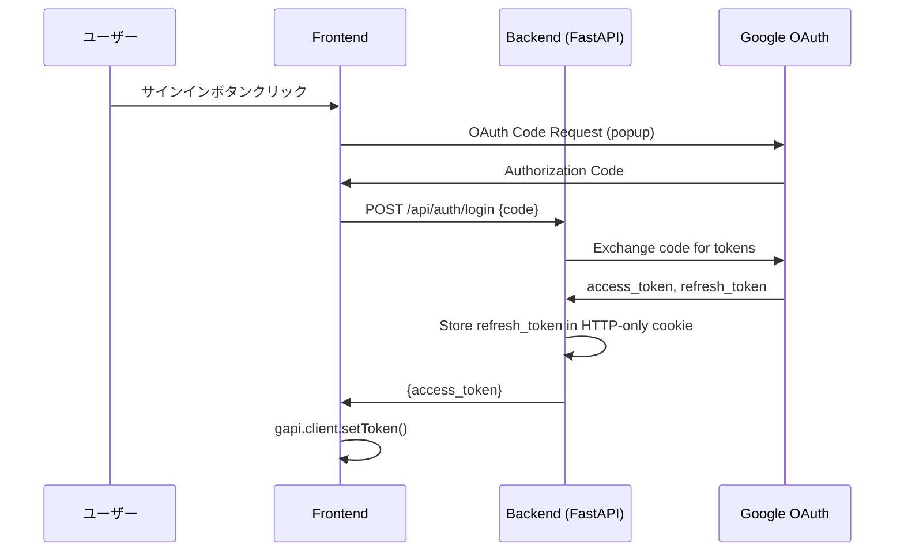

# キャスト管理システム - 完全仕様書
## Vue移行比較用リファレンス

> **作成日**: 2026-01-29  
> **目的**: 全ての挙動・デザイン・データフローを文書化し、Vue + Firestoreでの再実装時の比較対象とする

---

## 📋 目次

1. [システム概要](#1-システム概要)
2. [認証・権限](#2-認証権限)
3. [データ構造](#3-データ構造)
4. [画面別仕様](#4-画面別仕様)
5. [モーダル仕様](#5-モーダル仕様)
6. [API・外部連携](#6-api外部連携)
7. [デザイントークン](#7-デザイントークン)
8. [ビジネスロジック](#8-ビジネスロジック)
9. [Vue実装チェックリスト](#9-vue実装チェックリスト)

---

## 1. システム概要

### 1.1 アプリケーション情報

| 項目 | 現行値 |
|------|--------|
| **名称** | キャスト管理システム v1.4 |
| **用途** | キャスティング管理・オーダー・撮影連絡管理 |
| **技術スタック** | HTML/CSS/JS (Tailwind CSS) + Python FastAPI + Google Sheets |
| **認証** | Google OAuth 2.0 (Code Flow) |
| **データベース** | Google Spreadsheet (6シート) |

### 1.2 画面構成

```
┌─────────────────────────────────────────────────────────────┐
│ Header (sticky)                                             │
├─────────────────────────────────────────────────────────────┤
│ ┌─────────────┬─────────────────────┬─────────────────────┐ │
│ │casting-view │   status-view       │  management-view    │ │
│ │(キャストを探す)│(キャスティング状況) │  (管理画面)         │ │
│ └─────────────┴─────────────────────┴─────────────────────┘ │
└─────────────────────────────────────────────────────────────┘
```

---

## 2. 認証・権限

### 2.1 認証フロー



### 2.2 権限レベル

| 権限 | シート定義 | 操作可能範囲 |
|------|-----------|-------------|
| **Admin** | 権限管理リスト!B = 'admin' | 全操作 (ステータス変更、削除、編集) |
| **Viewer** | その他 | 閲覧、仮キャスティング追加のみ |

### 2.3 Vue実装時の対応

| 現行機能 | Vue実装 |
|---------|---------|
| `isAdmin` グローバル変数 | `useAuth().isAdmin` (computed) |
| `maybeCheckSession()` | `onAuthStateChanged` リスナー |
| Cookie保存のrefresh_token | Firebase Auth の永続セッション |
| 権限管理リストシート | Firestore `users` コレクション or Custom Claims |

---

## 3. データ構造

### 3.1 キャストリスト (casts)

| 列 | フィールド名 | 型 | 説明 | Vue Store Property |
|----|-------------|-----|------|-------------------|
| A | castId | string | 一意ID | `casts[].id` |
| B | name | string | キャスト名 | `casts[].name` |
| C | gender | string | '男性' / '女性' | `casts[].gender` |
| D | dateOfBirth | string | 生年月日 (YYYY-MM-DD) | `casts[].dateOfBirth` |
| E | agency | string | 事務所名 ('フリー' default) | `casts[].agency` |
| F | imageUrl | string | プロフィール画像URL | `casts[].imageUrl` |
| G | appearanceCount | number | 出演回数 | `casts[].appearanceCount` |
| H | email | string | メールアドレス | `casts[].email` |
| I | notes | string | 備考 | `casts[].notes` |
| J | castType | string | '内部' / '外部' | `casts[].castType` |
| K | slackMentionId | string | SlackメンションID | `casts[].slackMentionId` |
| L | snsX | string | X (Twitter) URL | `casts[].snsX` |
| M | snsInsta | string | Instagram URL | `casts[].snsInsta` |
| N | snsTiktok | string | TikTok URL | `casts[].snsTiktok` |
| **O** | **furigana** | **string** | **ふりがな** | `casts[].furigana` |

### 3.2 キャスティングリスト (castings)

| 列 | フィールド名 | 型 | 説明 |
|----|-------------|-----|------|
| A | castingId | string | 一意ID |
| B | accountName | string | チーム/アカウント名 |
| C | projectName | string | 作品名 |
| D | roleName | string | 役名 |
| E | castId | string | キャストID (FK) |
| F | castName | string | キャスト名 (非正規化) |
| G | startDate | string | 開始日 |
| H | endDate | string | 終了日 |
| I | rank | string | ランク (1st, 2nd等) |
| J | status | string | ステータス (後述) |
| K | note | string | ノート/時間帯 |
| L | slackThreadTs | string | SlackスレッドTS |
| M | slackPermalink | string | Slackパーマリンク |
| N | mainSub | string | 'メイン' / 'サブ' / 'その他' |
| O | calendarEventId | string | GoogleカレンダーイベントID |
| P | projectId | string | Notion Page ID |
| Q | lastUpdated | string | 最終更新日時 |
| R | updatedBy | string | 更新者 |
| S | castPriority | number | 同一キャストの優先順位 |
| T | castType | string | '内部' / '外部' |
| U | email | string | メール (非正規化) |
| V | cost | number | 金額 (税別) |
| W | structureData | JSON | カート構造データ |
| X | dbSentStatus | string | 撮影連絡DB送信済み判定 |

### 3.3 ステータス定義

| ステータス | 用途 | 次の遷移先 |
|-----------|------|-----------|
| `仮キャスティング` | 初期状態 | 仮押さえ, オーダー待ち |
| `仮押さえ` | カレンダー登録済み | 打診中, オーダー待ち |
| `オーダー待ち` | オーダー送信待ち | 打診中 |
| `オーダー待ち（仮キャスティング）` | 仮キャス+オーダー待ち | 打診中 |
| `打診中` | オーダー送信済み | OK, NG, 条件つきOK |
| `OK` | 事務所了承 | 決定 |
| `条件つきOK` | 条件付き了承 | 決定, NG |
| `決定` | 確定 | - |
| `NG` | 不可 | - |
| `キャンセル` | キャンセル | - |

---

## 4. 画面別仕様

### 4.1 ヘッダー

#### レイアウト
```
┌─────────────────────────────────────────────────────────────────────────┐
│ キャスト管理システム ✨   [キャストを探す][キャスティング状況][管理画面]  👤(0) サインイン │
└─────────────────────────────────────────────────────────────────────────┘
```

#### 要素詳細

| 要素 | ID | 挙動 |
|------|-----|------|
| ロゴ | - | 装飾のみ（リンクなし） |
| ナビタブ | `nav-casting`, `nav-status`, `nav-management` | クリックで`switchView()` |
| カートアイコン | `nav-cart` | クリックで`renderCartModal()` |
| カート件数 | `cart-count` | `Object.keys(cart).length` |
| サインイン | `authorize_button` | `handleAuthClick()` |
| サインアウト | `signout_button` | `handleSignoutClick()` |
| ユーザー名 | `user-name` | `currentUser.name` |

#### モバイル対応
- `md:hidden` でハンバーガーメニュー表示
- クリックで`#mobile-menu`をトグル

#### Vue実装

```vue
<!-- AppHeader.vue -->
<template>
  <header class="bg-white shadow-md sticky top-0 z-40">
    <nav class="container mx-auto px-4 py-3">
      <div class="flex justify-between items-center">
        <h1>キャスト管理システム ✨</h1>
        
        <!-- Desktop Nav -->
        <div class="hidden md:flex space-x-4">
          <router-link to="/casting" active-class="border-b-2 border-blue-600">
            キャストを探す
          </router-link>
          <router-link to="/status">キャスティング状況</router-link>
          <router-link to="/management">管理画面</router-link>
        </div>
        
        <!-- Cart & Auth -->
        <div class="flex items-center space-x-4">
          <CartButton />
          <AuthButton />
        </div>
      </div>
    </nav>
  </header>
</template>
```

---

### 4.2 キャスティング画面 (`casting-view`)

#### 画面レイアウト

```
┌─────────────────────────────────────────────────────────────────────────┐
│ ┌───────────────────┐  ┌──────────────────────────────────────────────┐│
│ │                   │  │ 3. キャストを選択              [3列][5列]  ││
│ │  1. 日付を選択    │  ├──────────────────────────────────────────────┤│
│ │  [◀][2026年1月][▶]│  │ [性別] [事務所▼] [フリーワード] [未仮キャス] ││
│ │  日 月 火 水 木...│  │ [出演回数順] [50音順]                       ││
│ │  ■  2  3  4  5...│  ├──────────────────────────────────────────────┤│
│ │                   │  │ 選択中: 2026/1/15                           ││
│ │  ───────────────  │  ├──────────────────────────────────────────────┤│
│ │  2. 撮影を選択    │  │ ┌────────┐ ┌────────┐ ┌────────┐           ││
│ │  ○ 案件A (1/15)   │  │ │+新規   │ │キャスト│ │キャスト│           ││
│ │  ○ 案件B (1/15)   │  │ │外部作成│ │Card   │ │Card   │            ││
│ │                   │  │ └────────┘ └────────┘ └────────┘           ││
│ └───────────────────┘  └──────────────────────────────────────────────┘│
└─────────────────────────────────────────────────────────────────────────┘
```

#### 4.2.1 カレンダー

| 機能 | 実装 | Vue対応 |
|------|------|---------|
| 月切替 | `prev-month`, `next-month` ボタン | `v-model:currentMonth` |
| 日付選択 | クリックで`selectedDates`配列にトグル | `selectionStore.selectedDates` |
| 今日表示 | `border border-red-500` | 同様 |
| 選択済み表示 | `bg-blue-500 text-white rounded-full` | 同様 |
| 複数選択 | Shift不要、クリックで追加/削除 | 同様 |

**関連関数:**
- `renderCalendar()` - カレンダー描画
- `normalizeDateString(input)` - 日付正規化 (MM/DD, YYYY-MM-DD, シリアル対応)
- `toEpochDay(ymd)` - エポック日変換

#### 4.2.2 撮影リスト

| 機能 | 実装 |
|------|------|
| データソース | `新香盤撮影リスト!A2:G` (Notion同期) |
| 表示条件 | 選択日付に一致する撮影のみ |
| 選択 | ラジオボタン、`selectedShooting`に設定 |
| 未選択時 | 「日付を選択すると...」メッセージ |

**関連関数:**
- `renderShootingList()` - 撮影リスト描画
- `updateCartFromShooting()` - 撮影選択時のカート更新

#### 4.2.3 フィルター

| フィルター | ID | 型 | 挙動 |
|-----------|-----|-----|------|
| 性別(男性) | `filter-gender-male` | checkbox | 男性のみ表示 |
| 性別(女性) | `filter-gender-female` | checkbox | 女性のみ表示 |
| 事務所 | `agency-filter-dropdown` | multi-select | 選択事務所のみ |
| フリーワード | `filter-keyword` | text | 名前・事務所・備考・**ふりがな**を検索 |
| 未仮キャスのみ | `filter-available-only` | checkbox | 仮キャス中を除外 |
| 出演回数順 | `sort-appearance` | radio | 降順ソート |
| 50音順 | `sort-kana` | radio | 昇順ソート |

**関連関数:**
- `getFilteredCasts()` - フィルター適用
- `renderFilters()` - フィルターUI描画

#### 4.2.4 キャストカード

```
┌─────────────────────┐
│ [画像         ]  🔴 │ ← ステータスバッジ
│                     │
├─────────────────────┤
│ 名前                │
│ 事務所              │
│ 男性 / 28歳 / 5回   │
├─────────────────────┤
│ [仮キャスティング]  │ ← ボタン
│ ※別件の撮影あり    │ ← 警告（条件付き）
└─────────────────────┘
```

| ステータス | バッジ色 | ボタンテキスト | カード透明度 |
|-----------|---------|---------------|-------------|
| 空き | なし | 「仮キャスティング」 | 100% |
| 決定 | `bg-red-500` | 「仮キャスティング追加」 | 100% |
| 仮押さえ | `bg-yellow-400` | 「仮キャスティング」 | 100% |
| 撮影稼働あり | `bg-cyan-500` | 「仮キャスティング」 | 100% |
| NG | `bg-gray-600` | disabled | 50% |
| カート済み | - | disabled「追加済み」 | 50% |

**関連関数:**
- `displayAvailableCasts()` - カードグリッド描画
- `getCastStatusForDates(castId, dates)` - ステータス判定
- `handleAddToCart(castId)` - カート追加
- `openCastDetailModal(castId)` - 詳細モーダル

#### 4.2.5 ビューモード

| モード | グリッドクラス |
|--------|---------------|
| 3列 (comfort) | `grid-cols-1 md:grid-cols-2 xl:grid-cols-3` |
| 5列 (dense) | `grid-cols-2 md:grid-cols-3 xl:grid-cols-5` |

---

### 4.3 キャスティング状況画面 (`status-view`)

#### 画面レイアウト

```
┌──────────────────────────────────────────────────────────────────────────┐
│ [🎬 通常キャスティング] [🏢 外部案件・社内イベント]    ← タブ             │
├──────────────────────────────────────────────────────────────────────────┤
│ [◀] 2026年1月 [▶]   ☐オーダー待ちのみ  ☐過去を表示  [再読込]            │
├──────────────────────────────────────────────────────────────────────────┤
│ ▼ 2026/01/15 (水)                                                       │
│   ├─ TeamA                                                              │
│   │   └─ 作品名A                                                        │
│   │       ├─ キャスト1 [決定]     役名   [編集] [追加オーダー] [まとめ] │
│   │       └─ キャスト2 [打診中]   役名   [編集] [追加オーダー]          │
│   └─ TeamB                                                              │
└──────────────────────────────────────────────────────────────────────────┘
```

#### タブ仕様

| タブ | フィルター条件 |
|-----|---------------|
| 🎬 通常キャスティング | `accountName !== '外部案件' && accountName !== '社内イベント'` |
| 🏢 外部案件・社内イベント | `accountName === '外部案件' || accountName === '社内イベント'` |

#### フィルター

| フィルター | 変数 | デフォルト |
|-----------|------|-----------|
| 過去を表示 | `showPast` | `false` |
| オーダー待ちのみ | `statusOrderWaitOnly` | `false` |

#### グループ化ロジック

```javascript
// 1. 日付でグループ (昇順)
// 2. 各日付内でアカウント名でグループ
// 3. 各アカウント内で案件名でグループ
// 4. 優先度(castPriority)でソート
```

#### 行アクション

| ボタン | 条件 | 実行関数 |
|--------|------|---------|
| ステータスバッジ | クリック | `openStatusQuickModal(castingId)` |
| 行全体 | クリック | `handleCastingRowClick(castingId)` → 編集モーダル |
| [追加オーダー] | 常時 | `startAdditionalOrder(context)` |
| [まとめ] | 管理者のみ | `openCastingSummaryModal(...)` |
| [メール] | 外部タブ時 | `openExternalOrderMailModal(rec)` |

#### ステータスバッジ色

| ステータス | 背景色 | テキスト色 |
|-----------|--------|-----------|
| 仮キャスティング | `bg-gray-200` | `text-gray-700` |
| 仮押さえ | `bg-yellow-200` | `text-yellow-800` |
| 打診中 | `bg-blue-200` | `text-blue-800` |
| オーダー待ち | `bg-purple-200` | `text-purple-800` |
| OK | `bg-green-200` | `text-green-800` |
| 決定 | `bg-green-500` | `text-white` |
| 条件つきOK | `bg-orange-200` | `text-orange-800` |
| NG | `bg-red-500` | `text-white` |
| キャンセル | `bg-gray-400` | `text-white` |

---

### 4.4 撮影連絡管理画面 (`management-view`)

#### 画面レイアウト

```
┌──────────────────────────────────────────────────────────────────────────┐
│ [1.香盤連絡待ち] [2.発注書送信待ち] [3.メイキング共有待ち] [4.投稿日連絡] │
├──────────────────────────────────────────────────────────────────────────┤
│ [スケジュール同期] [CSVエクスポート]                                     │
├──────────────────────────────────────────────────────────────────────────┤
│ ▼ 2026/01/15 (水)                                                       │
│   ▼ TeamA / 作品名A                                                     │
│     ┌────────────────────────────────────────────────────────────┐      │
│     │ キャスト | 役名 | IN | OUT | 場所 | 金額 | [保存] [メール]│      │
│     └────────────────────────────────────────────────────────────┘      │
└──────────────────────────────────────────────────────────────────────────┘
```

#### タブ別仕様

| タブ | ステータス値 | 同期ボタン | 編集可能フィールド |
|-----|-------------|-----------|-------------------|
| 1. 香盤連絡待ち | `香盤連絡待ち` | スケジュール同期 | IN, OUT, 場所, 住所 |
| 2. 発注書送信待ち | `発注書送信待ち` | Notion同期 | 金額 |
| 3. メイキング共有待ち | `メイキング共有待ち` | - | メイキングURL |
| 4. 投稿日連絡待ち | `投稿日連絡待ち` | 撮影日程同期 | 投稿日 |

#### 行アクション

| ボタン | 実行関数 |
|--------|---------|
| 💾 保存 | `saveShootingRow(castingId, btn)` |
| 📧 メール | `openShootMailModal(castingId)` |
| 📄 発注書 | `openOrderDocModal(castingId)` |
| ステータス変更 | `openShootStatusModal(castingId, currentStatus)` |

---

## 5. モーダル仕様

### 5.1 カートモーダル (Step 1)

```
┌─────────────────────────────────────────────────────────────────┐
│ [×]  カート (ステップ 1/2)                                       │
├─────────────────────────────────────────────────────────────────┤
│ 撮影日: 2026/01/15〜2026/01/16                                  │
│ 撮影: 【案件A】作品名                                            │
│ Notion: [リンク]                                                 │
│                                                                  │
│ ┌─────────────────────────────────────────────────────────────┐ │
│ │ 選択したキャスト一覧（ドラッグで並び替え）                    │ │
│ │ ┌─────────────────┐                                          │ │
│ │ │ 1. 田中太郎 [×] │                                          │ │
│ │ └─────────────────┘                                          │ │
│ └─────────────────────────────────────────────────────────────┘ │
│                                                                  │
│ ┌─────────────────────────────────────────────────────────────┐ │
│ │ プロジェクト1                                          [−]  │ │
│ │ [作品名入力]                                                 │ │
│ │   役名1: [________] 種別: [メイン▼] ノート: [___]           │ │
│ │   → ドロップゾーン（キャストをここにドロップ）              │ │
│ │   [+ 役を追加]                                               │ │
│ │ [+ プロジェクトを追加]                                       │ │
│ └─────────────────────────────────────────────────────────────┘ │
│                                                                  │
│                                          [キャンセル] [次へ →]  │
└─────────────────────────────────────────────────────────────────┘
```

#### データ構造

```javascript
cartProjects = [
  {
    id: 'proj_1',
    title: '作品名A',
    roles: [
      {
        id: 'role_1',
        name: '主役',
        type: 'メイン', // 'メイン' | 'サブ' | 'その他'
        note: '',
        castIds: ['cast_1', 'cast_2']
      }
    ]
  }
]
```

#### ドラッグ&ドロップ

- **上部プール**: 未割り当てキャスト
- **役ごとのドロップゾーン**: 割り当て先
- 同じキャストを複数役に割り当て可能

### 5.2 確認モーダル (Step 2)

```
┌─────────────────────────────────────────────────────────────────┐
│ [×]  確認 (ステップ 2/2)                                         │
├─────────────────────────────────────────────────────────────────┤
│ アカウント: TeamA                                                │
│ 撮影日: 2026/01/15〜2026/01/16                                  │
│                                                                  │
│ ■ 作品名A                                                        │
│   ├─ 主役: 田中太郎 (ランク1) [メイン]                          │
│   └─ ゲスト: 山田花子 (ランク2) [サブ]                          │
│                                                                  │
│ ☐ 親密表現あり                                                   │
│                                                                  │
│ PDF添付: [ファイルを選択]  ← 複数ファイル選択可                 │
│                                                                  │
│                                  [← 戻る] [キャンセル] [送信]   │
└─────────────────────────────────────────────────────────────────┘
```

### 5.3 ステータスクイック変更モーダル

```
┌──────────────────────────────────────────────────┐
│ ステータス変更                              [×]  │
├──────────────────────────────────────────────────┤
│ TeamA / 作品名A / 田中太郎                        │
│ 現在のステータス: 打診中                          │
│                                                   │
│ 新しいステータス:                                 │
│ [仮キャスティング] [仮押さえ] [打診中]            │
│ [OK] [決定] [NG] [条件つきOK] [キャンセル]       │
│                                                   │
│ 金額（税別）: ※OK/決定選択時のみ表示             │
│ [______________] 円                              │
│                                                   │
│ メッセージ（任意）:                              │
│ [__________________________________]             │
│                                                   │
│                          [キャンセル] [変更する] │
└──────────────────────────────────────────────────┘
```

#### 金額入力表示条件

```javascript
['OK', '決定', '条件つきOK'].includes(selectedStatus)
```

### 5.4 キャスト詳細モーダル

| フィールド | 表示場所 |
|-----------|---------|
| 画像 | 上部大きく表示 (Google Drive URL対応) |
| 名前 | タイトル |
| 事務所 | サブタイトル |
| 性別 / 年齢 / 出演回数 | 詳細セクション |
| SlackID | 詳細セクション |
| キャストタイプ | 詳細セクション |
| 備考 | 詳細セクション |

### 5.5 メールモーダル

#### タブ

| タブ | テンプレート |
|-----|-------------|
| 香盤連絡 | 撮影日時・場所・IN/OUTを含む |
| 発注書送付 | 発注書添付案内 |

#### アクション

- **クリップボードにコピー**: 件名 + 本文
- **mailto:で開く**: デフォルトメーラー起動

### 5.6 PDF発注書モーダル

- jsPDF でブラウザ生成
- 日本語フォント (Noto Sans JP)
- フィールド: 発注先、対象者、撮影日、金額、備考
- 季節の挨拶自動挿入

### 5.7 プログレスモーダル

```
┌────────────────────────────────────────┐
│ 処理中...                               │
│ しばらくお待ちください                  │
│                                         │
│ [████████████████░░░░] 80%             │
└────────────────────────────────────────┘
```

#### 使用箇所

| 操作 | プログレス表示 |
|------|---------------|
| オーダー送信 | ✅ あり |
| 特別オーダー送信 | ✅ あり |
| ステータス変更 | ❌ ローダーのみ |
| データ再読込 | ❌ ローダーのみ |

---

## 6. API・外部連携

### 6.1 Backend API (FastAPI)

| エンドポイント | メソッド | 用途 |
|---------------|----------|------|
| `/api/auth/login` | POST | OAuth Code → Token交換 |
| `/api/auth/refresh` | GET | Token更新 |
| `/api/auth/logout` | POST | ログアウト |
| `/config` | GET | カレンダーID等設定取得 |
| `/api/send_order` | POST | オーダー送信 (Slack + シート) |
| `/api/special_order` | POST | 外部/社内オーダー |
| `/api/update_status` | POST | ステータス更新 |
| `/api/update_casting` | POST | キャスティング編集 |
| `/api/slack/search_thread` | POST | Slackスレッド検索 |

### 6.2 Slack連携

#### 通知タイミング

| イベント | 通知内容 |
|---------|---------|
| オーダー送信 | 新規スレッド作成、キャスト一覧 |
| ステータス変更 | スレッドに返信 |
| 追加オーダー | 既存スレッドに返信 |

#### チャンネル振り分け

| 条件 | チャンネル |
|------|-----------|
| 通常案件 | `SLACK_DEFAULT_CHANNEL` |
| 外部案件/社内イベント | `SLACK_CHANNEL_EXTERNAL` |
| 特定チーム | 設定に基づく |

### 6.3 Googleカレンダー連携

| 操作 | タイミング |
|------|-----------|
| イベント作成 | オーダー送信時 |
| イベント更新 | ステータス変更時 (タイトル更新) |
| イベント削除 | NG/キャンセル時 |

#### カレンダー種別

| カレンダー | 用途 |
|-----------|------|
| 内部仮押さえ | 内部キャストの仮押さえ |
| 外部案件 | 外部案件オーダー |

---

## 7. デザイントークン

### 7.1 カラーパレット

| 用途 | Tailwindクラス | HEX |
|------|---------------|-----|
| プライマリ | `blue-500` | #3B82F6 |
| プライマリホバー | `blue-600` | #2563EB |
| 成功 | `green-500` | #22C55E |
| 警告 | `yellow-500` | #EAB308 |
| 危険 | `red-500` | #EF4444 |
| 背景 | `gray-100` | #F3F4F6 |
| カード背景 | `white` | #FFFFFF |
| テキスト | `gray-800` | #1F2937 |
| サブテキスト | `gray-500` | #6B7280 |

### 7.2 ボタンスタイル

| 種類 | クラス |
|------|--------|
| Primary | `bg-blue-500 hover:bg-blue-600 text-white font-bold py-2 px-4 rounded-lg` |
| Secondary | `bg-gray-500 hover:bg-gray-600 text-white font-bold py-2 px-4 rounded-lg` |
| Success | `bg-green-600 hover:bg-green-700 text-white font-bold py-2 px-4 rounded` |
| Danger | `bg-red-600 hover:bg-red-700 text-white font-bold py-2 px-4 rounded` |
| Outline | `border border-gray-300 text-gray-700 hover:bg-gray-50 px-4 py-2 rounded` |
| Disabled | `bg-gray-400 cursor-not-allowed` |

### 7.3 タイポグラフィ

| 要素 | クラス |
|------|--------|
| ページタイトル | `text-3xl font-bold` |
| セクションタイトル | `text-2xl font-bold` |
| カードタイトル | `text-lg font-semibold` |
| 本文 | `text-base` |
| 小テキスト | `text-sm text-gray-500` |

### 7.4 コンポーネント

| コンポーネント | クラス |
|---------------|--------|
| カード | `bg-white rounded-lg shadow-md` |
| カードホバー | `hover:shadow-lg transition-shadow` |
| モーダル背景 | `fixed inset-0 bg-black bg-opacity-50 z-50` |
| モーダル本体 | `bg-white rounded-lg shadow-xl p-6` |
| 入力フィールド | `border rounded px-3 py-2 w-full` |

---

## 8. ビジネスロジック

### 8.1 キャストステータス判定

```javascript
function getCastStatusForDates(castId, dates) {
  // 1. 選択日付と重なるキャスティングを検索
  // 2. ステータス優先度: NG > 決定 > 仮キャスティング
  // 3. 撮影スケジュール(別シート)との重複チェック
  // 4. 仮押さえ中のチーム名を返す
  
  return {
    isProvisional: boolean,  // 仮キャス中
    isConfirmed: boolean,    // 決定済み
    isShooting: boolean,     // 撮影稼働あり
    isNG: boolean,           // NG
    holdingTeams: string[]   // 仮押さえチーム名
  };
}
```

### 8.2 ランク自動付与

```javascript
function getNextCastPriority(castId, rangeStart, rangeEnd, tempAssignments) {
  // 同じキャストで同じ期間に既存の割り当てがあれば次の番号
  // なければ 1
  return nextRank; // 1, 2, 3...
}
```

### 8.3 撮影連絡DB自動追加

| 条件 | 処理 |
|------|------|
| ステータスが「OK」または「決定」に変更 | 撮影連絡DBに追加 |
| キャストタイプが「外部」のみ | 内部キャストは対象外 |
| 重複チェック | 同じcasting_idがあればスキップ |

---

## 9. Vue実装チェックリスト

### 9.1 Stores (Pinia)

| 現行 | Vue Store | 状態 |
|------|-----------|------|
| `castData` | `castStore.casts` | [ ] |
| `castingData` | `castStore.castings` | [ ] |
| `cart` | `cartStore.items` | [ ] |
| `cartProjects` | `cartStore.projects` | [ ] |
| `selectedDates` | `selectionStore.selectedDates` | [ ] |
| `selectedShooting` | `selectionStore.selectedShooting` | [ ] |
| `isAdmin` | `authStore.isAdmin` | [ ] |
| `currentUser` | `authStore.user` | [ ] |
| `statusMonth` | `statusStore.currentMonth` | [ ] |
| `showPast` | `statusStore.showPast` | [ ] |
| `currentContactTab` | `managementStore.currentTab` | [ ] |

### 9.2 Views

| 現行View | Vueコンポーネント | 状態 |
|----------|------------------|------|
| `#casting-view` | `CastingView.vue` | [ ] |
| `#status-view` | `StatusView.vue` | [ ] |
| `#management-view` | `ManagementView.vue` | [ ] |

### 9.3 Components

| 機能 | コンポーネント | 状態 |
|------|---------------|------|
| ヘッダー | `AppHeader.vue` | [ ] |
| カレンダー | `CalendarPicker.vue` | [ ] |
| 撮影リスト | `ShootingList.vue` | [ ] |
| フィルター | `FilterBar.vue` | [ ] |
| キャストカード | `CastCard.vue` | [ ] |
| キャストグリッド | `CastGrid.vue` | [ ] |
| ステータステーブル | `StatusTable.vue` | [ ] |
| ステータス行 | `StatusRow.vue` | [ ] |
| ステータスバッジ | `StatusBadge.vue` | [ ] |
| 連絡タブ | `ContactTabs.vue` | [ ] |
| 連絡行 | `ContactRow.vue` | [ ] |

### 9.4 Modals

| 現行モーダル | コンポーネント | 状態 |
|-------------|---------------|------|
| `#cart-modal` | `CartModal.vue` | [ ] |
| `#confirmation-modal` | `ConfirmModal.vue` | [ ] |
| `#edit-modal` | `EditModal.vue` | [ ] |
| `#status-quick-modal` | `StatusChangeModal.vue` | [ ] |
| `#new-external-cast-modal` | `NewCastModal.vue` | [ ] |
| `#shoot-mail-modal` | `EmailModal.vue` | [ ] |
| `#casting-summary-modal` | `SummaryModal.vue` | [ ] |
| `#special-order-modal` | `SpecialOrderModal.vue` | [ ] |
| `#progress-modal` | `ProgressModal.vue` | [ ] |
| PDF発注書 | `OrderPdfModal.vue` | [ ] |
| キャスト詳細 | `CastDetailModal.vue` | [ ] |

### 9.5 Services (Firestore / Cloud Functions)

| 現行API | Service / Function | 状態 |
|---------|-------------------|------|
| `loadAllData()` | `firestoreService.loadAll()` | [ ] |
| `processNewOrder()` | Cloud Function `submitOrder` | [ ] |
| `changeCastingStatus()` | Cloud Function `updateStatus` | [ ] |
| `postStatusUpdateToSlack()` | Cloud Function内 | [ ] |
| `updateCalendarEventOnStatusChange()` | Cloud Function内 | [ ] |
| `syncShootingSchedule()` | Cloud Function `syncSchedule` | [ ] |

### 9.6 Composables

| 機能 | Composable | 状態 |
|------|-----------|------|
| 認証 | `useAuth()` | [ ] |
| キャストステータス判定 | `useCastStatus()` | [ ] |
| プログレスバー | `useProgress()` | [ ] |
| メールテンプレート | `useEmailTemplate()` | [ ] |
| 日付ユーティリティ | `useDateUtils()` | [ ] |

---

## 付録: 関数一覧 (159関数)

### 認証系
- `gapiLoaded()`, `initializeGapiClient()`, `gisLoaded()`, `maybeCheckSession()`, `handleAuthClick()`, `handleSignoutClick()`, `ensureAuth()`, `updateUI()`, `getUserProfile()`

### データ読み込み
- `loadAllData()`, `fetchCastingDataFromSheet()`, `loadConfig()`

### カレンダー・日付
- `renderCalendar()`, `normalizeDateString()`, `toEpochDay()`, `groupDatesIntoRanges()`, `overlaps()`, `calculateAge()`, `saveStatusMonth()`, `loadStatusMonth()`

### フィルター・表示
- `renderFilters()`, `renderAgencyFilter()`, `updateAgencyButton()`, `getFilteredCasts()`, `displayAvailableCasts()`, `getCastStatusForDates()`

### カート
- `addToCart()`, `removeCastFromCart()`, `updateCartCount()`, `renderCartModal()`, `renderNewCartModal()`, `renderConfirmationModal()`, `closeCartModal()`, `closeConfirmationModal()`, `initCartProjects()`, `addCartProject()`, `removeCartProject()`, `updateProjectTitle()`, `addCartRole()`, `removeCartRole()`, `updateRoleName()`, `updateRoleType()`, `updateRoleNote()`, `renderDraggableCast()`, `renderCartProject()`, `renderCartRole()`

### オーダー送信
- `submitNewOrder()`, `processNewOrderFromModal()`, `processNewOrder()`, `confirmProvisionalBookings()`, `getNextCastPriority()`, `findExistingThreadForOrder()`, `createInternalHoldEvents()`, `getExternalOrderEmails()`

### 状況画面
- `renderCastingStatusView()`, `handleCastingRowClick()`, `openEditModal()`, `closeEditModal()`, `saveEdit()`, `deleteCastingOrder()`, `startAdditionalOrder()`

### ステータス変更
- `openStatusQuickModal()`, `closeStatusQuickModal()`, `changeCastingStatus()`, `postStatusUpdateToSlack()`, `updateCalendarEventOnStatusChange()`

### 管理画面
- `showShootContactPage()`, `loadShootingContactPage()`, `renderProjectTable()`, `toggleAccordion()`, `saveShootingRow()`, `saveCastingCost()`, `syncShootingSchedule()`, `updateShootingContactStatus()`, `updateShootingContactFields()`

### メール・PDF
- `openShootMailModal()`, `copyToClipboardAndClose()`, `openOrderDocModal()`, `generatePDFFromData()`, `loadJapaneseFont()`, `getSeasonalGreeting()`, `openExternalOrderMailModal()`, `buildExternalMailBody()`

### モーダル・詳細
- `openCastDetailModal()`, `openCastingSummaryModal()`, `closeCastingSummaryModal()`, `openNewExternalCastModal()`, `saveNewExternalCast()`

### ユーティリティ
- `showLoader()`, `showMessage()`, `showProgressBar()`, `updateProgressBar()`, `hideProgressBar()`, `switchView()`, `updateSelectedPeriodDisplay()`, `extractNotionPageId()`, `loadScript()`

---

> **この仕様書を使って、別プロジェクトのVue実装と比較し、不足機能・差異を特定してください。**
