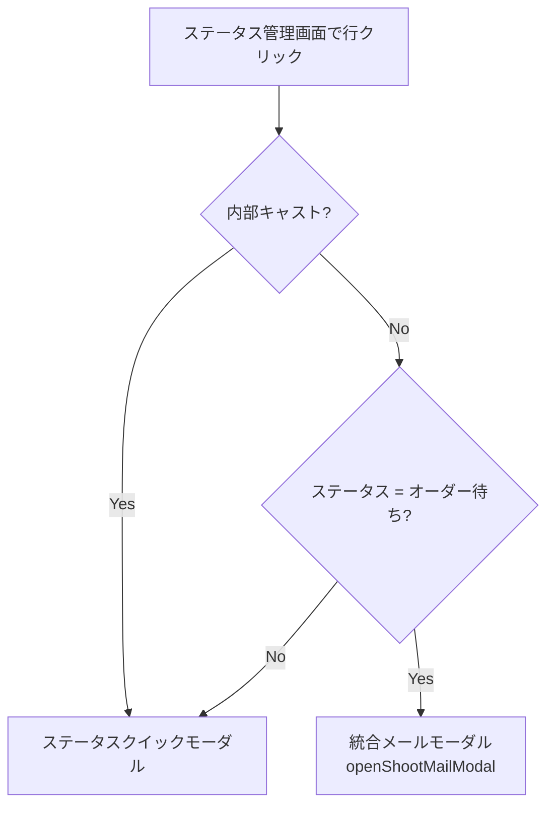
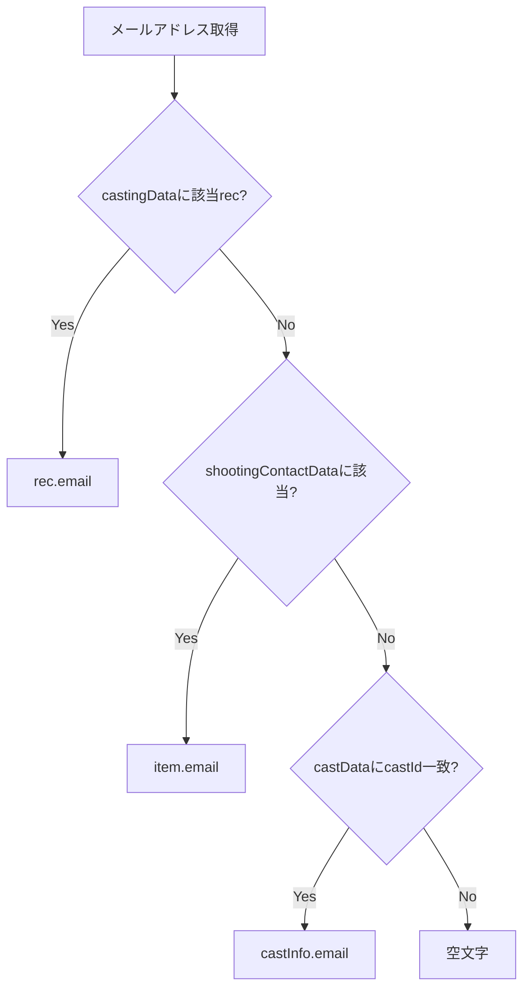
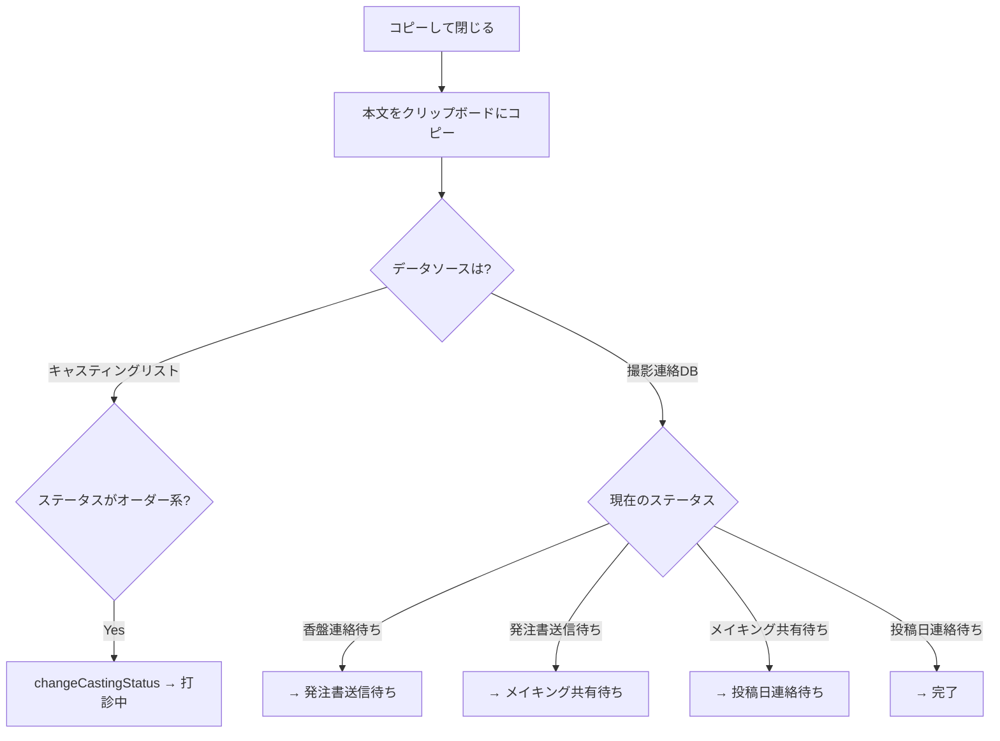

# メール自動生成仕様書

**更新日:** 2026年2月21日

---

## 📋 目次

1. [概要](#1-概要)
2. [メール生成のトリガー](#2-メール生成のトリガー)
3. [テンプレート一覧と本文](#3-テンプレート一覧と本文)
4. [テンプレート変数と置換ルール](#4-テンプレート変数と置換ルール)
5. [ステータス自動進行](#5-ステータス自動進行)

---

## 1. 概要

本システムのメール機能は **「メール本文を自動生成しクリップボードにコピーする」** 仕組み。実際のメール送信はユーザーが別途メーラーで行う。

メール生成は以下の2つのモーダルで行われる:

| モーダル | 関数 | 用途 |
|---|---|---|
| **統合メールモーダル** | `openShootMailModal()` | 6種類のテンプレートを切り替え可能 |
| **外部打診モーダル（レガシー）** | `openExternalOrderMailModal()` | 外部キャスト打診専用 |

---

## 2. メール生成のトリガー

### トリガー①: 撮影連絡ページのメール作成ボタン

全タブの各行に「✉️ 作成」ボタンがあり、クリックで **統合メールモーダル** が開く。

```
撮影連絡ページ → 各タブのテーブル行 → ✉️ 作成ボタン → openShootMailModal(castingId)
```

### トリガー②: ステータス管理画面の行クリック（外部キャスト + オーダー待ち）



> [!NOTE]
> 外部キャスト + ステータス「オーダー待ち」の行をクリックすると、ステータス変更ではなく**打診メール作成**が開く。

### トリガー③: 発注書送信待ちタブの発注書ボタン

```
撮影連絡ページ → 発注書送信待ちタブ → 📄 発注書ボタン → openOrderDocModal(castingId)
```

※これは PDF 発注書の生成であり、メール本文の生成ではない。

---

## 3. テンプレート一覧と本文

### テンプレート自動選択ルール

モーダルを開いた時点で、対象レコードのステータスに応じて初期テンプレートが自動選択される:

| ステータス | 初期選択テンプレート |
|---|---|
| オーダー待ち / 打診中 / 仮キャスティング / 条件つきOK | **打診メール** |
| 香盤連絡待ち / 決定 / OK | **香盤連絡** |
| 発注書送信待ち | **発注書** |
| メイキング共有待ち | **オフショット_案件** |
| 投稿日連絡待ち | **投稿日連絡** |
| その他 | **デフォルト（空）** |

ドロップダウンから他のテンプレートに切り替えも可能。

---

### テンプレート1: 打診メール

| 項目 | 値 |
|---|---|
| **件名** | `【ご相談】{作品名} / {役名}役` |
| **想定ステータス** | オーダー待ち / 打診中 / 仮キャスティング |

**本文:**
```
お世話になっております、直前のご依頼申し訳ございません。
以下作品にて、ご出演いただきたく
{{撮影日}}(曜日)のスケジュールについてお伺いできますでしょうか。
＝＝＝＝＝＝＝＝＝＝＝＝＝＝＝＝＝＝＝
【撮影概要】
撮影日　：{{撮影日}}(曜日)
作品名：「{{作品名}}」
役柄　：{{役名}}役

クライアント：なし
競合：なし

投稿先：ごっこ倶楽部tik tokアカウント
https://www.tiktok.com/@gokko5club
投稿先：daikaiアカウント
https://www.tiktok.com/@daikai_55
投稿先：ウミガメごっこアカウント
https://www.tiktok.com/@gokko5club.umigame
投稿先：docomo
https://www.tiktok.com/@docomo.official

※その他ごっこ倶楽部運営の各種SNSなどでも投稿予定。
[各種SNSリンク省略]

※作品認知向上のため、
プレスリリースや各種SNSでの告知発信の可能性もございます。

使用期間：無期限

二次使用：予定あり
・ドラマ素材を活用した各種SNSでの広告配信
X、Instagram、YouTube
・今回の施策用のキャンペーンページ(Webサイト)
二次使用期間は3ヶ月

ご出演料：￥{{金額}}〜/day
※出演時間確定次第となりますが上記を想定しております
＝＝＝＝＝＝＝＝＝＝＝＝＝＝＝＝＝＝＝
大変恐れ入りますが、
取り急ぎスケジュールの有無についてご確認いただけますと幸いです。

何卒よろしくお願い申し上げます。
```

---

### テンプレート2: 香盤連絡

| 項目 | 値 |
|---|---|
| **件名** | `【香盤連絡】{作品名}` |
| **想定ステータス** | 香盤連絡待ち / 決定 / OK |

**本文:**
```
お世話になっております。お待たせして大変申し訳ございません。
{{撮影日}}の香盤が確定しましたのでお伝えいたします。
また今回のご出演料は¥{{金額}}でお願いいたします。
＝＝＝＝＝＝＝＝＝＝＝＝＝＝＝＝＝＝＝＝
【{{撮影日}}　撮影概要】

▼{{キャスト名}} さま
{{撮影日}}　{{時間}}
作品名：「{{作品名1}}」　{{配役1}}役
　　　　「{{作品名2}}」　{{配役2}}役
　　　　「{{作品名3}}」　{{配役3}}役

集合場所：{{集合場所}}
{{住所}}
{{マップ}}

ご持参いただきたい衣装：
{{衣装内容}}

詳細については以下をご確認くださいませ。
{{notion}}

当日の緊急連絡先
{{連絡先}}
＝＝＝＝＝＝＝＝＝＝＝＝＝＝＝＝＝＝＝＝
何卒よろしくお願いいたします。
```

---

### テンプレート3: 発注書

| 項目 | 値 |
|---|---|
| **件名** | `【発注書送付】{作品名}` |
| **想定ステータス** | 発注書送信待ち |

**本文:**
```
この度は作品へのご参加ありがとうございます。
添付PDFにて発注内容をお伝えいたしますので、ご確認いただきご請求ください。
恐れ入りますが、翌月の3営業日以内迄に、ご請求書をお送りくださいませ。
なお、ご出演料のご請求書発行方法について以下ページにおまとめしております。
※同月中のご出演分であれば、他作品出演分の請求書とまとめての送付でも問題ございません。
請求書送付先：cast-invoice@gokkoclub.jp
【締め支払い日及び請求書発行について】
https://brass-soursop-b4a.notion.site/4f37617875b8400d93a444956ab54fa6
引き続き、何卒よろしくお願いいたします。
```

---

### テンプレート4: オフショット_案件

| 項目 | 値 |
|---|---|
| **件名** | `【オフショット共有】{作品名}` |
| **想定ステータス** | メイキング共有待ち |

**本文:**
```
案件撮影
お世話になっております。
先日{{キャスト名}}さまにご参加いただいた撮影の写真の共有でございます。
NGチェックの意味も含め、Googleドライブにて共有させていただきます。
・作品名『{{作品名1}}』　※{{撮影日}}撮影
{{GドライブURL}}
※編集権限を付与しておりますので、NGはご自由に削除いただけます。
※こちらの写真は2025//()●:00までにNG対応お願いいたします。
※作品投稿後にご活用いただけます。
よろしくお願いいたします。
```

---

### テンプレート5: オフショット_非案件

| 項目 | 値 |
|---|---|
| **件名** | `【オフショット共有】{作品名}` |
| **想定ステータス** | メイキング共有待ち |

**本文:**
```
お世話になっております。
先日{{キャスト名}}さまにご参加いただいた撮影の写真の共有でございます。
NGチェックの意味も含め、Googleドライブにて共有させていただきます。

・作品名『{{作品名1}}』　※{{撮影日}}撮影
{{GドライブURL}}
※編集権限を付与しておりますので、NGはご自由に削除いただけます。
※こちらの写真は2025//()●:00以降自由にご利用ください。
（全体共有いたしますので、それまでにNG対応お願いいたします。）

よろしくお願いいたします。
```

> [!TIP]
> 案件版と非案件版の違い: 案件版は「作品投稿後にご活用いただけます」、非案件版は「●:00以降自由にご利用ください」。

---

### テンプレート6: 投稿日連絡

| 項目 | 値 |
|---|---|
| **件名** | `【投稿日連絡】{作品名}` |
| **想定ステータス** | 投稿日連絡待ち |

**本文:**
```
お世話になっております。
先日{{キャスト名}} さまにご参加いただいた作品の投稿スケジュールの共有でございます。

作品名　：『{{作品名1}}』
投稿日　：2025//()
アカウント：{{アカウント}}

【TikTok閲覧・シェア時の注意点】
作品出演の告知をいただく際、
TikTokのリンク共有はアルゴリズムでマイナスに働いてしまいます。
告知いただく際は、以下いずれかでご対応ください。
① 投稿当日に告知を行う場合
・URLは記載せず、画像とテキストのみで投稿をお願いします。
② 投稿翌日以降に告知を行う場合
・URLは記載せず、画像とテキストのみで投稿をお願いします。
・「動画リンク」ではなく、「アカウントのリンク」を記載する形でご投稿ください。

[Notion詳細リンク省略]

よろしくお願いいたします。
```

---

## 4. テンプレート変数と置換ルール

### 変数一覧

| 変数 | 置換元データ | 備考 |
|---|---|---|
| `{{撮影日}}` | `item.date` or `item.startDate` | なければ `MM/DD` |
| `{{キャスト名}}` | `item.castName` | — |
| `{{作品名}}` / `{{作品名1}}` | `item.projectName` | — |
| `{{役名}}` / `{{配役1}}` | `item.roleName` | — |
| `{{金額}}` | `item.cost` | `Number().toLocaleString()` でカンマ区切り。なければ `18,000` |
| `{{時間}}` | `{inTime}〜{outTime}` | 両方あれば結合、なければ `時間未定` |
| `{{集合場所}}` | `item.location` | なければ `（集合場所）` |
| `{{住所}}` | — | 固定プレースホルダー `（住所）` |
| `{{マップ}}` | — | 固定プレースホルダー `（マップURL）` |
| `{{衣装内容}}` | — | 固定プレースホルダー `（衣装詳細）` |
| `{{notion}}` | `item.notionId` | `https://www.notion.so/{id}` 形式に変換 |
| `{{連絡先}}` | — | 固定プレースホルダー `090-xxxx-xxxx (担当者)` |
| `{{アカウント}}` | `item.account` | なければ `（アカウント名）` |
| `{{GドライブURL}}` | — | 固定プレースホルダー `(Google Drive URL)` |
| `{{作品名2}}`, `{{配役2}}` 等 | — | 固定プレースホルダー `（作品名）`, `（役名）` |

### To（送信先メールアドレス）の取得順序



---

## 5. ステータス自動進行

### 「コピーして閉じる（ステータス更新）」ボタン押下時



| 現在のステータス | 次のステータス | 更新API |
|---|---|---|
| オーダー待ち / 打診中 / 仮キャスティング | 打診中 | `changeCastingStatus()` |
| 香盤連絡待ち | 発注書送信待ち | `/api/shooting_contact/update` |
| 発注書送信待ち | メイキング共有待ち | `/api/shooting_contact/update` |
| メイキング共有待ち | 投稿日連絡待ち | `/api/shooting_contact/update` |
| 投稿日連絡待ち | 完了 | `/api/shooting_contact/update` |

> [!IMPORTANT]
> メール本文をコピーすると **同時にステータスが自動で次に進む**。ユーザーが実際にメールを送信したかどうかに関わらず進行するため、注意が必要。

---

## 関連コード参照

| 関数名 | ファイル | 行番号 | 役割 |
|---|---|---|---|
| [openShootMailModal](file:///Users/mk0012/Desktop/casting-management-system-v1/templates/index.html#L4580-L4869) | index.html | L4580-4869 | 統合メールモーダル（6テンプレート） |
| [copyToClipboardAndClose](file:///Users/mk0012/Desktop/casting-management-system-v1/templates/index.html#L4871-L4913) | index.html | L4871-4913 | コピー＋自動ステータス進行 |
| [handleCastingRowClick](file:///Users/mk0012/Desktop/casting-management-system-v1/templates/index.html#L2281-L2301) | index.html | L2281-2301 | ステータス画面の行クリック分岐 |
| [openExternalOrderMailModal](file:///Users/mk0012/Desktop/casting-management-system-v1/templates/index.html#L2302-L2325) | index.html | L2302-2325 | 外部打診モーダル（レガシー） |
| [buildExternalMailBody](file:///Users/mk0012/Desktop/casting-management-system-v1/templates/index.html#L2327-L2384) | index.html | L2327-2384 | 外部打診メール本文生成 |
