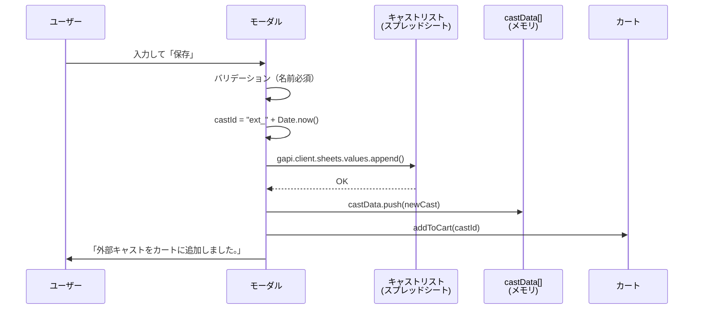

# 新規キャスト追加機能 仕様書

**更新日:** 2026年2月24日

---

## 1. 概要

「キャストを探す」ページ（casting-view）から、DBに存在しない**外部キャスト**を新規登録し、そのままオーダーのカートに追加できる機能。

> [!NOTE]
> 内部キャストの追加はこの機能では行わない。内部キャストはスプレッドシートのマスターデータ（`キャストリスト`シート）で事前登録される。

---

## 2. トリガー

キャストを探すページで**日付が1つ以上選択されている**時、キャスト一覧の末尾に「＋ 新規外部キャストを追加」カードが表示される。

```
┌─────────────────────┐
│     ＋              │  ← 点線ボーダー・青色
│                     │
│ 新規外部キャストを追加 │
│ DBに存在しない外部    │
│ キャストを作成して    │
│ からオーダー          │
└─────────────────────┘
```

**表示条件:** `selectedDates.length > 0`（日付が選択されている場合のみ）

---

## 3. モーダル

### 入力フィールド

| フィールド | DOM ID | 必須 | 初期値 | 備考 |
|---|---|---|---|---|
| 名前 | `new-cast-name` | ✅ | 空 | 空の場合エラー表示 |
| 性別 | `new-cast-gender` | — | 未選択 | セレクト: 男性 / 女性 |
| 所属 | `new-cast-agency` | — | 空 | 未入力時は `外部` がセットされる |
| メールアドレス | `new-cast-email` | — | 空 | — |
| 備考 | `new-cast-notes` | — | 空 | テキストエリア |

---

## 4. 保存処理

### フロー



### castId の生成

```javascript
const castId = 'ext_' + Date.now();
// 例: "ext_1740000000000"
```

### スプレッドシート書き込み

`キャストリスト` シートに1行追加:

| 列 | インデックス | 内容 | 値 |
|---|---|---|---|
| A | 0 | キャストID | `ext_` + timestamp |
| B | 1 | 名前 | ユーザー入力（必須） |
| C | 2 | 性別 | 男性 / 女性 / 空 |
| D | 3 | 生年月日 | 空（未入力） |
| E | 4 | 事務所 | ユーザー入力 or `外部` |
| F | 5 | 画像URL | 空 |
| G | 6 | 出演回数 | `0` |
| H | 7 | メール | ユーザー入力 |
| I | 8 | 備考 | ユーザー入力 |
| J | 9 | 内部/外部 | `外部`（固定） |
| K | 10 | SlackメンションID | 空 |

### ローカルデータへの追加

```javascript
const newCast = {
  castId, name, gender, dateOfBirth: '', age: null,
  agency, imageUrl: '', appearanceCount: 0, email, notes,
  castType: '外部',
  isInternal: false,
  internalType: '外部',
  slackMentionId: '',
};
castData.push(newCast);
```

### カートへの自動追加

保存完了後、`addToCart(newCast.castId)` が呼ばれ、追加したキャストが自動的にカートに入る。ページの再読み込みなしで即座に利用可能。

---

## 5. キャストリスト シート全体の列構成

新規追加時は A〜K 列のみ書き込むが、読み込み時は O列まで参照される:

| 列 | インデックス | フィールド | 読み込み | 書き込み |
|---|---|---|---|---|
| A | 0 | castId | ✅ | ✅ |
| B | 1 | name | ✅ | ✅ |
| C | 2 | gender | ✅ | ✅ |
| D | 3 | dateOfBirth | ✅ | ✅（空） |
| E | 4 | agency | ✅ | ✅ |
| F | 5 | imageUrl | ✅ | ✅（空） |
| G | 6 | appearanceCount | ✅ | ✅（0） |
| H | 7 | email | ✅ | ✅ |
| I | 8 | notes | ✅ | ✅ |
| J | 9 | castType（内部/外部） | ✅ | ✅（外部） |
| K | 10 | slackMentionId | ✅ | ✅（空） |
| L | 11 | snsX（X/Twitter URL） | ✅ | — |
| M | 12 | snsInsta（Instagram URL） | ✅ | — |
| N | 13 | snsTiktok（TikTok URL） | ✅ | — |
| O | 14 | furigana（ふりがな） | ✅ | — |

---

## 6. 制約事項

| 項目 | 内容 |
|---|---|
| 追加できるタイプ | **外部キャストのみ** |
| 重複チェック | なし（同名キャストの重複登録は可能） |
| 画像アップロード | 不可（登録後にシートで直接編集） |
| SNS / ふりがな | 不可（登録後にシートで直接編集） |
| 管理者制限 | なし（ログインユーザーなら誰でも追加可能） |

---

## 関連コード参照

| 関数名 | ファイル | 行番号 | 役割 |
|---|---|---|---|
| [「＋」カード描画](file:///Users/mk0012/Desktop/casting-management-system-v1/templates/index.html#L1076-L1092) | index.html | L1076-1092 | 新規追加カードの表示・クリックイベント |
| [openNewExternalCastModal](file:///Users/mk0012/Desktop/casting-management-system-v1/templates/index.html#L5975-L6024) | index.html | L5975-6024 | 入力モーダルの描画 |
| [saveNewExternalCast](file:///Users/mk0012/Desktop/casting-management-system-v1/templates/index.html#L6033-L6095) | index.html | L6033-6095 | シート追加 + ローカルデータ追加 + カート追加 |
| [キャストデータ読み込み](file:///Users/mk0012/Desktop/casting-management-system-v1/templates/index.html#L710-L744) | index.html | L710-744 | `キャストリスト` シートからの全データ読み込み |
