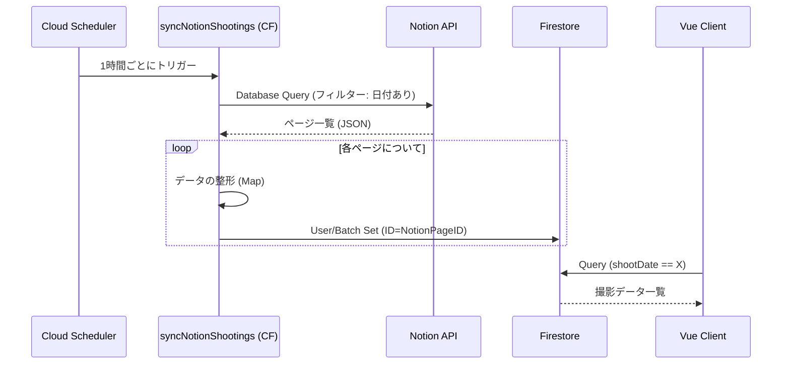

# Notion → Firestore 連携移行仕様書

## 1. 現状 (As-Is) と移行後 (To-Be)

### 現状 (GAS + Sheets)
1. **Google Apps Script (GAS)** が Notion API を叩く
2. 取得した撮影データをスプレッドシートの「新香盤撮影リスト」シートに書き込む
3. フロントエンド (`index.html`) が Sheets API でそのシートを読み込む
4. 日付選択時に該当する撮影データをフィルタリングして表示

### 移行後 (Cloud Functions + Firestore)
1. **Cloud Functions (Pub/Sub Scheduler)** が Notion API を定期的に叩く (例: 1時間ごと)
2. 取得したデータを Firestore の `shootings` コレクションに保存/更新する
3. フロントエンド (Vue) が Firestore SDK で `shootings` コレクションをクエリする
   - `where("shootDate", "==", selectedDate)` 等で必要なデータのみ取得

---

## 2. Notion 連携の技術仕様

### 2.1 データ同期フロー



### 2.2 Firestore データモデル (`shootings` collection)

Notion のプロパティを Firestore のフィールドにマッピングします。

| Firestore Field | Type | Notion Property | 備考 |
|---|---|---|---|
| (Document ID) | string | `id` | NotionのページIDをそのまま使用（重複排除のため） |
| `title` | string | `タイトル` (Title) | 作品名 |
| `shootDate` | Timestamp | `撮影日` (Date) | 開始日を使用 |
| `team` | string | `チーム` (Select) | アカウント名/チーム名 |
| `director` | string | `CD` (Person) | 監督名 (最初の1名) |
| `floorDirector` | string | `FD` (Person) | FD名 (最初の1名) |
| `details` | string | `詳細` (Rich Text) | 補足情報など（必要であれば） |
| `updatedAt` | Timestamp | (`last_edited_time`) | Notion側の最終更新日時 |
| `syncedAt` | Timestamp | - | Firestoreへの同期日時 |

---

## 3. 実装詳細

### 3.1 Cloud Functions: `syncNotionShootings`

`functions/src/sync/notion.ts` (新規作成)

```typescript
import * as functions from 'firebase-functions';
import * as admin from 'firebase-admin';
import { Client } from '@notionhq/client';

const db = admin.firestore();
// Notion クライアントの初期化
const notion = new Client({ auth: process.env.NOTION_API_KEY });
const DATABASE_ID = process.env.NOTION_SHOOTING_DB_ID;

export const syncNotionShootings = functions
  .region('asia-northeast1')
  .pubsub.schedule('every 1 hours') // 1時間ごとに実行
  .timeZone('Asia/Tokyo')
  .onRun(async (context) => {
    if (!DATABASE_ID) {
      console.error('NOTION_SHOOTING_DB_ID is not set.');
      return;
    }

    try {
      console.log('Starting Notion Sync...');
      
      // 1. Notion DB からデータを取得
      // 過去データも含めるか、未来のみにするかはフィルターで調整可能
      // ここでは「撮影日が設定されているもの」全件取得の例
      const response = await notion.databases.query({
        database_id: DATABASE_ID,
        filter: {
          property: '撮影日',
          date: {
            is_not_empty: true
          }
        },
        page_size: 100 // 必要に応じてページネーション処理を追加
      });

      const batch = db.batch();
      let count = 0;

      // 2. データを整形して Batch Operation に追加
      for (const page of response.results) {
         if (!('properties' in page)) continue;
         
         const props = page.properties;
         
         // プロパティの取得ロジック (Notion APIの型に依存)
         /* 
            注: Notion APIのレスポンス構造は複雑なため、
            実際の実装では型ガードや安全なアクセスヘルパーが必要です。
         */
         const title = props['タイトル']?.type === 'title' 
            ? props['タイトル'].title[0]?.plain_text ?? '' 
            : '';
            
         const dateProp = props['撮影日']?.type === 'date' ? props['撮影日'].date : null;
         if (!dateProp?.start) continue; // 日付がないページはスキップ
         
         const shootDate = admin.firestore.Timestamp.fromDate(new Date(dateProp.start));
         
         const team = props['チーム']?.type === 'select' 
            ? props['チーム'].select?.name ?? '' 
            : '';
            
         // Person プロパティからの名前抽出
         const director = props['CD']?.type === 'people' 
            ? props['CD'].people[0]?.name ?? '' 
            : '';
            
         const floorDirector = props['FD']?.type === 'people' 
            ? props['FD'].people[0]?.name ?? '' 
            : '';

         const docRef = db.collection('shootings').doc(page.id); // Notion Page ID をキーにする
         
         batch.set(docRef, {
           title,
           shootDate,
           team,
           director,
           floorDirector,
           notionUrl: page.url,
           lastEditedProps: page.last_edited_time,
           syncedAt: admin.firestore.FieldValue.serverTimestamp()
         }, { merge: true }); // マージ書き込みで既存フィールドを維持
         
         count++;
      }

      // 3. Firestore に書き込み
      await batch.commit();
      console.log(`Synced ${count} items from Notion.`);

    } catch (error) {
      console.error('Notion Sync Failed:', error);
    }
  });
```

### 3.2 必要な環境変数

Cloud Functions に以下の環境設定が必要です。

```bash
firebase functions:config:set notion.api_key="secret_xxxxxxxxxxxxxxxxxxxxxxxx"
firebase functions:config:set notion.shooting_db_id="xxxxxxxxxxxxxxxxxxxxxxxxxxxxxx"
```
※ コード内では `functions.config().notion.api_key` または `process.env.NOTION_API_KEY` (dotenv使用時) でアクセスします。

### 3.3 クライアントサイド (Vue) での利用

`frontend/src/composables/useShootings.ts`

```typescript
import { ref } from 'vue';
import { db } from '@/services/firebase';
import { collection, query, where, getDocs, Timestamp } from 'firebase/firestore';

export interface Shooting {
  id: string; // Notion Page ID
  title: string;
  shootDate: Date;
  team: string; // アカウント名
  director: string;
  floorDirector: string;
}

export function useShootings() {
  const loading = ref(false);
  const shootings = ref<Shooting[]>([]);

  // 日付で撮影リストを検索
  const fetchShootingsByDate = async (date: Date) => {
    loading.value = true;
    shootings.value = [];
    
    try {
      // 日付の範囲設定 (00:00:00 〜 23:59:59)
      const start = new Date(date);
      start.setHours(0, 0, 0, 0);
      const end = new Date(date);
      end.setHours(23, 59, 59, 999);

      const q = query(
        collection(db, 'shootings'),
        where('shootDate', '>=', Timestamp.fromDate(start)),
        where('shootDate', '<=', Timestamp.fromDate(end))
      );

      const snapshot = await getDocs(q);
      shootings.value = snapshot.docs.map(doc => {
        const data = doc.data();
        return {
          id: doc.id,
          title: data.title,
          shootDate: data.shootDate.toDate(),
          team: data.team,
          director: data.director,
          floorDirector: data.floorDirector
        } as Shooting;
      });
      
    } catch (e) {
      console.error(e);
    } finally {
      loading.value = false;
    }
  };

  return { loading, shootings, fetchShootingsByDate };
}
```

---

## 4. 移行ステップ

1. **Notion Integration の作成**:
   - Notion 開発者ポータルで新しい Integration (Internal) を作成し、API Key (`secret_...`) を取得。
   - 対象の「撮影リスト」データベースに、作成した Integration を招待 (Connect) する。

2. **Cloud Functions の実装**:
   - 上記 `syncNotionShootings` を実装。
   - 環境変数を設定。
   - デプロイ: `firebase deploy --only functions`

3. **初期データ同期**:
   - Cloud Scheduler タブから、「今すぐ実行」を行って、Firestore にデータが入るか確認。

4. **フロントエンド実装**:
   - `useShootings` コンポーザブルを使用して、カレンダー日付選択時にデータを取得するように `index.html` のロジックを Vue に移植。

---

## 5. メリット

- **API制限対策**: クライアントから直接 Notion API を叩くのではなく、サーバー側でバッチ処理するため、大量アクセスによる制限を受けにくい。
- **高速化**: スプレッドシートや Notion API を都度叩くよりも、Firestore からの読み込みの方が圧倒的に高速。
- **堅牢性**: 中間に Firestore を挟むことで、Notion が落ちていても（同期済みの）データは参照可能。
