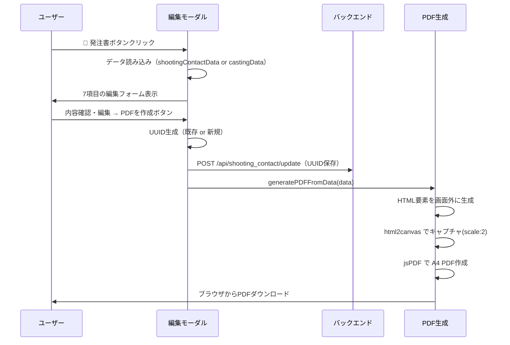

# 発注書（PDF）仕様書

**更新日:** 2026年2月24日

---

## 1. 概要

発注書は **GOKKO倶楽部出演発注書** としてPDFで生成される。ユーザーがモーダルで内容を確認・編集後「PDFを作成」を押すとブラウザからダウンロードされる。

**生成方式:** HTML → `html2canvas` でキャプチャ → `jsPDF` でA4 PDFに変換 → `pdf.save()` でダウンロード

---

## 2. トリガー

| トリガー | 場所 |
|---|---|
| 撮影連絡ページ「発注書送信待ち」タブ → 📄 発注書ボタン | `openOrderDocModal(castingId)` |

---

## 3. 編集モーダル

PDFを作成する前に、以下7項目の入力・編集が可能:

| フィールド | 初期値 | DOM ID |
|---|---|---|
| 日付 | 現在の日付 (`toLocaleDateString()`) | `pdf-date` |
| 宛名（キャスト様） | `castName` | `pdf-castname` |
| 案件名 | `projectName` | `pdf-project` |
| 役名 | `roleName` | `pdf-role` |
| 撮影日 | `shootDate` / `startDate` / `date` | `pdf-shootdate` |
| 金額 | `cost`（半角数字入力） | `pdf-cost` |
| 備考 | `note` | `pdf-note` |

---

## 4. UUID（発注書番号）

- 既存の `poUuid` があればそれを再利用、なければ `crypto.randomUUID()` で新規生成
- 生成した UUID は `/api/shooting_contact/update` に保存 → 撮影連絡DB の U列に記録
- PDFの右上に `No. {uuid}` として表示

---

## 5. PDF本文レイアウト

```
┌─────────────────────────────────────────┐
│            GOKKO倶楽部出演発注書            │  ← タイトル（中央・太字・20px）
│                                         │
│                         2025/02/24      │  ← 日付（右寄せ）
│                 No. xxxxxxxx-xxxx-xxxx  │  ← 発注書番号（右寄せ・小文字・灰色）
│                                         │
│ ○○○○ 様                                │  ← 宛名
│                                         │
│ ご快諾いただきましたドラマ出演の件に        │
│ つきまして、下記の通り発注申し上げます。    │  ← 挨拶文
│ 内容をご確認いただき、ご不明な点が          │
│ ございましたら担当までご連絡ください。      │
│                                         │
│ 【発注元】                               │
│ 〒135-0091                              │
│ 東京都港区台場2-3-1トレードピアお台場12F   │
│ 株式会社GOKKO                            │
│ 担当：GOKKO倶楽部キャスティング担当         │
│                                         │
│ 【お取引条件】                            │
│ 支払条件：月末締め翌月末払い                │
│ 支払方法：ご指定の銀行口座へお振込み        │
│ 秘密保持：…SNS含む）を禁止               │  ← 秘密保持条項
│                                   以上   │
│                                         │
│                 記                       │  ← 中央揃え
│                                         │
│ ┌──────────┬────────────────────┐        │
│ │   項目   │     内容           │        │
│ ├──────────┼────────────────────┤        │
│ │  案件名  │ {案件名}           │        │
│ ├──────────┼────────────────────┤        │
│ │  役名    │ {役名}             │        │  ← 明細テーブル
│ ├──────────┼────────────────────┤        │
│ │  撮影日  │ {撮影日}           │        │
│ ├──────────┼────────────────────┤        │
│ │出演料    │ ¥XX,XXX（税別）    │        │
│ └──────────┴────────────────────┘        │
└─────────────────────────────────────────┘
```

---

## 6. 明細テーブルの項目

| 項目 | 内容 | 備考 |
|---|---|---|
| 案件名 | `data.project` | — |
| 役名 | `data.role` | — |
| 撮影日 | `data.shootDate` | — |
| 出演料（金額） | `¥{金額}（税別）` | 半角数字を `toLocaleString()` でカンマ区切りに変換 |

### 金額フォーマットルール

```javascript
// 数字のみ抽出 → 0より大きく、¥マーク未付なら自動フォーマット
const numCost = Number(data.cost.replace(/[^0-9]/g, ''));
if (numCost > 0 && !data.cost.includes('¥')) {
  costStr = `¥${numCost.toLocaleString()}`;
}
// 例: "18000" → "¥18,000"
// 例: "¥18,000" → そのまま "¥18,000"
```

---

## 7. 固定テキスト

### 発注元情報

| 項目 | 値 |
|---|---|
| 郵便番号 | 〒135-0091 |
| 住所 | 東京都港区台場2-3-1トレードピアお台場12F |
| 会社名 | 株式会社GOKKO |
| 担当 | GOKKO倶楽部キャスティング担当 |

### お取引条件

| 項目 | 値 |
|---|---|
| 支払条件 | 月末締め翌月末払い |
| 支払方法 | ご指定の銀行口座へお振込み |
| 秘密保持 | 本件に関わる脚本内容、撮影情報、共演者情報等は、公式解禁まで第三者への漏洩（SNS含む）を禁止 |

---

## 8. 出力ファイル

| 項目 | 値 |
|---|---|
| **ファイル名** | `{撮影日}_{案件名}_{キャスト名}様_発注書.pdf` |
| **サイズ** | A4（210mm × 297mm） |
| **フォント** | Hiragino Kaku Gothic ProN / Yu Gothic |

### ファイル名例

```
20250315_ごっこ倶楽部ドラマ_山田太郎様_発注書.pdf
```

※撮影日の `/` や `-` は自動的に除去される。

---

## 9. 処理フロー



---

## 関連コード参照

| 関数名 | ファイル | 行番号 | 役割 |
|---|---|---|---|
| [openOrderDocModal](file:///Users/mk0012/Desktop/casting-management-system-v1/templates/index.html#L4318-L4434) | index.html | L4318-4434 | 編集モーダル表示 + UUID生成・保存 |
| [generatePDFFromData](file:///Users/mk0012/Desktop/casting-management-system-v1/templates/index.html#L4449-L4560) | index.html | L4449-4560 | HTML生成 → html2canvas → jsPDF → ダウンロード |
| [getSeasonalGreeting](file:///Users/mk0012/Desktop/casting-management-system-v1/templates/index.html#L4439-L4446) | index.html | L4439-4446 | 季節の挨拶取得（※現在未使用） |
