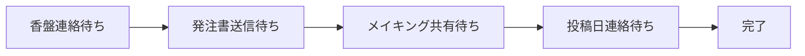
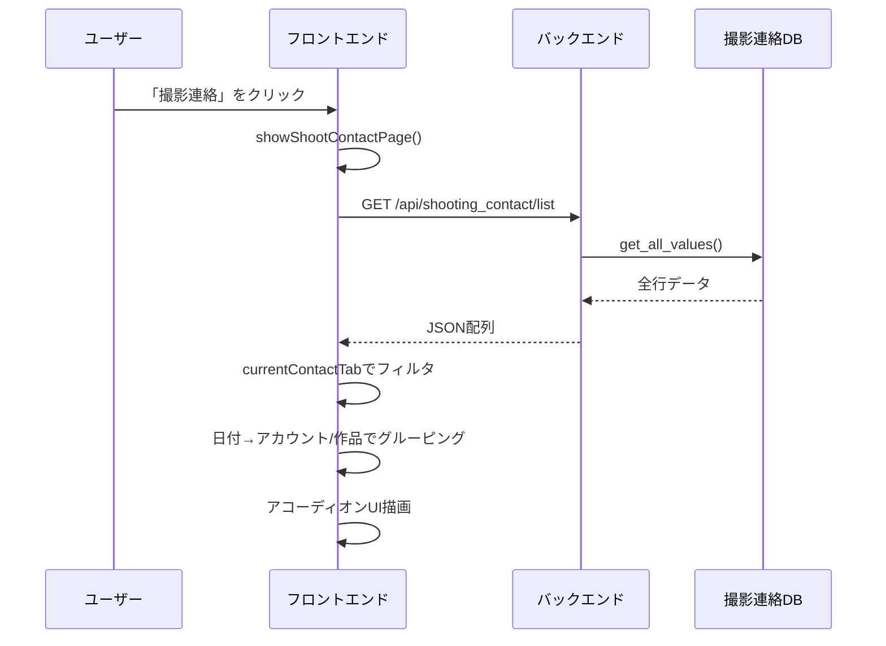
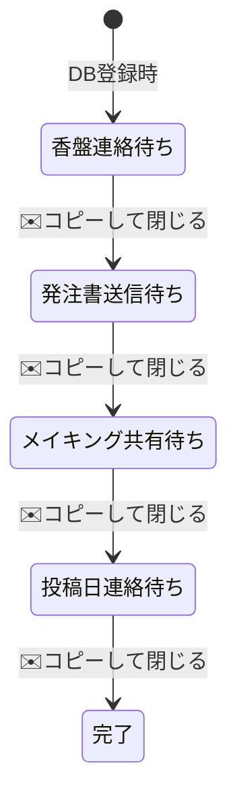
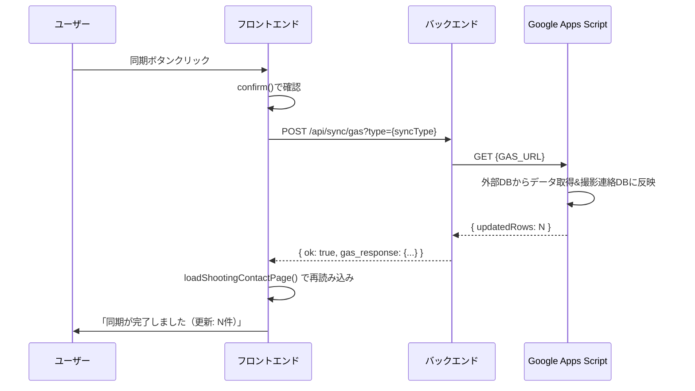
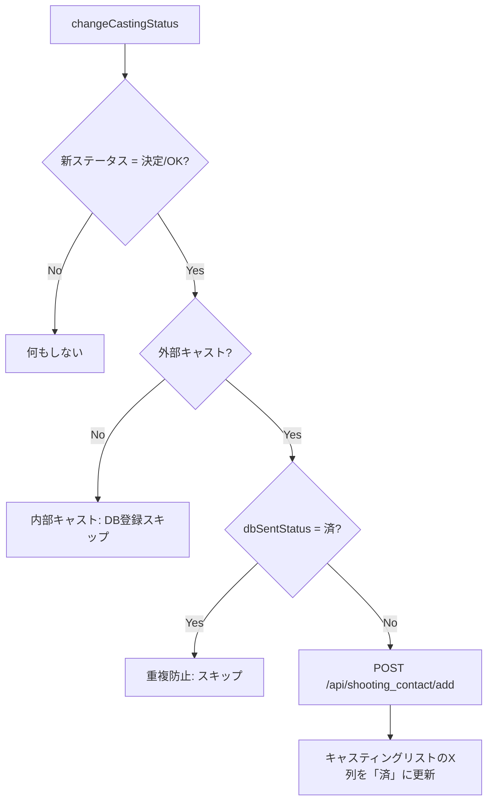

# 撮影連絡ページ仕様書

**更新日:** 2026年2月19日

---

## 📋 目次

1. [概要](#1-概要)
2. [データソース](#2-データソース)
3. [ページ構成とUI](#3-ページ構成とui)
4. [タブ別テーブル仕様](#4-タブ別テーブル仕様)
5. [ステータス遷移](#5-ステータス遷移)
6. [メール作成モーダル](#6-メール作成モーダル)
7. [GAS同期機能](#7-gas同期機能)
8. [バックエンドAPI](#8-バックエンドapi)
9. [データ登録トリガー](#9-データ登録トリガー)

---

## 1. 概要

撮影連絡ページは、撮影決定後のキャストへの各種連絡を管理するワークフローページ。ナビゲーションの「撮影連絡」ボタン（`management-view`）からアクセスする。

4段階のステータスに対応する4つのタブで構成され、各タブにメール作成・送信支援機能を持つ。



---

## 2. データソース

### スプレッドシート

| 項目 | 値 |
|---|---|
| **シートID** | 環境変数 `SHOOTING_CONTACT_SHEET_ID` |
| **シート名** | `撮影連絡DB` |

### 列構成（A〜U列）

| 列 | インデックス | フィールド名 | 説明 |
|---|---|---|---|
| A | 0 | `castingId` | キャスティングID（主キー） |
| B | 1 | `accountName` | アカウント名 |
| C | 2 | `projectName` | 作品名 |
| D | 3 | `notionId` | Notion Page ID |
| E | 4 | `roleName` | 役名 |
| F | 5 | `castName` | キャスト名 |
| G | 6 | `castType` | キャスト種別（内部/外部） |
| H | 7 | `shootDate` | 撮影日 |
| I | 8 | `note` | 備考 |
| J | 9 | `status` | ステータス |
| K | 10 | `inTime` | IN時間 |
| L | 11 | `outTime` | OUT時間 |
| M | 12 | `location` | 場所 |
| N | 13 | `address` | 住所 |
| O | 14 | `makingUrl` | メイキングURL |
| P | 15 | `cost` | 金額 |
| Q | 16 | `postDate` | 投稿日 |
| R | 17 | `updatedBy` | 更新者 |
| S | 18 | `updatedAt` | 更新日時 |
| T | 19 | `mainSub` | 区分（メイン/サブ/その他） |
| U | 20 | `poUuid` | 発注書UUID |

---

## 3. ページ構成とUI

### 表示フロー



### 4タブ構成

| タブ | ステータス値 | 同期ボタン |
|---|---|---|
| 1. 香盤連絡待ち | `香盤連絡待ち` | 🔄 香盤DBと同期 |
| 2. 発注書送信待ち | `発注書送信待ち` | なし |
| 3. メイキング共有待ち | `メイキング共有待ち` | 🎬 メイキングDBと同期 |
| 4. 投稿日連絡待ち | `投稿日連絡待ち` | 📅 投稿日DBと同期 |

### データのグルーピング

1. `status` でフィルタ（選択タブに一致するもののみ）
2. **第1階層**: 撮影日（`shootDate`）で日付グルーピング。投稿日タブのみ `postDate` を使用
3. **第2階層**: アカウント名 + NotionID（またはプロジェクト名）でグルーピング
4. 各グループがアコーディオン（折りたたみ）で表示

```
📅 撮影日: 2025-03-15
  🏢 チームA / 🎬 作品名X (3名)
    [テーブル: キャスト一覧]
  🏢 チームB / 🎬 作品名Y (2名)
    [テーブル: キャスト一覧]
📅 撮影日: 2025-03-16
  ...
```

---

## 4. タブ別テーブル仕様

### 共通カラム

| ヘッダー | 内容 |
|---|---|
| 案件名 / 役名 | `projectName` + `roleName` |
| キャスト | `castName` |
| M/S | `mainSub`（メイン/サブ/その他） |

### タブ固有のカラムとアクション

#### 1. 香盤連絡待ち

| 追加カラム | 内容 | 編集 |
|---|---|---|
| 日時/場所 | IN/OUT時間 + 場所 | ✅ テキスト入力 |
| 金額 | `cost` | ✅ テキスト入力 |

**アクションボタン:**
- 💾 保存 → `saveShootingRow()` → `POST /api/shooting_contact/update`
- ✉️ 作成 → `openShootMailModal()` → メール作成モーダル

#### 2. 発注書送信待ち

| 追加カラム | 内容 | 編集 |
|---|---|---|
| 日時/場所 | IN/OUT時間 + 場所 | ✅ テキスト入力 |
| 金額 | `cost` | ✅ テキスト入力 |

**アクションボタン:**
- 💾 保存 → `saveShootingRow()`
- 📄 発注書 → `openOrderDocModal()` → 発注書PDF作成モーダル
- ✉️ 作成 → `openShootMailModal()`

#### 3. メイキング共有待ち

| 追加カラム | 内容 | 編集 |
|---|---|---|
| メイキングURL | `makingUrl` | ❌ リンク表示のみ |

**アクションボタン:**
- ✉️ 作成 → `openShootMailModal()`

#### 4. 投稿日連絡待ち

| 追加カラム | 内容 | 編集 |
|---|---|---|
| 投稿日 | `postDate` | ❌ テキスト表示のみ |

**アクションボタン:**
- ✉️ 作成 → `openShootMailModal()`

### 保存処理の詳細 (`saveShootingRow`)

```javascript
// 行内のinputから値を取得
const inTime = row.querySelector('.shoot-in')?.value;
const outTime = row.querySelector('.shoot-out')?.value;
const location = row.querySelector('.shoot-location')?.value;
const cost = row.querySelector('.shoot-cost')?.value;

// API呼び出し
await fetch("/api/shooting_contact/update", {
  method: "POST",
  body: JSON.stringify({ castingId, inTime, outTime, location, cost })
});
```

---

## 5. ステータス遷移

### 自動ステータス進行

メールモーダルの「コピーして閉じる（ステータス更新）」ボタンを押すと、本文をクリップボードにコピーし、**自動的に次のステータスへ進む**。



### 遷移ロジック (`copyToClipboardAndClose`)

| 現在のステータス | 次のステータス | 更新先 |
|---|---|---|
| 香盤連絡待ち | 発注書送信待ち | 撮影連絡DB（`/api/shooting_contact/update`） |
| 発注書送信待ち | メイキング共有待ち | 撮影連絡DB |
| メイキング共有待ち | 投稿日連絡待ち | 撮影連絡DB + **マスターデータ同期** |
| 投稿日連絡待ち | 完了 | 撮影連絡DB |
| オーダー待ち / 打診中 / 仮キャスティング | 打診中 | キャスティングリスト（`changeCastingStatus()`） |

> [!IMPORTANT]
> `メイキング共有待ち → 投稿日連絡待ち` の遷移時、バックエンド側でマスターデータシートの P列（poUuid）と O列（cost）も同期更新される。

### 手動ステータス変更

`openShootStatusModal()` で手動でステータスを進めることも可能（確認ダイアログあり）。

---

## 6. メール作成モーダル

### テンプレート一覧

| テンプレート名 | 件名パターン | 用途 |
|---|---|---|
| 打診メール | `【ご相談】{作品名} / {役名}役` | 出演可否の確認 |
| 香盤連絡 | `【香盤連絡】{作品名}` | 撮影スケジュール・場所の通知 |
| 発注書 | `【発注書送付】{作品名}` | 発注内容の送付 |
| オフショット_案件 | `【オフショット共有】{作品名}` | 案件撮影のオフショット共有 |
| オフショット_非案件 | `【オフショット共有】{作品名}` | 非案件撮影のオフショット共有 |
| 投稿日連絡 | `【投稿日連絡】{作品名}` | 投稿スケジュールの通知 |

### テンプレート自動選択

| ステータス | 初期選択テンプレート |
|---|---|
| 香盤連絡待ち / 決定 / OK | 香盤連絡 |
| 発注書送信待ち | 発注書 |
| メイキング共有待ち | オフショット_案件 |
| 投稿日連絡待ち | 投稿日連絡 |
| オーダー待ち / 打診中 / 仮キャスティング | 打診メール |

### テンプレート内の変数置換

| 変数 | 置換元 |
|---|---|
| `{{撮影日}}` | `item.date` or `item.startDate` |
| `{{キャスト名}}` | `item.castName` |
| `{{作品名}}` / `{{作品名1}}` | `item.projectName` |
| `{{役名}}` / `{{配役1}}` | `item.roleName` |
| `{{金額}}` | `item.cost`（カンマ区切りフォーマット） |
| `{{時間}}` | `{inTime}〜{outTime}` |
| `{{集合場所}}` | `item.location` |
| `{{notion}}` | Notion URL（`notionId` からハイフン除去して構築） |
| `{{アカウント}}` | `item.account` |

### モーダルの機能

1. **To欄**: キャストのメールアドレスを表示 + コピーボタン
2. **テンプレート切替**: ドロップダウンで切替可能、件名・本文が即時反映
3. **件名・本文**: 自由に編集可能
4. **「コピーして閉じる」**: 本文をクリップボードにコピー → ステータスを自動で次に進める

---

## 7. GAS同期機能

### 同期の種類

| タブ | 同期タイプ | GAS URL |
|---|---|---|
| 香盤連絡待ち | `schedule` | 固定URL（ハードコード） |
| メイキング共有待ち | `making` | 固定URL（ハードコード） |
| 投稿日連絡待ち | `post_date` | 環境変数 `GAS_URL_POST_DATE` |

### 同期フロー



### 同期内容

| タイプ | GASの処理内容 |
|---|---|
| `schedule` | 香盤DB（別シート）から IN/OUT 時間・場所を取得し、撮影連絡DBの K/L/M 列に反映 |
| `making` | メイキングDB（別シート）からメイキングURLを取得し、O列に反映 |
| `post_date` | 投稿日DB（別シート）から投稿日を取得し、Q列に反映 |

---

## 8. バックエンドAPI

### `GET /api/shooting_contact/list`

撮影連絡DBの全データを取得。

| 項目 | 値 |
|---|---|
| レスポンス | `Array<ShootingContactItem>` |
| データソース | `撮影連絡DB` シートの全行（ヘッダー除く） |

### `POST /api/shooting_contact/add`

新規レコードを追加。

| 項目 | 値 |
|---|---|
| 必須フィールド | `castingId`, `account`, `projectName`, `notionId`, `roleName`, `castName`, `castType`, `shootDate` |
| 初期ステータス | `香盤連絡待ち` |
| 処理 | シートに1行追加（`append_row`） |

### `POST /api/shooting_contact/update`

既存レコードの部分更新。

**リクエストモデル (`ShootingContactUpdateItem`):**

```python
class ShootingContactUpdateItem(BaseModel):
    castingId: str           # 必須（検索キー）
    status: Optional[str]    # J列
    inTime: Optional[str]    # K列
    outTime: Optional[str]   # L列
    location: Optional[str]  # M列
    address: Optional[str]   # N列
    cost: Optional[str]      # P列
    makingUrl: Optional[str] # O列
    postDate: Optional[str]  # Q列
    mainSub: Optional[str]   # T列
    poUuid: Optional[str]    # U列
```

**処理フロー:**
1. A列から `castingId` で行を検索
2. 指定フィールドのみ `batch_update` で更新
3. S列に現在日時を自動記録
4. **ステータスが `メイキング共有待ち → 投稿日連絡待ち` の場合**: マスターデータシートの P列（poUuid）と O列（cost）も同期

### `POST /api/sync/gas`

GASスクリプトを実行して外部DBと同期。

| パラメータ | 値 |
|---|---|
| `type` | `schedule` / `making` / `post_date` |

---

## 9. データ登録トリガー

### 撮影連絡DBへの自動登録

キャスティングのステータスが「決定」「OK」になった時、**外部キャスト**のみ自動で撮影連絡DBに登録される。



| 条件 | 登録 |
|---|---|
| 外部キャスト + 決定/OK + 未登録（X列≠済） | ✅ |
| 内部キャスト | ❌ |
| 既に登録済み（X列=済） | ❌（重複防止） |

---

## 関連コード参照

| 関数名 | ファイル | 行番号 | 役割 |
|---|---|---|---|
| [showShootContactPage](file:///Users/mk0012/Desktop/casting-management-system-v1/templates/index.html#L3760-L3796) | index.html | L3760-3796 | ページ初期化・タブ描画 |
| [loadShootingContactPage](file:///Users/mk0012/Desktop/casting-management-system-v1/templates/index.html#L3798-L3939) | index.html | L3798-3939 | API取得・フィルタ・グルーピング・描画 |
| [renderProjectTable](file:///Users/mk0012/Desktop/casting-management-system-v1/templates/index.html#L3949-L4107) | index.html | L3949-4107 | タブ別テーブル生成 |
| [saveShootingRow](file:///Users/mk0012/Desktop/casting-management-system-v1/templates/index.html#L4140-L4192) | index.html | L4140-4192 | 行内の編集データ保存 |
| [openShootMailModal](file:///Users/mk0012/Desktop/casting-management-system-v1/templates/index.html#L4580-L4869) | index.html | L4580-4869 | メール作成モーダル（6テンプレート） |
| [copyToClipboardAndClose](file:///Users/mk0012/Desktop/casting-management-system-v1/templates/index.html#L4871-L4913) | index.html | L4871-4913 | コピー＋自動ステータス進行 |
| [syncShootingSchedule](file:///Users/mk0012/Desktop/casting-management-system-v1/templates/index.html#L4977-L5015) | index.html | L4977-5015 | GAS同期実行 |
| [shooting_contact_list](file:///Users/mk0012/Desktop/casting-management-system-v1/main.py#L911-L974) | main.py | L911-974 | データ取得API |
| [add_shooting_contact](file:///Users/mk0012/Desktop/casting-management-system-v1/main.py#L975-L1021) | main.py | L975-1021 | データ追加API |
| [update_shooting_contact_status](file:///Users/mk0012/Desktop/casting-management-system-v1/main.py#L1023-L1103) | main.py | L1023-1103 | データ更新API（+マスターデータ同期） |
| [sync_gas_trigger](file:///Users/mk0012/Desktop/casting-management-system-v1/main.py#L1105-L1131) | main.py | L1105-1131 | GAS同期API |
