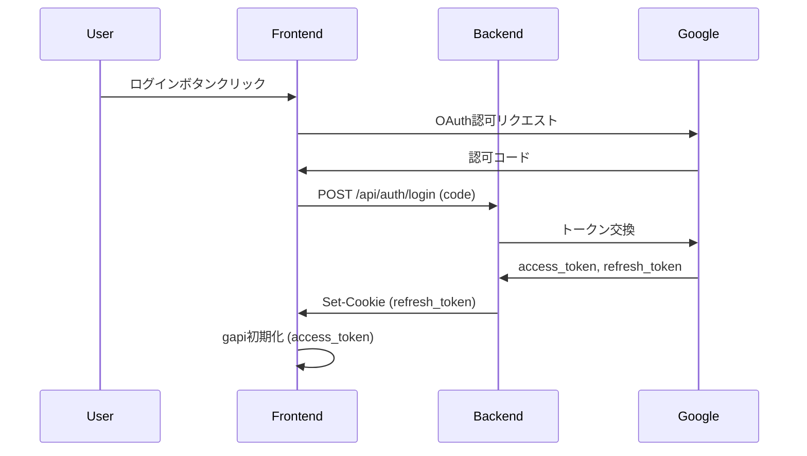

# キャスティング管理システム - 完全仕様書

**更新日:** 2026年1月14日  
**バージョン:** 1.0

---

## 📋 目次

1. [システム概要](#1-システム概要)
2. [技術スタック](#2-技術スタック)
3. [環境変数](#3-環境変数)
4. [認証システム](#4-認証システム)
5. [データモデル](#5-データモデル)
6. [バックエンドAPI](#6-バックエンドapi)
7. [フロントエンド機能](#7-フロントエンド機能)
8. [Slack連携](#8-slack連携)
9. [Googleカレンダー連携](#9-googleカレンダー連携)
10. [撮影連絡DB](#10-撮影連絡db)
11. [外部連携](#11-外部連携)

---

## 1. システム概要

### 1.1 目的
キャスティング業務を効率化するためのWebベースの管理システム。以下の機能を提供：
- キャスト情報の管理と検索
- 撮影案件へのキャスト割り当て
- ステータス管理（仮押さえ→決定→NG等）
- Slack通知による関係者への自動連絡
- Googleカレンダーとの同期
- 撮影連絡情報の管理

### 1.2 ユーザーロール
| ロール | 権限 |
|--------|------|
| 管理者 | 全機能の利用、ステータス変更、削除操作 |
| 一般ユーザー | 閲覧、オーダー作成（ステータス変更は制限） |

### 1.3 システム構成図
```
┌─────────────────────────────────────────────────────────────┐
│                    フロントエンド                              │
│  ┌─────────────┐  ┌─────────────┐  ┌─────────────┐         │
│  │ キャスト検索 │  │ カート/オーダー│  │ ステータス管理│         │
│  └─────────────┘  └─────────────┘  └─────────────┘         │
└──────────────────────────┬──────────────────────────────────┘
                           │
              ┌────────────┴────────────┐
              │    FastAPI Backend      │
              │     (main.py)           │
              └────────────┬────────────┘
                           │
    ┌──────────────────────┼──────────────────────┐
    │                      │                      │
┌───┴───┐           ┌──────┴──────┐        ┌──────┴──────┐
│ Slack │           │Google Sheets│        │   Calendar  │
│  API  │           │  (データ)    │        │     API     │
└───────┘           └─────────────┘        └─────────────┘
```

---

## 2. 技術スタック

### 2.1 バックエンド
| 技術 | 用途 |
|------|------|
| Python 3.12 | ランタイム |
| FastAPI | Webフレームワーク |
| Uvicorn | ASGIサーバー |
| gspread / gspread_asyncio | Google Sheets API |
| slack_sdk | Slack API |
| Pydantic | リクエスト/レスポンス検証 |

### 2.2 フロントエンド
| 技術 | 用途 |
|------|------|
| Jinja2テンプレート | HTMLレンダリング |
| Tailwind CSS | スタイリング |
| Google API Client (gapi) | Google認証/Sheets/Calendar |
| Vanilla JavaScript | ロジック |

### 2.3 外部サービス
| サービス | 用途 |
|----------|------|
| Google Sheets | データストレージ（キャスト一覧、キャスティングリスト、撮影連絡DB） |
| Slack | 通知送信 |
| Google Calendar | 撮影予定の管理 |
| Notion（GAS経由） | 案件情報の同期 |
| Heroku | 本番デプロイ |

---

## 3. 環境変数

### 3.1 Google関連
| 変数名 | 説明 |
|--------|------|
| `GOOGLE_CLIENT_ID` | OAuth クライアントID |
| `GOOGLE_OAUTH_CLIENT_SECRET_JSON` | OAuth 設定JSON |
| `GOOGLE_SHEETS_CREDS_JSON` | サービスアカウント認証JSON |
| `SPREADSHEET_ID` | メインスプレッドシートID |
| `SHOOTING_CONTACT_SHEET_ID` | 撮影連絡DBスプレッドシートID |
| `CALENDAR_ID_INTERNAL_HOLD` | 内部キャスト用カレンダーID |

### 3.2 Slack関連
| 変数名 | 説明 |
|--------|------|
| `SLACK_BOT_TOKEN` | Bot User OAuth Token (xoxb-...) |
| `SLACK_DEFAULT_CHANNEL` | デフォルト通知チャンネルID |
| `SLACK_CHANNEL_EXTERNAL` | 外部案件用チャンネルID |
| `SLACK_CHANNEL_TYPE_A` | パターンA用チャンネル |
| `SLACK_CHANNEL_TYPE_B` | パターンB用チャンネル |
| `SLACK_CHANNEL_TEST` | テスト用チャンネル |
| `SLACK_MENTION_GROUP_ID` | メンション対象グループID |

### 3.3 その他
| 変数名 | 説明 |
|--------|------|
| `GAS_ENDPOINT_URL` | Google Apps Script WebAppエンドポイント |

---

## 4. 認証システム

### 4.1 認証フロー



### 4.2 エンドポイント

#### POST `/api/auth/login`
- **入力:** `{ "code": "認可コード" }`
- **出力:** `{ "access_token": "...", "refresh_token": "...", "expires_in": 3600 }`
- **Cookie:** `refresh_token` を HttpOnly Cookie として設定

#### GET `/api/auth/refresh`
- **入力:** Cookie内の `refresh_token`
- **出力:** `{ "access_token": "...", "expires_in": 3600 }`

#### POST `/api/auth/logout`
- **処理:** `refresh_token` Cookie を削除

### 4.3 権限管理
管理者かどうかはメールアドレスで判定（フロントエンド）:
```javascript
const ADMIN_EMAILS = ["admin1@example.com", "admin2@example.com"];
const isAdmin = ADMIN_EMAILS.includes(currentUser?.email);
```

---

## 5. データモデル

### 5.1 Googleスプレッドシート構造

#### シート: キャスト一覧
| 列 | 内容 |
|----|------|
| A | キャストID (UUID) |
| B | 名前 |
| C | かな |
| D | 生年月日 |
| E | 性別 |
| F | 所属事務所 |
| G | 内部/外部フラグ |
| H | 写真URL |
| I | メールアドレス |
| J | Slack User ID |
| K | Instagram URL |
| L | TikTok URL |
| M | X (Twitter) URL |

#### シート: キャスティングリスト
| 列 | 内容 |
|----|------|
| A | キャスティングID (UUID) |
| B | アカウント名（チーム/案件名） |
| C | 案件名 |
| D | 役名 |
| E | キャストID |
| F | キャスト名 |
| G | 開始日 |
| H | 終了日 |
| I | 優先順位 |
| J | ステータス |
| K | 時間範囲 |
| L | SlackスレッドID |
| M | Slackパーマリンク |
| N | メイン/サブ区分 |
| O | カレンダーイベントID |
| P | 案件ID (NotionページID) |
| Q | 最終更新日時 |
| R | 更新者 |
| S | 金額 |
| T | キャストタイプ（内部/外部） |
| U | メールアドレス |
| V | 発注書ID |
| W | 構造データ (JSON) |

### 5.2 Pydanticモデル

#### OrderItem
```python
class OrderItem(BaseModel):
    castingId: str
    roleName: str = ""
    castName: str
    rank: int
    note: str = ""
    projectName: str
    slack_user_id: Optional[str] = None
    conflictInfo: Optional[str] = None
    isInternal: bool = False
```

#### OrderCreatedPayload
```python
class OrderCreatedPayload(BaseModel):
    accountName: str
    projectName: str
    projectId: str
    dateRanges: List[str]
    orders: List[OrderItem]
    orderType: Literal["pattern_a", "pattern_b", "test"] = "test"
    ccString: Optional[str] = None
    slackThreadTs: Optional[str] = None
    isAdditionalOrder: bool = False
```

#### StatusUpdatePayload
```python
class StatusUpdatePayload(BaseModel):
    castingId: str
    newStatus: str
    castName: str
    slackThreadTs: Optional[str] = None
    slackPermalink: Optional[str] = None
    extraMessage: Optional[str] = None
    isInternal: Optional[bool] = False
    projectId: Optional[str] = None
    mainSub: Optional[str] = "その他"
    orderDetails: Optional[list] = None
```

#### SpecialOrderPayload
```python
class SpecialOrderPayload(BaseModel):
    orderType: Literal["external", "internal"]
    title: str
    dates: List[str]
    startTime: str
    endTime: str
    castIds: List[str]
    ordererEmail: str
```

---

## 6. バックエンドAPI

### 6.1 オーダー関連

#### POST `/api/notify/order_created`
**通常オーダーの作成**

- **Content-Type:** `multipart/form-data`
- **パラメータ:**
  - `files`: PDF添付ファイル（複数可）
  - `payload_str`: OrderCreatedPayload の JSON文字列

**処理フロー:**
1. Slack通知送信（PDF添付 or テキストのみ）
2. `ts`（スレッドID）と`permalink`を取得
3. レスポンスとしてフロントエンドに返却
4. フロントエンドがスプレッドシートに書き込み

**Slack ts取得ロジック（PDF時）:**
1. `files_upload_v2` でPDFアップロード
2. `files.info` API で shares を取得
3. shares から `ts` を抽出

---

#### POST `/api/notify/special_order`
**特別オーダー（外部案件/社内イベント）の作成**

- **入力:** SpecialOrderPayload
- **処理:**
  1. Slack通知送信
  2. スプレッドシートに直接書き込み（バックエンドで実行）
  3. 内部キャストの場合、カレンダー登録用データを返却
- **出力:** `{ ok: true, calendar_events: [...] }`

---

#### POST `/api/special_order/update`
**特別オーダーの更新**

- **入力:** SpecialOrderUpdatePayload
- **処理:**
  1. `slackThreadTs` で完全一致検索
  2. スプレッドシート更新
  3. Slackスレッドに更新通知

---

#### POST `/api/special_order/delete`
**特別オーダーの削除**

- **入力:** `{ slackThreadTs: string }`
- **処理:**
  1. 同じ `slackThreadTs` を持つ全レコードを検索
  2. ステータスを「削除済み」に更新
  3. Slackスレッドに削除通知

---

#### POST `/api/order/delete`
**通常オーダー（キャスト単位）の削除**

- **入力:** `{ castingId: string, slackThreadTs: string }`
- **処理:**
  1. 該当レコードのステータスを「削除済み」に更新
  2. Slackスレッドに削除通知
  3. `calendar_event_id` を返却（カレンダー削除はフロントエンド実行）

---

### 6.2 ステータス更新

#### POST `/api/notify/status_update`
- **入力:** StatusUpdatePayload
- **処理:**
  1. Slackスレッドにステータス変更通知
  2. 「OK」または「決定」の場合:
     - GAS経由でNotionに同期（バックグラウンドタスク）
- **出力:** `{ ok: true }`

---

### 6.3 撮影連絡DB

#### GET `/api/shooting_contact/list`
**撮影連絡データの取得**

- **出力:** 全レコードのリスト

---

#### POST `/api/shooting_contact/add`
**撮影連絡レコードの追加**

- **重複チェック:** 同一 `castingId` が存在する場合はスキップ

---

#### POST `/api/shooting_contact/update`
**撮影連絡レコードの更新**

- **更新可能フィールド:**
  - ステータス
  - IN/OUT時間
  - 場所・住所
  - 金額
  - メイキングURL
  - 投稿日

---

### 6.4 その他

#### GET `/api/sync/gas`
**GASトリガー呼び出し**

- **用途:** 撮影スケジュールの手動同期

---

## 7. フロントエンド機能

### 7.1 ビュー構成

| ビュー | 説明 |
|--------|------|
| `casting-view` | キャスト検索・カート追加画面 |
| `status-view` | キャスティング状況一覧 |
| `shooting-contact-view` | 撮影連絡DB管理画面 |

---

### 7.2 キャスト検索画面 (casting-view)

#### 機能
- **フィルタリング:** 事務所、性別、年齢範囲
- **撮影日選択:** NotionページIDベースの撮影一覧から選択
- **キャストカード表示:**
  - 写真
  - 名前・所属
  - ステータスバッジ（仮押さえ済み、決定済み等）
  - NG状態表示

#### 関連関数
- `loadAllData()`: 全データ読み込み
- `displayAvailableCasts()`: キャスト一覧表示
- `getFilteredCasts()`: フィルタリング処理

---

### 7.3 カートシステム

#### 状態管理
```javascript
let cart = {};  // { castId: true } 形式
let cartProjects = [];  // 案件・役情報の配列
let cartMeta = {
  account: '',
  notionUrl: '',
  projectNames: [],
  combinedProjectNames: [],
  pdfFiles: []
};
```

#### ワークフロー

**Step 1: カート内容確認**
1. カートに追加されたキャストを表示
2. 案件情報を入力（NotionURL、案件名）
3. PDF添付（任意）

**Step 2: 役割割り当て**
1. ドラッグ＆ドロップでキャストを役に割り当て
2. 役名、タイプ（メイン/サブ）、備考を入力
3. 複数案件対応（追加ボタン）

**Step 3: 確認・送信**
1. 内容確認
2. 日程確認（衝突警告表示）
3. 仮押さえ確認 → 送信

#### 関連関数
- `addToCart(castId)`: カート追加
- `renderCartStep1(modal)`: Step 1表示
- `renderCartStep2(modal)`: Step 2表示
- `renderConfirmationModal()`: 確認モーダル
- `confirmProvisionalBookings(data)`: 仮押さえ処理
- `processNewOrder(data)`: Slack通知 + シート書き込み

---

### 7.4 ステータス管理画面 (status-view)

#### 機能
- **月別表示:** 月ごとのキャスティング状況
- **タブ切り替え:**
  - `casting`: 通常オーダー（内部/外部）
  - `special`: 特別オーダー（外部案件/社内イベント）
- **ステータス変更:** モーダルでステータス更新
- **追加オーダー:** 既存スレッドへの追加

#### ステータス種類
| ステータス | 色 | 説明 |
|------------|----|----|
| 仮押さえ | 黄色 | 日程仮確保 |
| 仮キャスティング | 青色 | 内部キャストの仮確定 |
| 打診中 | グレー | 事務所に打診中 |
| オーダー待ち | オレンジ | オーダー発行待ち |
| OK | 緑 | 事務所からOK回答 |
| 決定 | 緑+太字 | 正式決定 |
| NG | 赤 | 不可 |
| キャンセル | 赤+打消し線 | キャンセル |
| 削除済み | グレー（非表示） | 論理削除 |

#### 関連関数
- `renderCastingStatusView(refresh)`: ステータス一覧表示
- `changeCastingStatus(castingId, newStatus, extraArg)`: ステータス変更
- `postStatusUpdateToSlack(rec, newStatus, extraMessage)`: Slack通知
- `openStatusQuickModal(castingId)`: クイック操作モーダル
- `deleteCastingOrder(castingId)`: オーダー削除

---

### 7.5 特別オーダー機能

#### 外部案件 (external)
- 外部クライアントからの案件
- 外部用Slackチャンネルに通知
- 撮影連絡DBには追加されない

#### 社内イベント (internal)
- 社内イベント・撮影
- デフォルトSlackチャンネルに通知
- 内部キャストはカレンダー登録対象

#### 関連関数
- `openSpecialOrderModal(type)`: 特別オーダーモーダル
- `openEditSpecialOrderModal(slackThreadTs)`: 編集モーダル
- `saveEditSpecialOrder()`: 編集保存
- `confirmDeleteSpecialOrder()`: 削除確認
- `executeDeleteSpecialOrder()`: 削除実行

---

### 7.6 撮影連絡DB (shooting-contact-view)

#### タブ構成
| タブ | 説明 |
|------|------|
| 香盤連絡待ち | IN/OUT時間・場所の連絡待ち |
| 発注書送信待ち | 発注書作成・送信待ち |
| メイキング共有待ち | メイキングURL共有待ち |
| 投稿日連絡待ち | SNS投稿日連絡待ち |
| 完了 | 全フロー完了 |

#### 機能
- 日付・案件別アコーディオン表示
- IN/OUT時間・場所・金額の編集
- メール作成（テンプレート生成）
- 発注書PDF生成
- ステータス更新

#### 関連関数
- `loadShootingContactPage()`: データ読み込み
- `renderProjectTable(items)`: テーブル表示
- `saveShootingRow(castingId, btn)`: 行データ保存
- `openShootMailModal(castingId)`: メール作成モーダル
- `openOrderDocModal(castingId)`: 発注書モーダル
- `generatePDFFromData(data)`: PDF生成

---

## 8. Slack連携

### 8.1 必要なスコープ
| スコープ | 用途 |
|----------|------|
| `chat:write` | メッセージ送信 |
| `files:write` | ファイルアップロード |
| `files:read` | ファイル情報取得（ts取得用） |
| `channels:read` | チャンネル情報取得 |
| `channels:history` | チャンネル履歴取得 |

### 8.2 チャンネル振り分け
```python
def pick_channel(order_type: str):
    if order_type == "pattern_a":
        return SLACK_CHANNEL_TYPE_A
    elif order_type == "pattern_b":
        return SLACK_CHANNEL_TYPE_B
    elif order_type == "test":
        return SLACK_CHANNEL_TEST
    elif order_type == "external":
        return SLACK_CHANNEL_EXTERNAL
    else:
        return SLACK_DEFAULT_CHANNEL
```

### 8.3 スレッドID (ts) の仕様

#### 形式
- **完全形式:** `1768379900.553249` (10桁.6桁)
- **Permalink内:** `p1768379900553249` (16桁連結)

#### 保存
- スプレッドシートにはシングルクォート付きで保存
- 例: `'1768379900.553249`
- これにより数値変換による精度喪失を防止

#### 検索
- 完全一致で検索
- シングルクォートは検索時に除去

---

## 9. Googleカレンダー連携

### 9.1 対象
- **内部キャストのみ**: 仮押さえ/決定時にカレンダー登録

### 9.2 イベント形式
| フィールド | 内容 |
|------------|------|
| summary | `[仮] キャスト名 / 案件名` または `キャスト名 / 案件名` |
| description | 詳細情報（案件名、役名等） |
| start/end | 撮影日時（終日 or 時間指定） |

### 9.3 処理
```javascript
// カレンダー登録
async function createInternalHoldEvents(events) {
  for (const ev of events) {
    const resource = {
      summary: ev.usePrefix ? `[仮] ${ev.castName} / ${ev.projectName}` : `${ev.castName} / ${ev.projectName}`,
      description: `案件: ${ev.projectName}\n役名: ${ev.roleName}`,
      start: { date: ev.date },  // 終日イベント
      end: { date: nextDay(ev.date) }
    };
    
    const response = await gapi.client.calendar.events.insert({
      calendarId: CALENDAR_ID,
      resource: resource
    });
    
    // イベントIDをスプレッドシートに保存
    await updateSheet(ev.rowNumber, response.result.id);
  }
}
```

### 9.4 ステータス変更時の処理
| 新ステータス | カレンダー処理 |
|--------------|----------------|
| OK/決定 | `[仮]` プレフィックスを削除 |
| NG/キャンセル | イベント削除 |
| 削除済み | イベント削除（フロントエンド実行） |

---

## 10. 撮影連絡DB

### 10.1 データ追加条件
- ステータスが「決定」または「OK」に変更された場合
- **外部キャストのみ**（内部キャストは対象外）
- 重複チェック: 同一 `castingId` が存在する場合はスキップ

### 10.2 ステータスフロー
```
香盤連絡待ち → 発注書送信待ち → メイキング共有待ち → 投稿日連絡待ち → 完了
```

### 10.3 メールテンプレート
`openShootMailModal()` で自動生成:
- 撮影日時
- 場所・住所
- 報酬金額
- 振込先情報
- メイキングURL
- 投稿条件

---

## 11. 外部連携

### 11.1 Notion連携（GAS経由）

#### 同期トリガー
- ステータスが「OK」または「決定」に変更
- バックグラウンドタスクで実行

#### 同期データ
```python
async def sync_to_notion_via_gas(payload):
    if not GAS_ENDPOINT_URL:
        return
    
    async with httpx.AsyncClient() as client:
        await client.post(
            GAS_ENDPOINT_URL,
            json={
                "action": "syncToNotion",
                "projectId": payload.projectId,
                "castName": payload.castName,
                "status": payload.newStatus,
                "mainSub": payload.mainSub
            }
        )
```

### 11.2 撮影スケジュール同期

#### 手動同期
```javascript
async function syncShootingSchedule(btn, syncType) {
  const res = await fetch(`/api/sync/gas?type=${syncType}`);
  // GAS経由で撮影スケジュールを取得・更新
}
```

---

## 付録A: ファイル構成

```
casting-management-system-v1/
├── main.py                 # FastAPIバックエンド
├── templates/
│   └── index.html          # メインフロントエンド
├── docs/                   # ドキュメント
├── requirements.txt        # Python依存関係
├── Procfile                # Herokuデプロイ設定
├── .env                    # 環境変数（gitignore対象）
└── client_secret.json      # OAuth設定（gitignore対象）
```

---

## 付録B: 主要関数一覧

### バックエンド (main.py)

| 関数名 | 行 | 説明 |
|--------|----|----|
| `get_creds()` | 142-161 | Google認証情報取得 |
| `pick_channel()` | 180-183 | Slackチャンネル振り分け |
| `build_order_text()` | 185-295 | オーダー通知テキスト生成 |
| `auth_login()` | 335-367 | ログイン処理 |
| `notify_order_created()` | 415-558 | 通常オーダー通知 |
| `notify_special_order()` | 561-754 | 特別オーダー通知 |
| `notify_status_update()` | 757-795 | ステータス更新通知 |
| `update_special_order()` | 1037-1184 | 特別オーダー更新 |
| `delete_special_order()` | 1186-1246 | 特別オーダー削除 |
| `delete_order()` | 1248-1310 | 通常オーダー削除 |

### フロントエンド (index.html)

| 関数名 | 説明 |
|--------|----|
| `loadAllData()` | 全データ読み込み |
| `displayAvailableCasts()` | キャスト一覧表示 |
| `renderCastingStatusView()` | ステータス画面表示 |
| `changeCastingStatus()` | ステータス変更処理 |
| `confirmProvisionalBookings()` | 仮押さえ確認・実行 |
| `processNewOrder()` | オーダー送信 |
| `createInternalHoldEvents()` | カレンダーイベント作成 |
| `loadShootingContactPage()` | 撮影連絡DB読み込み |
| `openShootMailModal()` | メール作成モーダル |
| `generatePDFFromData()` | PDF生成 |

---

**End of Document**
