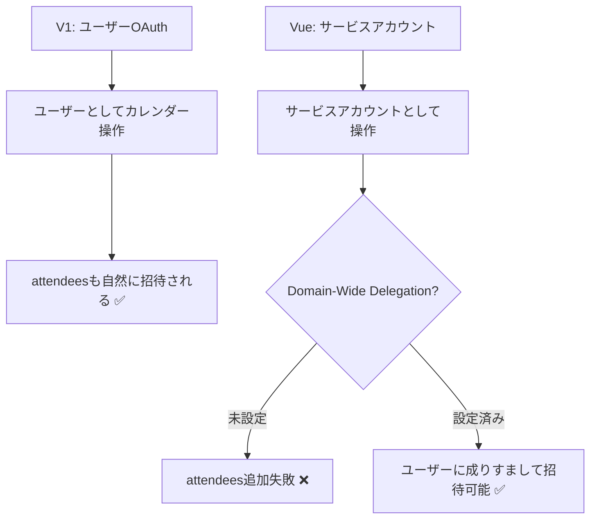
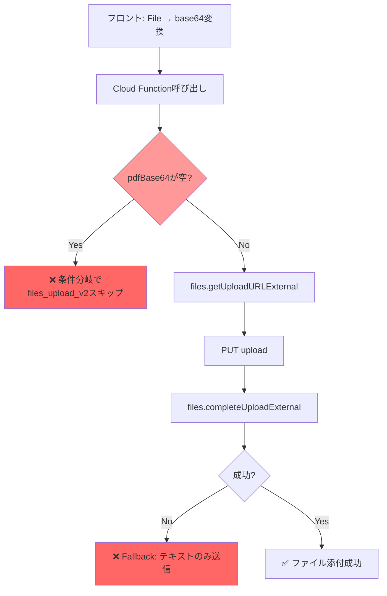

# V1 vs Vue版: カレンダー招待 & PDF添付の比較分析と解決策

## 問題の概要

Vue版で2つの機能が正しく動作しない:
1. **カレンダー招待** — イベントは作成されるが、招待メールが送れない
2. **PDF添付** — ファイル選択してもSlackにPDFが添付されない

---

## 1. カレンダー招待

### V1（現行サイト）の実装 ✅ 動作中

| 項目 | 詳細 |
|---|---|
| **認証方式** | ユーザーの**OAuth トークン** (`gapi.client.calendar`) |
| **イベント作成** | `events.insert()` に `attendees` を**同時に含める** |
| **招待メール** | ユーザーのGoogleアカウントとして送信 → **自然に届く** |
| **追加招待者** | `外部オーダー連携メール` シートから取得して attendees に追加 |

```javascript
// V1: ユーザーOAuthで直接作成（attendees込み）
await gapi.client.calendar.events.insert({
  calendarId: INTERNAL_HOLD_CALENDAR_ID,
  resource: {
    summary, description,
    start: startObj, end: endObj,
    attendees: [{ email: castEmail }, { email: additionalEmail }]
  }
});
```

### Vue版の実装 ❌ 招待失敗

| 項目 | 詳細 |
|---|---|
| **認証方式** | **サービスアカウント** (`google.auth.GoogleAuth`) |
| **イベント作成** | `events.insert()` に attendees **なし** で作成 |
| **招待追加** | 作成後に `events.patch()` で attendees を追加（`sendUpdates: 'none'`） |
| **結果** | サービスアカウントにはDomain-Wide Delegation未設定 → 招待失敗 |

```typescript
// Vue: サービスアカウントでイベント作成（attendeesなし）
const result = await calendar.events.insert({
  calendarId, requestBody  // ← attendees含まず
});
// 後からpatchで追加（失敗しても無視）
await calendar.events.patch({
  calendarId, eventId,
  requestBody: { attendees },
  sendUpdates: "none"  // ← メールも送らないし、そもそも権限不足で失敗
});
```

### 根本原因



### 解決策

#### 案A: Cloud Functionでユーザーの**アクセストークン**を使う（推奨）

> [!TIP]
> V1と同じユーザーOAuth方式。最も確実で設定変更不要。

フロントエンドでFirebase Authのユーザートークンを使ってカレンダーAPIを直接呼ぶ。Cloud Functionを通さない。

**変更点:**
- [useGoogleCalendar.ts](file:///Users/mk0012/Desktop/workspace/vue_casty/src/composables/useGoogleCalendar.ts): stub関数を実際のカレンダーAPIコールに書き換え
- Firebase AuthのOAuth scopeに `calendar` を追加
- Cloud Functionからカレンダー作成ロジックを**削除**し、フロントから直接実行

**メリット:** V1と同じ方式なので確実に動く。Domain-Wide Delegation不要  
**デメリット:** フロントにカレンダーロジックが戻る

#### 案B: GCP管理画面でDomain-Wide Delegationを設定

> [!IMPORTANT]
> GCP側の設定変更のみで、コード変更は最小限。

1. [Google Cloud Console](https://console.cloud.google.com/) → IAM → サービスアカウント  
2. サービスアカウントのDomain-Wide Delegationを**有効化**
3. [Google Workspace 管理コンソール](https://admin.google.com/) → セキュリティ → APIコントロール → ドメイン全体の委任
4. サービスアカウントのクライアントIDを追加し、スコープ `https://www.googleapis.com/auth/calendar` を付与

**追加コード変更:** `sendUpdates: 'none'` → `sendUpdates: 'all'` に変更

```diff
// calendar.ts L140-143
 const result = await calendar.events.insert({
   calendarId: params.calendarId,
-  requestBody,
+  requestBody: { ...requestBody, attendees },
+  sendUpdates: "all",
 });
```

**メリット:** コード変更最小限  
**デメリット:** Google Workspace管理者権限が必要。組織のセキュリティポリシーに依存

#### 案C: Cloud Functionでinsert時にattendeesを含める + `sendUpdates: 'all'`

> [!NOTE]
> DWD設定後に適用するパッチ。patchではなくinsert時に含めることで一度のAPI呼び出しで完了。

```typescript
// calendar.ts: insert時にattendeesを含める
const result = await calendar.events.insert({
  calendarId: params.calendarId,
  requestBody: { summary, description, start, end, attendees },
  sendUpdates: "all",
});
```

---

## 2. PDF添付

### V1（現行サイト）の実装 ✅ 動作中

| 項目 | 詳細 |
|---|---|
| **ファイル保持** | `cartMeta.pdfFiles` にDOMの `FileList` を保存 |
| **送信方式** | `FormData` + `multipart/form-data` でバックエンドに送信 |
| **バックエンド** | FastAPI (`UploadFile`) → Slack SDK `files_upload_v2()` |
| **Slack SDK** | Python `slack_sdk` の `files_upload_v2` メソッド（安定） |

```javascript
// V1: FormDataでファイルを直接送信
const formData = new FormData();
formData.append('payload_str', JSON.stringify(payload));
for (let i = 0; i < files.length; i++) {
  formData.append('files', files[i], files[i].name);
}
const res = await fetch('/api/notify/order_created', {
  method: 'POST', body: formData
});
```

### Vue版の実装 ❌ PDF添付失敗

| 項目 | 詳細 |
|---|---|
| **ファイル変換** | `File` → `ArrayBuffer` → `Uint8Array` → `btoa()` → base64文字列 |
| **送信方式** | Cloud Function `httpsCallable()` でbase64文字列を送信 |
| **Cloud Function** | base64 → `Buffer.from(base64, 'base64')` → Slack API (raw fetch) |
| **Slack API** | `files.getUploadURLExternal` → PUT → `files.completeUploadExternal` |

```typescript
// Vue: base64に変換してCloud Functionに送信
const arrayBuffer = await pdfFile.arrayBuffer();
const bytes = new Uint8Array(arrayBuffer);
let binary = '';
for (let i = 0; i < bytes.length; i++) {
  binary += String.fromCharCode(bytes[i]!);
}
pdfBase64 = btoa(binary);

const result = await notifyOrder({
  ...payload, pdfBase64, pdfFileName
});
```

### 根本原因の切り分け

Vue版のPDF添付が失敗する可能性のある箇所:



> [!WARNING]
> **最も疑わしい問題点:**
> 1. `httpsCallable` のペイロードサイズ制限（デフォルト**1MB**、`maxInstances`設定はあるが`maxRequestSize`設定なし）
> 2. base64変換で元ファイルの**約1.33倍**にサイズが増加
> 3. Cloud Functions v2の callable は**10MBまで**だが、base64エンコードでサイズが膨らむ

### 解決策

#### 案A: Firebase Storage経由でアップロード（推奨）

> [!TIP]
> サイズ制限を回避し、最も堅牢な方式。

1. フロントエンドで**Firebase Storage**にPDFをアップロード
2. Cloud Functionには**Storage URI（パス）のみ**を渡す
3. Cloud Function内でStorageからファイルを取得してSlackにアップロード

```typescript
// 1. フロント: Firebase Storageにアップロード
import { ref as storageRef, uploadBytes, getDownloadURL } from 'firebase/storage'
const fileRef = storageRef(storage, `orders/${Date.now()}_${pdfFile.name}`)
await uploadBytes(fileRef, pdfFile)
const storagePath = fileRef.fullPath

// 2. Cloud Functionに渡す
const result = await notifyOrder({
  ...payload,
  pdfStoragePath: storagePath,  // base64ではなくパス
  pdfFileName: pdfFile.name
})
```

```typescript
// 3. Cloud Function: Storageから取得してSlackへ
const bucket = admin.storage().bucket()
const file = bucket.file(data.pdfStoragePath)
const [fileBuffer] = await file.download()
// Slack APIにアップロード
```

#### 案B: Cloud Functionsのリクエストサイズ上限を確認 & デバッグ

まず問題を特定するために:

1. Cloud Functions のログで `pdfBase64Length` の値を確認
2. `hasPdfBase64: !!data.pdfBase64` が `true` になっているか確認
3. `files.getUploadURLExternal` のレスポンスを確認

```bash
# Firebase Functions のログを確認
firebase functions:log --only notifyOrderCreated
```

#### 案C: V1と同様にバックエンドAPIを使う

Cloud Functionsを経由せず、V1同様にFastAPIバックエンドに`FormData`で送る方式に戻す。

---

## まとめ

| 問題 | V1の方式 | Vue版の方式 | 根本原因 | 推奨解決策 |
|---|---|---|---|---|
| **カレンダー招待** | ユーザーOAuth + insert時にattendees | サービスアカウント + 後からpatch | DWD未設定 | **案B**: GCPでDWD設定 + insert時attendees |
| **PDF添付** | FormData → FastAPI → Slack SDK | base64 → Cloud Function → raw fetch | サイズ制限 or API呼び出し失敗 | **案A**: Firebase Storage経由 |

## 確認方法

### カレンダー招待の確認
Cloud Functions のログ (`firebase functions:log`) で以下を確認:
- `Calendar attendees added successfully` → 成功
- `Calendar attendee addition failed` → DWDが原因

### PDF添付の確認
Cloud Functions のログで以下を確認:
- `PDF check: hasPdfBase64` が `true` か
- `pdfBase64Length` の値（0なら送信前に問題）
- `Failed to get upload URL` → Slack API側の問題
- `Failed to complete upload` → アップロード処理の問題
