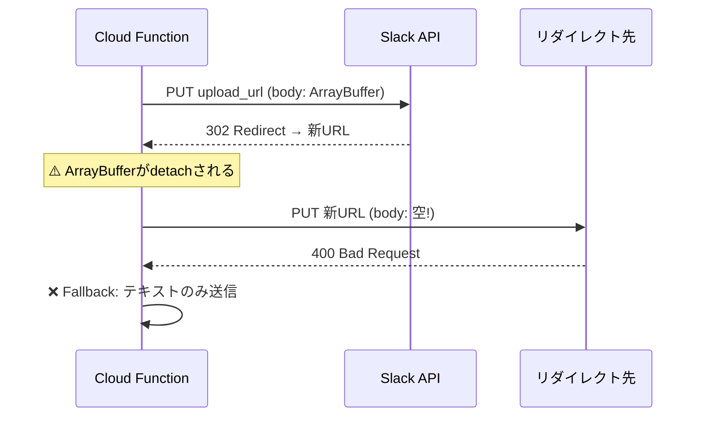
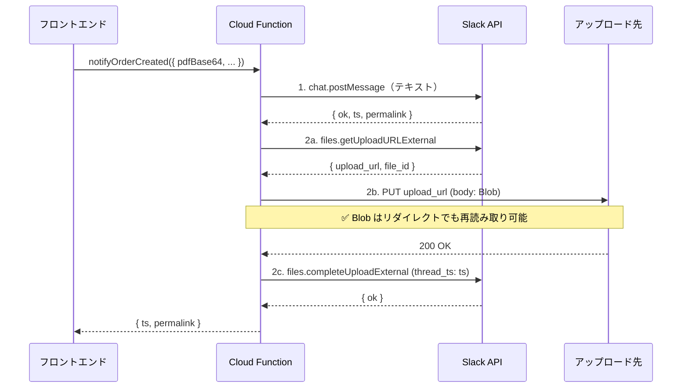

# Vue版 PDF添付問題の修正記録

**更新日:** 2026年2月24日

---

## 問題

Vue版のオーダー送信時、Slack通知にPDFファイルが添付されない。テキストメッセージのみが送信される。

---

## 原因

Slack の `files.getUploadURLExternal` API が返すアップロードURLが **HTTP 302リダイレクト** を返すことがある。

Node.js の `fetch()` はリダイレクト時に自動追跡するが、その際 **リクエストbody の `ArrayBuffer` が消費（detach）** されてしまう。結果、リダイレクト先への PUT でbodyが空になり → アップロード失敗 → テキストのみ送信にフォールバック。



---

## 修正内容

[slack.ts](file:///Users/mk0012/Desktop/workspace/vue_casty/functions/src/slack.ts#L83-L181) の `uploadFileToSlack()` に2つの改善を適用:

### 修正1: Blob を使用（ArrayBuffer detach 回避）

```diff
 // Step 2b: ファイル PUT
-const putResponse = await fetch(getUrlResult.upload_url, {
-    method: "PUT",
-    headers: { "Content-Type": "application/pdf" },
-    body: fileBuffer,
-});
+// Blob でリダイレクト時の ArrayBuffer detach を回避
+const fileBlob = new Blob([fileBuffer], { type: "application/pdf" });
+const putResponse = await fetch(getUrlResult.upload_url, {
+    method: "PUT",
+    body: fileBlob,
+});
```

> [!NOTE]
> `Blob` は `ReadableStream` として扱われるため、リダイレクト時に再読み取りが可能。`ArrayBuffer` / `Uint8Array` / `Buffer` は一度送信すると detach される。

### 修正2: テキスト先行投稿 → PDFスレッド添付

```diff
-// 旧: ファイルアップロードと同時にメッセージ投稿
-const completePayload = {
-    files: [{ id: file_id, title: fileName }],
-    channel_id: channel,
-    initial_comment: text,
-};

+// 新: Step 1 — テキストメッセージを先に投稿（ts/permalink 確実取得）
+const textResult = await postToSlack(token, channel, text, undefined, threadTs);
+const messageTs = textResult.ts || threadTs || "";
+
+// 新: Step 2 — PDFをスレッドにアップロード
+const completePayload = {
+    files: [{ id: file_id, title: fileName }],
+    channel_id: channel,
+    thread_ts: messageTs,  // 先に投稿したメッセージのスレッドに添付
+};
```

> [!IMPORTANT]
> 旧方式では `initial_comment` を `files.completeUploadExternal` に渡してメッセージとファイルを同時投稿していたが、この場合 `ts` の取得が不安定だった。テキストを先に投稿することで `ts` が確実に取得でき、Firestore への書き戻しも安定する。

---

## V1（現行サイト）との比較

| 項目 | V1 | Vue版（修正後） |
|---|---|---|
| **言語** | Python (FastAPI) | TypeScript (Cloud Functions) |
| **Slack SDK** | `slack_sdk.files_upload_v2()` | raw `fetch()` API |
| **リダイレクト対応** | SDK が内部で処理 | `Blob` で body 再読み取り可能に |
| **ts 取得** | `files.info` + shares から抽出 | テキスト先行投稿で確実に取得 |
| **ファイル転送** | `FormData` + multipart | base64 → `Buffer` → `Blob` → PUT |

### V1 の方式

```python
# V1: Python SDK が内部でリダイレクト/リトライを処理
response = await slack_client.files_upload_v2(
    channel=channel,
    initial_comment=text,
    file_uploads=[{
        "file": content,      # bytes
        "filename": filename,
        "title": filename
    }],
    thread_ts=thread_ts
)
```

V1 は Python の `slack_sdk` を使用しており、SDK がリダイレクト処理やリトライを内部的に処理するため問題は発生しなかった。

---

## 修正後のフロー



---

## ステータス

✅ **修正済み** — [slack.ts L83-181](file:///Users/mk0012/Desktop/workspace/vue_casty/functions/src/slack.ts#L83-L181) で修正適用済み
